# 基于 YOLO 的机器人场景目标检测 — 项目报告

> 学号：___202611160208___　姓名：___王喻晨___　班级：___计工本2602___
> 完成日期：2026-10-5　环境：Windows / RTX 5060 Laptop 8GB / Python 3.11

---

## 〇、运行环境与验证环境要求

### 本项目实测配置环境

| 项       | 配置                                              | 说明                                                      |
| ------- | ----------------------------------------------- | ------------------------------------------------------- |
| 操作系统    | Windows 11 64 位                                 | Windows 10 及以上                                          |
| 内存      | 32GB                                            | ≥8GB                                                    |
| 显卡      | RTX 5060 Laptop 8GB                             | NVIDIA 系列显卡                                             |
| GPU 软件栈 | NVIDIA 驱动（本机实测 **616.92**）；PyTorch **cu128** 轮子 | RTX 50 系必须 cu128；驱动过旧或装 cu121/cu124 会报错。查看命令：`nvidia-smi` |
| Python  | 3.11（Miniconda 虚拟环境 `yolo`）                     | 3.10/3.12 亦可                                            |
| 磁盘      | ≥10GB 空闲                                        | 依赖约 6GB + 数据集 0.1GB + 训练结果约 2GB                      |
| 关键依赖版本  | 见 requirements.txt                              |                                                         |

### 验证/演示环境（Level 1~5 截图与页面运行）

| 项    | 要求                                                            |
| ---- | ------------------------------------------------------------- |
| 终端   | Anaconda Prompt 或 PowerShell（需 `conda activate yolo`）         |
| 浏览器  | Chrome / Edge 任一现代浏览器（Level 5 页面用，访问 `http://localhost:8501`） |
| 标注工具 | tkinter （`启动标注.bat`）                                          |
| 截图工具 | Windows 自带                                                    |

## 一、项目概述

使用实验室提供的 obstacle / cola / football 三类机器人场景图片（共 935 张），完成数据整理、目标标注、YOLO 模型训练与新图片目标检测的完整工程实践，并封装本地检测页面。

**类别定义**：

- `0 obstacle`：画面中心重点展示的蓝色泡沫盒子
- `1 cola`：深色可乐瓶
- `2 football`：黑白足球

## 二、环境配置（Level 1）

| 组件                 | 版本                             | 说明                                                              |
| ------------------ | ------------------------------ | --------------------------------------------------------------- |
| Miniconda / Python | 3.11                           | 虚拟环境 `yolo` 隔离                                                  |
| PyTorch            | 2.11.0+cu128                   | **RTX 50 系(Blackwell/sm_120)必须 cu128 轮子**，离线 .whl 安装并 SHA256 校验 |
| Ultralytics        | 8.4.155                        | YOLOv8 实现                                                       |
| 标注工具               | tkinter 修正器(自研) + labelImg(试用) | 见"问题与解决 #4"                                                     |

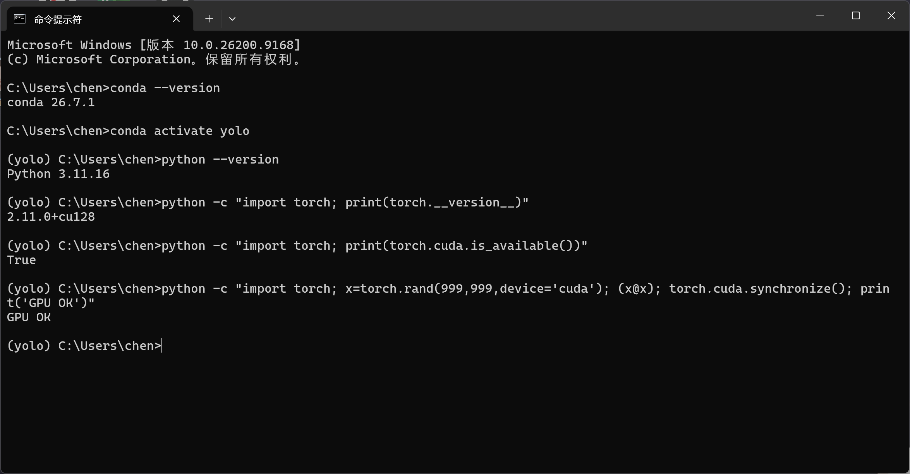

## 三、数据集整理（Level 1）

- 数据下载：合计 935 张 jpg，分辨率 640×(400~480)；
- 目录结构：按 YOLO 规范建立 `dataset/images/{train,val}` + `dataset/labels/{train,val}`；
- **划分方式**：每个类别内部独立按 **8:2** 随机划分（`random.seed(42)` 固定可复现），结果 train 749（249/234/266）、val 186（62/58/66），保证三类在两集合中比例一致。

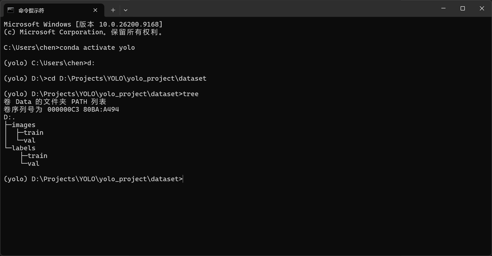

## 四、目标标注（Level 2）——半自动方案

采用 **"开放词汇模型预标注 + 人工修正 + 模型辅助清洗"** 三级流水线：

1. **预标注**（`scripts/pre_annotate.py`）：YOLO-World 用 9 组具体外观提示词（stacked chairs→后改为 blue box 系、coke/dark/plastic bottle、soccer ball）对 935 张图生成初始 YOLO 标签，同类 IoU 去重；
2. **人工修正**（`scripts/annotator.py`，自研 tkinter 工具）：逐张删误框、补漏框。val 集 186 张全部修正完成；
3. **模型辅助清洗**（`scripts/clean_train_labels.py` + `scripts/clean_by_color.py`）：第一版"定位干扰物→删重叠框"在 dry-run 阶段暴露 CLIP 语义过宽（"exercise ball" 会误匹配黑白足球、一次将删 495 框），改用颜色词+HSV 校验后实际删除 0 个——依赖检测器召回的思路不可靠（教训见问题 #9）；随后经我用手机实拍测试暴露盲区，升级为**直接对标签框做 HSV 颜色审计**（obstacle 框必须含青蓝像素、football 框不得为橙色），删 287+19 个误标。全程 dry-run+可视化抽样审计+备份。

标签格式示例（YOLO 归一化 `class cx cy w h`）：

```
0 0.117681 0.667692 0.166285 0.251923
2 0.480469 0.659375 0.143750 0.268750
```

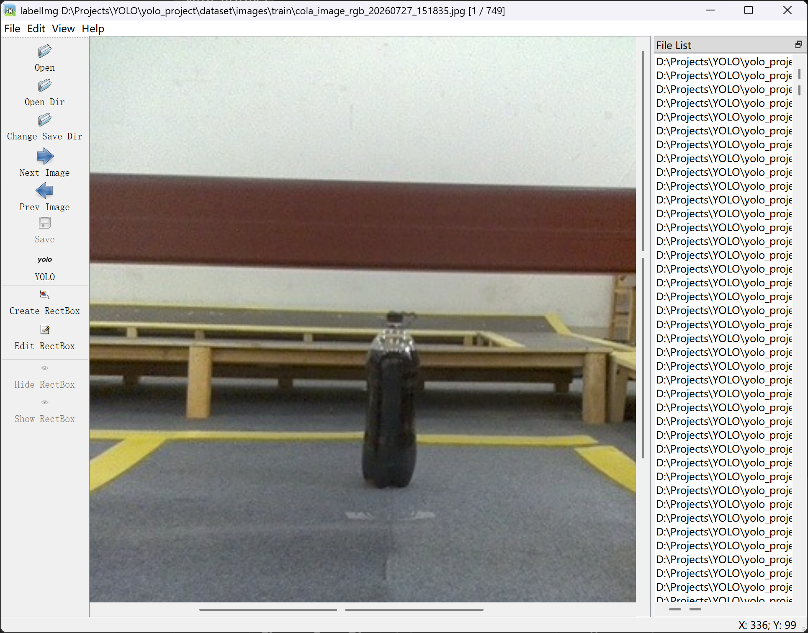
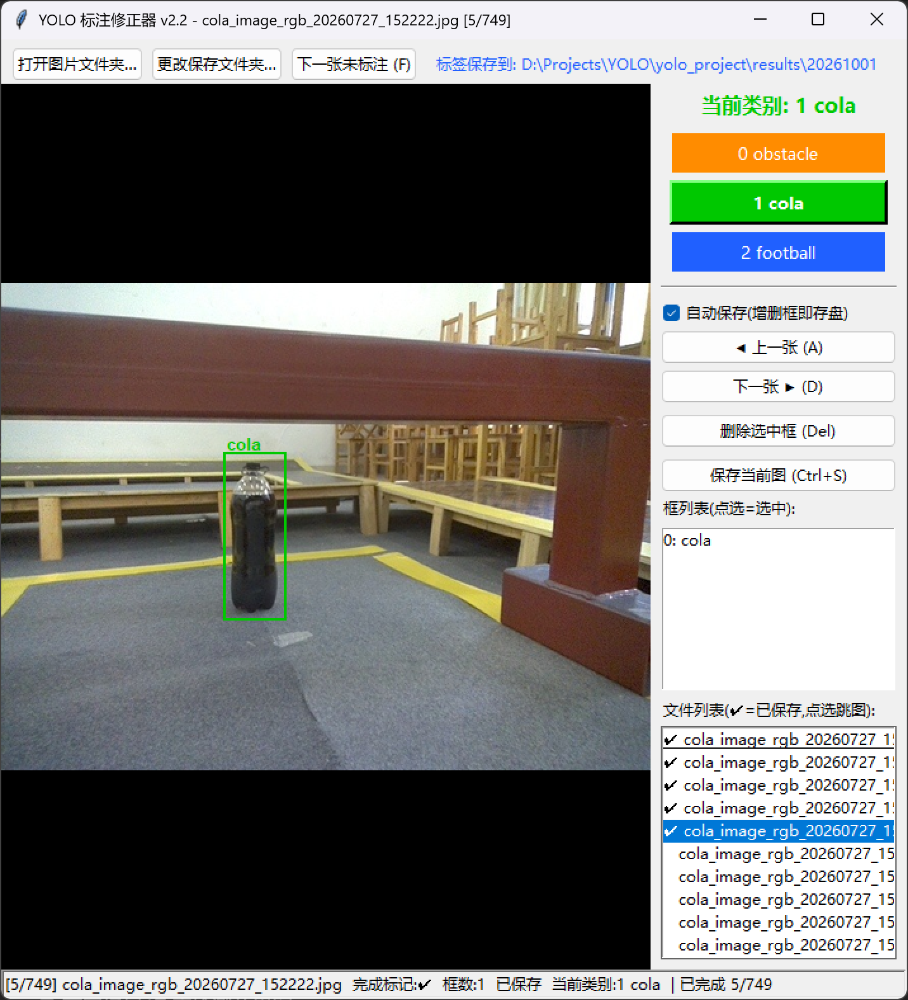
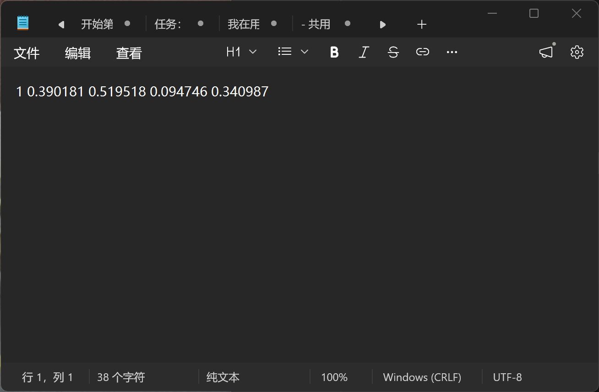

## 五、模型训练（Level 3）

配置：yolov8s 预训练权重迁移学习，imgsz=640，batch=16，AdamW(auto)，默认数据增强(Mosaic/HSV)。

### 实验对比表（均在人工修正后的 val 上评估，公平可比）

| 实验               | 训练数据                 | mAP50     | mAP50-95  | obstacle  | cola   | football |
| ---------------- | -------------------- | --------- | --------- | --------- | ------ | -------- |
| baseline-2       | 原始预标注                | 0.867†    | 0.827†    | 0.722†    | 0.942† | 0.938†   |
| 同一模型重评           | （旧模型）                | 0.767     | 0.700     | 0.698     | 0.926  | 0.679    |
| fixed_v1         | 预标注 train            | 0.867     | 0.728     | 0.880     | 0.954  | 0.768    |
| fixed_v2         | 预标注 train（干扰物清洗删 0 框） | 0.847     | 0.742     | 0.777     | 0.933  | 0.832    |
| fixed_v3         | v2 数据跑满100轮          | 0.829     | 0.744     | 0.761     | 0.962  | 0.763    |
| **fixed_v4（最终）** | **+颜色审计清洗(287+19框)** | **0.888** | **0.783** | **0.900** | 0.945  | 0.818    |

† 在含错误的旧 val 标签上评估，虚高不可直接比较——这一现象本身是"标注质量决定指标可信度"的实证（见问题 #2）。

**关键迭代——实测驱动**：v2 在 val 指标良好的情况下，我用图片测试发现 obstacle 严重误检（把椅子/门架当障碍、真蓝盒子漏检）。颜色审计揭示 train 集 obstacle 标签 **49%（287/586）为非蓝色误标**——此前"定位干扰物删重叠框"的清洗依赖检测器召回，实际删除 0 个。改用**直接校验标签框内 HSV 颜色**（obstacle 框需蓝色占比>25%、football 框橙色>30% 判为瑜伽球）清洗后重训 v4：obstacle 精确率 0.569→**0.968**、mAP50 0.900，实拍场景复测误检消失。教训：**val 指标≠真实可用，实拍实测是最后一道质检**。

**最终模型**：`runs/fixed_v4/weights/best.pt`（21.4MB）。

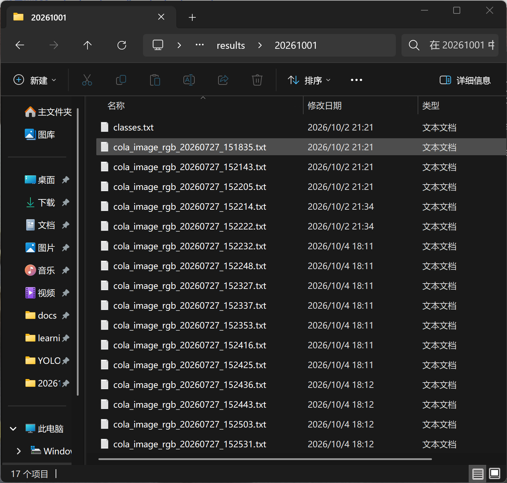
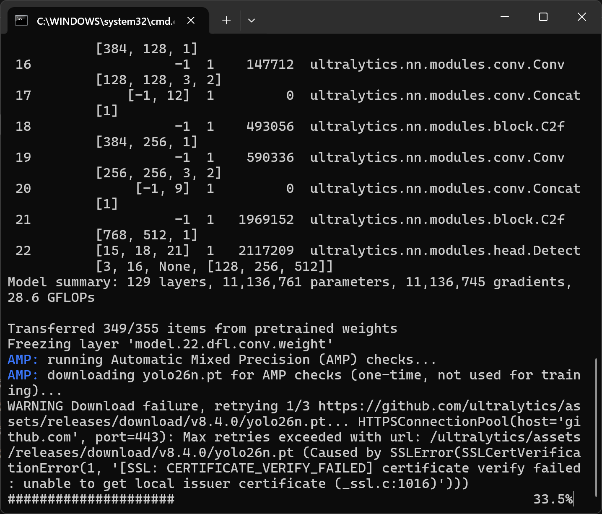
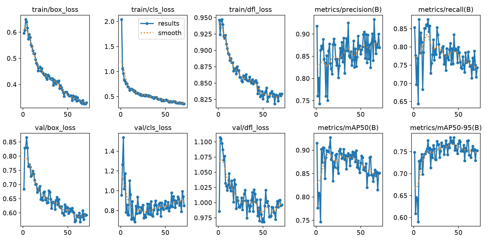
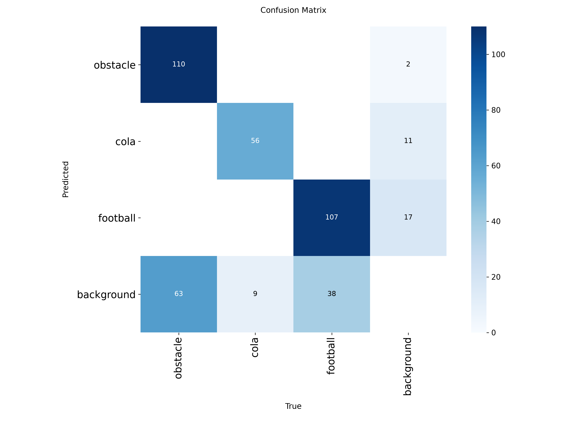
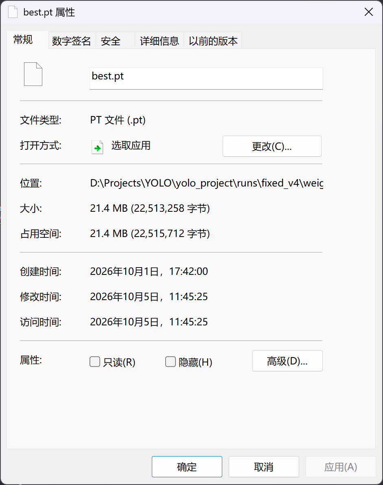

## 六、图片检测（Level 4）

`yolo_project/predict.py` 加载 fixed_v4 权重（`runs/fixed_v4/weights/best.pt`），对训练集之外图片推理，结果含目标框+类别名+置信度，并输出 `detections.csv` 明细。

- 单目标 / 多目标 / 检测效果图：

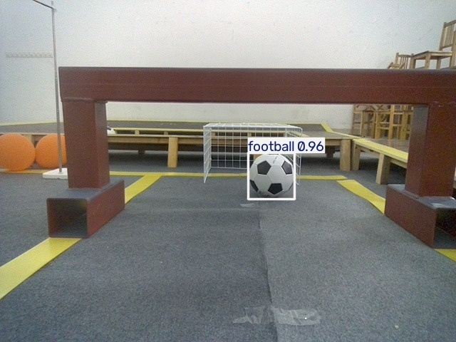

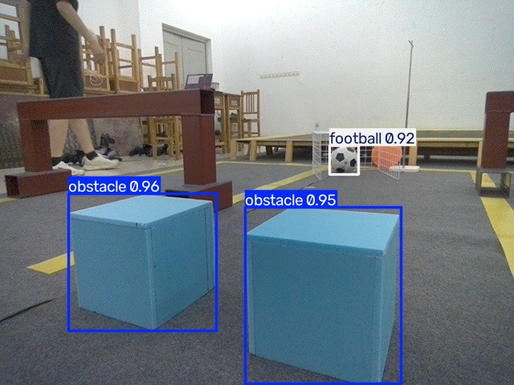

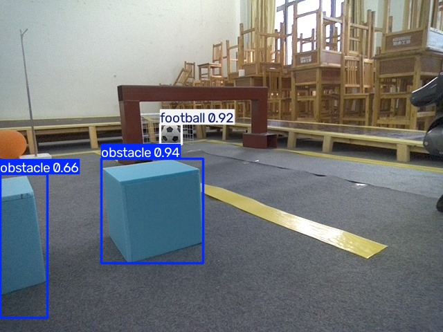

## 七、本地检测页面（Level 5）

`yolo_project/app.py`（Streamlit，约 80 行）：上传图片 → 模型推理 → 并排显示原图/结果图 + 目标表格（类别/置信度/位置）+ 侧栏置信度滑条实时调节。

- 启动：`streamlit run yolo_project/app.py` 或双击 `启动页面.bat`；
- 实测：conf 0.25→0.5 时低置信误检正确被过滤。

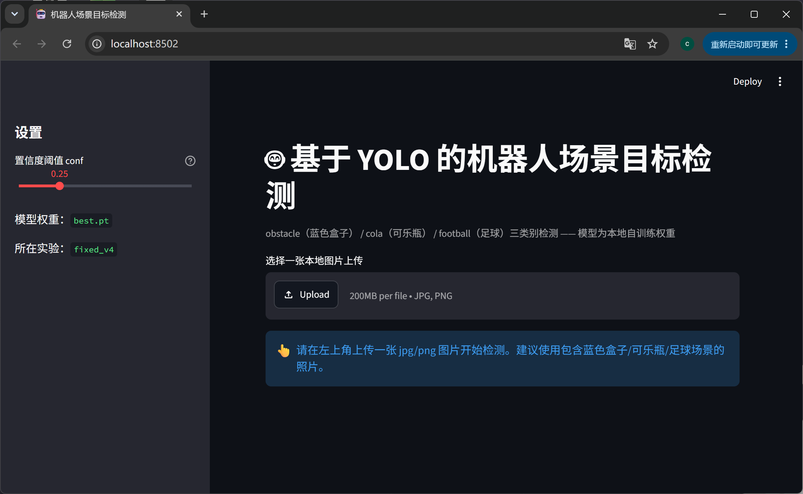

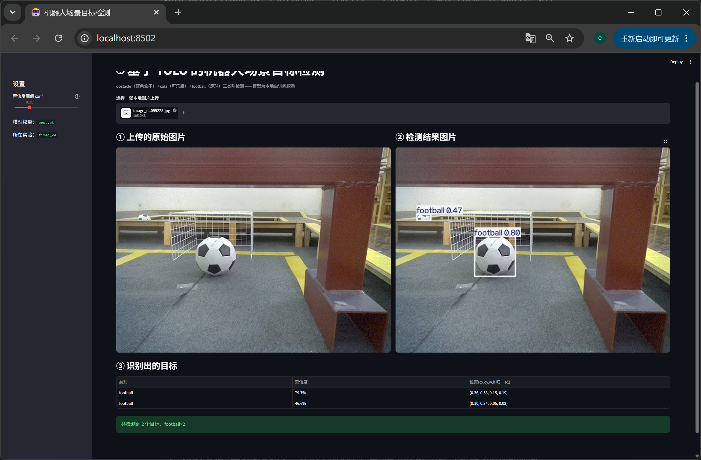

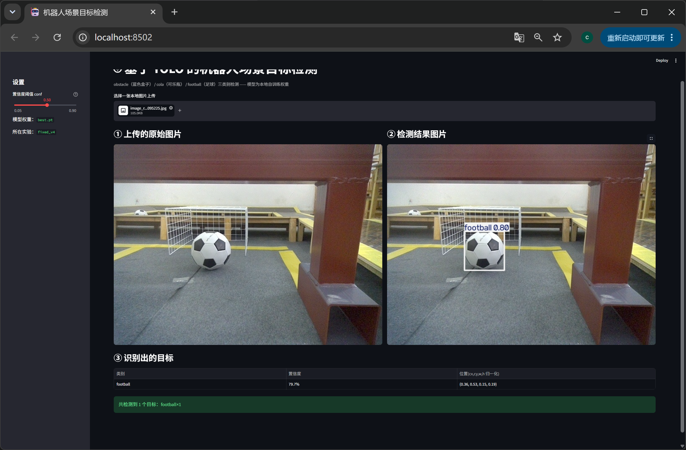

## 八、遇到的问题与解决方案

1. **RTX 5060 装不上 GPU 版 PyTorch**：50 系 Blackwell 架构需 CUDA 12.8+ 轮子（cu121 报 no kernel image）→ 锁定 cu128 离线安装，三条命令验证（版本/可用性/真实矩阵运算）。
2. **"obstacle" 抽象词零检出**：YOLO-World 无法匹配功能概念词 → 拆解为具体外观词（blue box/cyan box…）；同类教训 "cola bottle"→"coke/dark/plastic bottle"、"exercise ball" 误匹配黑白足球（叠加 HSV 橙色校验解决）。
3. **类别定义踩坑**：按词义把 obstacle 理解为"所有挡路物"标注了椅子，后续从复杂度考虑并且查看图片后确定为蓝盒子 → 教训：**动手标注前先弄清类别在这个数据集里的视觉所指**，这个踩坑也导致了后续的训练数据受到影响，导致obstacle类别识别不如另外两个类别的识别，当然调试问题的过程也加深了相关知识的理解。
4. **labelImg 随机闪退**：1.8.6 版与 Python 3.11+Windows 深层不兼容（Qt5Core.dll 0xc0000409 原生层崩溃，设置兼容、管理员权限等无效）→ 通过 Windows 事件日志定位根因后果断止损，自研 tkinter 标注修正器（python直接读写 YOLO txt）。
5. **GitHub 资源下载被重置**：走 `gh-proxy.com` 镜像前缀。
6. **旧模型指标虚高**：baseline 0.867 在修正标签上重评仅 0.767 → 建立"评估集必须先人工修正"的规范。
7. **小数据集训练随机性**：fixed_v1 obstacle 0.880 无法复现（v3 同数据 0.761）→ 认知：单次实验指标波动 ±5~10 点，重要结论需多次训练验证。
8. **val 指标好≠真实可用**（最重要的一条）：v2 在 val 上 mAP50=0.847 看似良好，实测 obstacle 却"基本不能用"——根因是 train 集 49% 的 obstacle 标签为非蓝色误标，而上一轮清洗依赖干扰物检测器召回、实际未删。改直接校验标签框颜色并重训后，obstacle 精确率 0.569→0.968。教训：**实测是最后一道质检，清洗要围绕标签本身做审计**。

## 九、收获与总结

完整经历了"环境→数据→标注→训练→评估→推理→部署"目标检测工程闭环；最深的三点体会：

1. **数据质量是天花板**：指标会诚实地反映标签错误，修正标签带来的提升比调参更根本；
2. **工具是手段**：labelImg 不可用时的止损与自研替代，考核验的是标注结果而非工具本身；
3. **实验要可复现、可审计**：固定随机种子、dry-run、备份、事件日志定位——工程习惯比知识更重要。

## 十、文件清单

```
yolo_project/
├── train.py / predict.py / app.py / data.yaml   # 训练/推理/页面代码与数据集配置
├── dataset/          # images+labels(train/val) + classes.txt
├── runs/             # baseline-2 / fixed_v1~v4 / exp 实验记录（最终权重 fixed_v4/weights/best.pt）
├── results/          # 检测输出图 + detections.csv
└── qa/               # 标签清洗质检可视化
scripts/              # 数据体检/划分/预标注/清洗/质检/统计/标注器等 11 个脚本
new_images/           # 训练集之外的自拍测试图（Level 4 输入）
screenshots/          # Level 1~5 验证截图
启动标注.bat / 启动训练.bat / 启动检测.bat / 启动页面.bat   # 一键入口
requirements.txt / README.md / report.md
```
