# 从零搭建 CyberDog 仿真环境：我的实践记录

- 姓名：张鋆源
- 学号：202511700120
- 专业班级：物联本2501
- 项目：2026秋季工程实践能力考核 项目二
- 完成时间：2026年9月24日

## 写在前面

这次项目对我来说并不是一路顺利完成的。最开始我连 Ubuntu 都没有装好，主要时间花在了系统安装和 NVIDIA 显卡兼容问题上。后面的 Docker、CyberDog 镜像、Gazebo、传感器和运动控制部分，我按教程一步步操作；遇到不熟悉的命令、配置或报错时，会参考 AI 的解释。具体操作和结果检查由我完成，AI 只起辅助作用。

我想把这件事如实写清楚：

- Level 1 的 Ubuntu 安装是我主要参与和排查的部分，也是我体会最深的部分。
- Level 2、Level 3 和 Level 4 由我按教程完成。遇到不熟悉的命令时，我会参考 AI 的解释，再继续操作和检查结果。
- Level 5 和 Level 6 的流程相对直接，主要是启动服务、发送指令，再通过日志和模型位置确认结果。
- 报告中涉及的版本、命令和输出以实际环境为准。

## 项目概述

本项目最终完成了 Level 1 到 Level 6。Ubuntu 安装和 NVIDIA 黑屏排查是我投入时间最多的部分；Level 2 到 Level 4 我按照教程完成，遇到不熟悉的命令时参考 AI 的解释；Level 5 和 Level 6 用于确认运动控制服务能够启动，并让机器狗真正产生运动。

最终可以看到 Gazebo 和 RViz2 正常运行、相机发布图像话题、激光雷达发布 `/scan`、`motion_manager` 输出运行日志，机器狗在仿真中向前移动约 0.98 米。

## 1. 项目目标

题目要求从 Linux 和 Docker 开始，逐步完成 CyberDog 四足机器人仿真环境。最终需要做到：

1. 安装 Ubuntu 和 Docker。
2. 导入 CyberDog 镜像并运行容器。
3. 启动 Gazebo 和 RViz2。
4. 在机器人模型上启用相机，并确认激光雷达话题。
5. 启动 `motion_manager` 运动控制服务。
6. 让机器狗完成站立和向前运动。

最终完成情况如下：

| Level | 内容 | 完成情况 |
| --- | --- | --- |
| Level 1 | Ubuntu 与 Docker | 已完成 |
| Level 2 | 导入镜像、创建容器 | 已完成 |
| Level 3 | Gazebo 与 RViz2 | 已完成 |
| Level 4 | 相机与激光雷达 | 已完成 |
| Level 5 | `motion_manager` | 已完成 |
| Level 6 | Motion 测试 | 已完成 |

最终实际环境：

| 项目 | 实际版本 |
| --- | --- |
| 宿主机系统 | Ubuntu 24.04.5 LTS |
| 电脑型号 | 2025 款联想拯救者 Y7000P |
| Docker Engine | 29.8.1 |
| 容器系统 | Ubuntu 20.04.6 LTS |
| ROS2 | Galactic |
| 镜像 | `cyberdog_sim:v2026` |

题目示例中的 Docker 版本是 20.10.21，但本次没有安装该版本，原因在 2.4 节说明。

## 2. 从安装 Ubuntu 开始

### 2.1 跟着视频教程安装

我最开始对 Ubuntu、Docker 和 ROS2 都不熟悉，因此先参考了 B 站上的 Ubuntu 安装教程。视频里的步骤很多，从制作启动盘、设置 BIOS、分区、安装系统到进入桌面，每一步都有可能失败。

跟做时最明显的问题是：教程中的系统版本、软件版本和我的电脑并不完全一致。教程里能直接成功的操作，在我的电脑上可能会出现不同提示。我不能只照着抄命令，还要先确认自己的系统和硬件情况。

这部分让我第一次意识到，安装教程只能作为参考，真正可靠的是根据自己的环境检查版本和报错。

### 2.2 NVIDIA 显卡导致黑屏

我的电脑是 2025 款联想拯救者 Y7000P。安装 Ubuntu 时遇到的最麻烦问题，是 NVIDIA 显卡与系统驱动不匹配，导致电脑黑屏，无法正常进入桌面。

一开始我无法判断是安装盘、分区、系统镜像还是显卡驱动的问题。后来我结合教程、资料和 AI 的解释，把排查范围逐步缩小到 NVIDIA 驱动和当前 Ubuntu 版本、内核版本的匹配问题。不同教程里给出的驱动版本和安装方式并不一样，所以我不能直接照搬某一个固定版本，而要先确认电脑使用的显卡和系统环境。

当时我没有把全部错误信息和驱动版本保存下来，所以这里不补写无法确认的具体错误码，只记录实际排查过程。解决这个问题花费了较多时间，中间需要反复检查和确认驱动是否与当前系统匹配。最终系统能够正常进入桌面。这个过程比较耗时，也是整个项目中让我印象最深的一段。

### 2.3 Level 1 遇到的问题

1. 教程步骤多，容易漏掉其中一步。
2. 教程版本与我的电脑环境不同，不能完全照搬。
3. 安装 Ubuntu 后出现 NVIDIA 驱动问题，导致黑屏。
4. 一开始不会判断问题属于系统、启动盘还是显卡驱动。
5. 需要在教程、搜索资料和 AI 解释之间反复对照，才能找到适合当前环境的做法。

最后完成了 Ubuntu 环境，并保存了系统与 Docker 的验证结果：

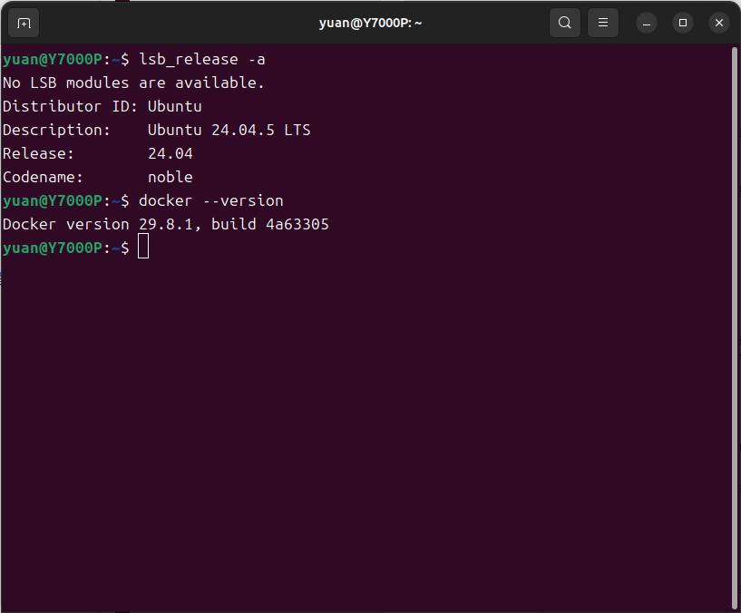

### 2.4 Docker 版本差异

题目示例写的是 Docker 20.10.21，但本次没有安装这个版本，主要有三个原因：

1. Ubuntu 24.04 的 Docker 官方软件仓库没有提供 20.10.21。
2. 20.10.21 已经停止维护，继续使用会缺少安全更新。
3. 在 Ubuntu 24.04 上强行混用旧发行版的软件包，可能出现依赖冲突。

因此我按照 Ubuntu 24.04 官方仓库安装 Docker，实际版本为 29.8.1。项目后续只用到了镜像导入、容器运行和终端进入等基础功能，这些命令在 29.8.1 中可以正常使用。

后续命令主要使用：

```text
docker load
docker tag
docker run
docker exec
docker images
```

这些命令在 Docker 29.8.1 中可以正常使用，Level 2 及之后的仿真也验证了这一点。

## 3. Level 2：导入镜像与创建容器

Level 2 由我按照教程完成。

### 3.1 镜像文件

CyberDog 镜像文件约为 11.8 GB，下载和导入都需要较长时间。导入命令为：

```bash
sudo docker load -i cyberdog_raceV2.tar
```

镜像导入后，原始标签是 `cyberdog_sim:v2`，与题目要求的 `cyberdog_sim:v2026` 不一致，因此补充了标签：

```bash
sudo docker tag cyberdog_sim:v2 cyberdog_sim:v2026
```

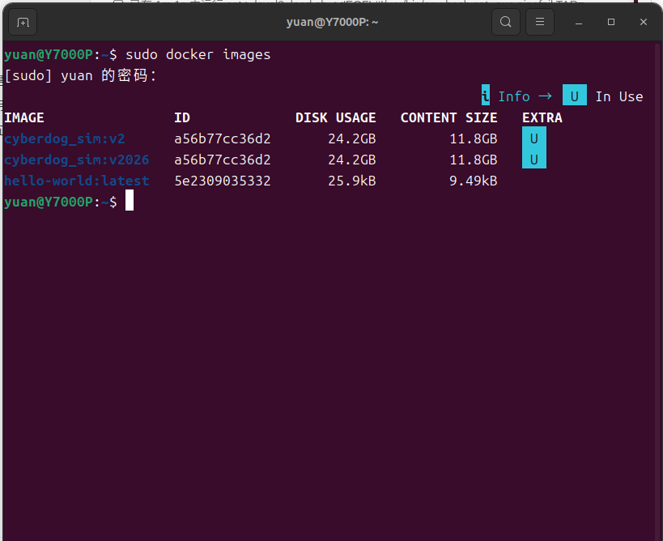

### 3.2 容器和图形显示

Gazebo 和 RViz2 需要在图形桌面中显示，所以容器启动时要设置 `DISPLAY` 并挂载 X11 Socket：

```bash
xhost +SI:localuser:root

sudo docker run -it \
  --name cyberdog_sim_level2 \
  --shm-size="1g" \
  --privileged=true \
  -e DISPLAY=:0 \
  -v /tmp/.X11-unix:/tmp/.X11-unix \
  cyberdog_sim:v2026
```

进入容器后可以看到 Ubuntu 20.04.6 LTS、ROS2 Galactic 和 `/home/cyberdog_ws` 工作区。

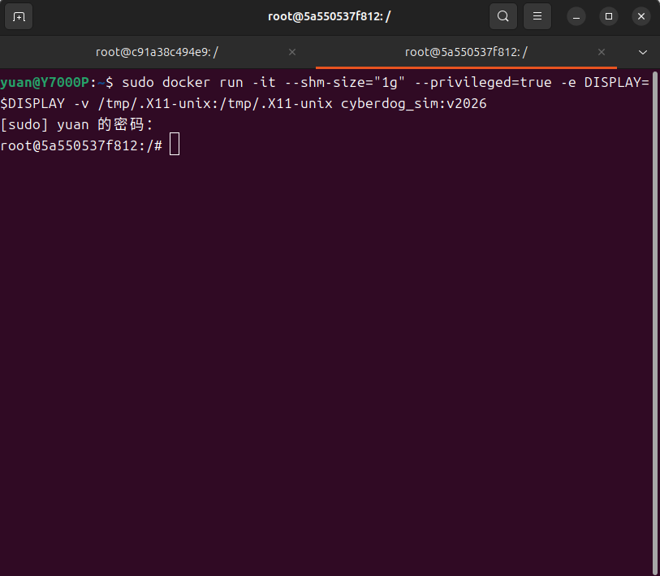

镜像、容器和图形显示均验证成功，后续可以在容器中继续启动 Gazebo 和 RViz2。这部分的主要问题是镜像太大、导入时间长，以及容器默认不能访问宿主机的图形界面。解决办法分别是避免重复导入，以及通过 X11 授权和 Socket 挂载让 Gazebo 在宿主机桌面上显示。

## 4. Level 3：运行 Gazebo 与 RViz2

Level 3 由我按教程启动。刚开始面对三个窗口和多个终端时容易弄混，遇到不明白的地方会参考 AI 的解释，再确认每一步的作用。进入容器后执行：

```bash
cd /home/cyberdog_sim
python3 src/cyberdog_simulator/cyberdog_gazebo/script/launchsim.py
```

启动后出现三个窗口：

- Gazebo：显示赛道、机器狗和物理仿真。
- CyberDog 控制程序：负责机器狗控制。
- RViz2：显示机器人模型、TF 和传感器数据。

实际启动后，Gazebo 中能够看到赛道和机器狗，RViz2 中能够加载机器人可视化数据。Gazebo 和 RViz2 的用途不同：Gazebo 是仿真环境，RViz2 是可视化工具，关闭其中一个并不代表另一个也要关闭。

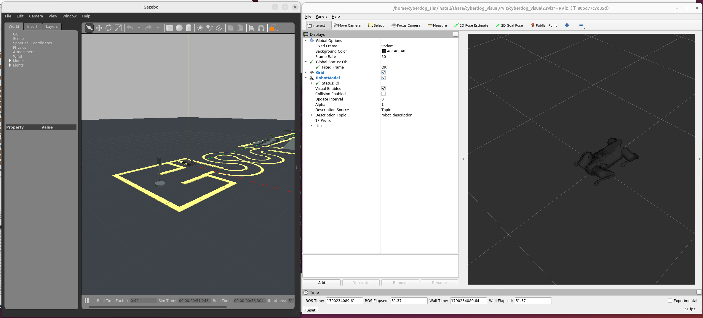

另一个运行时间点的 Gazebo 与 RViz2 画面：

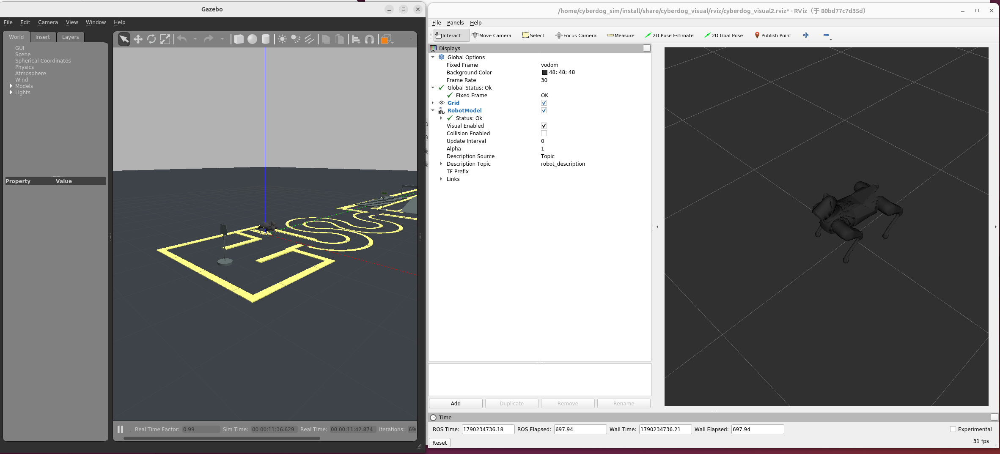

### 4.1 启动时遇到的问题

使用一键启动脚本时，容器内尝试打开 `gnome-terminal`，但出现了桌面服务连接错误：

```text
Error constructing proxy for org.gnome.Terminal
Connection refused
```

这说明容器内的启动脚本无法正常连接宿主机的桌面终端服务，并不代表 Gazebo 或相机配置本身有问题。后来我改用题目提供的分步启动方法，分别在三个终端启动 Gazebo、控制程序和 RViz2，避开了容器创建新终端窗口这一步。

## 5. Level 4：相机与激光雷达

Level 4 由我按教程完成。相机配置比前面的步骤更容易写错，因此我在修改 Xacro 文件时，对不清楚的层级和标签参考了 AI 的解释。一开始我把配置放到了 XML 声明前面，导致 Xacro 报错；后来恢复原始文件，再把配置插入到 `Foot contacts` 之前，才通过校验。

### 5.1 相机配置

机器人模型里已经有 `RGB_camera_link`，但只有这个 Link 并不会自动产生相机图像。还需要在 `gazebo.xacro` 中加入 Gazebo 相机 Sensor 和 ROS2 插件。

核心配置如下：

```xml
<gazebo reference="RGB_camera_link">
  <sensor name="race_rgb_camera" type="camera">
    <always_on>true</always_on>
    <update_rate>30</update_rate>
    <visualize>true</visualize>
    <pose>0 0 0 0 0 0</pose>
    <camera>
      <horizontal_fov>1.047</horizontal_fov>
      <image>
        <width>640</width>
        <height>480</height>
        <format>R8G8B8</format>
      </image>
      <clip>
        <near>0.05</near>
        <far>10.0</far>
      </clip>
    </camera>
    <plugin name="race_rgb_camera_controller"
            filename="libgazebo_ros_camera.so">
      <ros>
        <namespace>/camera_raw</namespace>
        <remapping>image_raw:=rgb/image_raw</remapping>
        <remapping>camera_info:=rgb/camera_info</remapping>
      </ros>
      <camera_name>race_rgb_camera</camera_name>
      <frame_name>RGB_camera_link</frame_name>
    </plugin>
  </sensor>
</gazebo>
```

其中：

- `visualize=true` 用于显示蓝色相机视锥。
- `update_rate=30` 表示图像目标频率为 30 Hz。
- `640x480` 是图像分辨率。
- `libgazebo_ros_camera.so` 负责把 Gazebo 相机数据发布成 ROS2 话题。

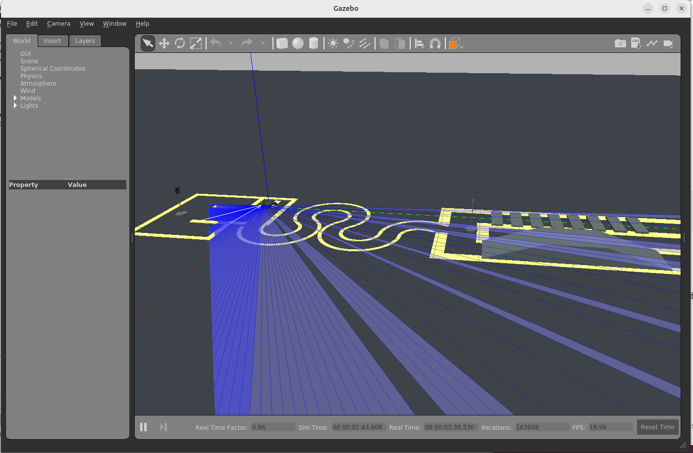

### 5.2 相机话题验证

相机配置生效后，可以看到两个话题：

```text
/camera_raw/race_rgb_camera/camera_info
/camera_raw/race_rgb_camera/image_raw
```

图像消息中的坐标系为 `RGB_camera_link`，实际发布频率接近配置的 30 Hz。

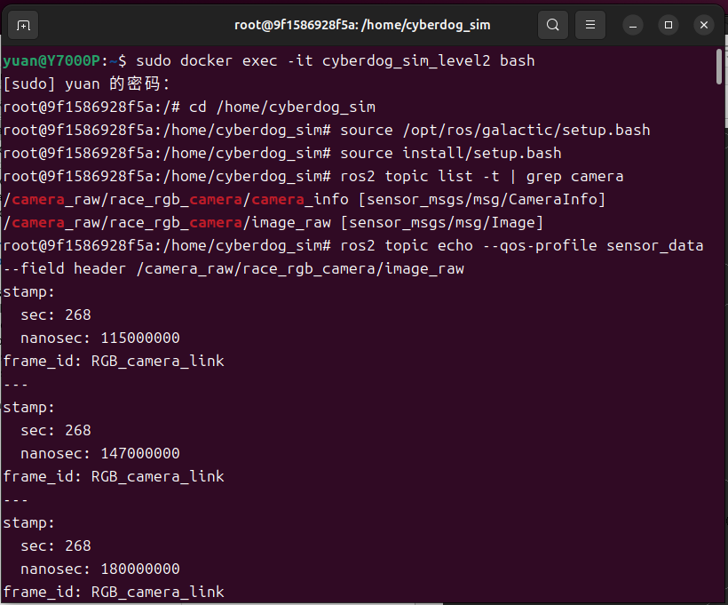

继续查看消息输出，可以看到时间戳连续更新，图像话题保持正常发布：

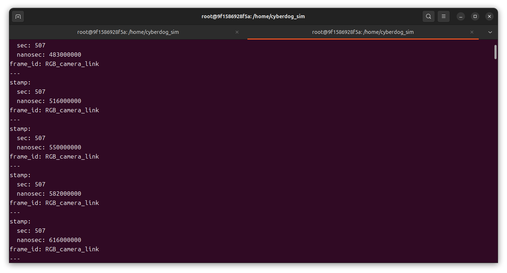

Gazebo 内部相机图像发布频率截图：

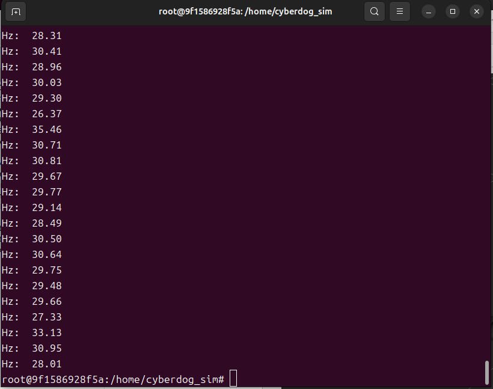

### 5.3 激光雷达

激光雷达话题为 `/scan`，类型是 `sensor_msgs/msg/LaserScan`，发布节点为 `cyberdog_laserscan`。Gazebo 内部扫描频率约为 5 Hz。

重新分步启动后，我还遇到过控制程序找不到共享内存的问题：

```text
SharedMemoryObject::Attach shm_open(development-simulator) failed:
No such file or directory
```

原因是 `race_gazebo.launch.py` 默认使用 `paused:=true`，机器人模型和共享内存没有完成初始化。改用下面的参数重新启动后，`/dev/shm/development-simulator` 才被创建，控制程序也能正常运行：

```bash
ros2 launch cyberdog_gazebo race_gazebo.launch.py paused:=false use_lidar:=true
```

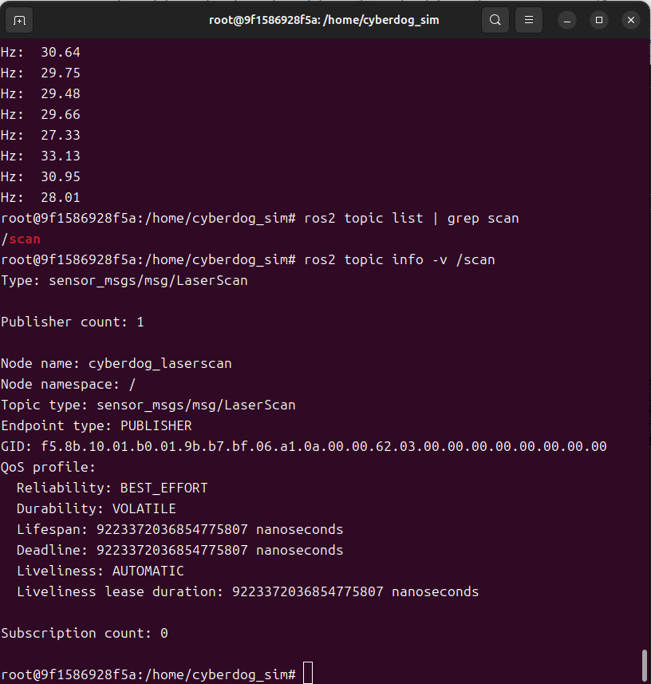

Level 4 相对复杂，主要原因是要同时理解 Xacro 的 XML 层级和 Gazebo 与 ROS2 之间的插件关系。

## 6. Level 5：启动运动控制服务

Level 5 的操作比较直接。进入容器后启动：

```bash
cd /home/cyberdog_ws
source /opt/ros/galactic/setup.bash
source install/setup.bash
ros2 run motion_manager motion_manager
```

节点正常启动后会持续输出 `[INFO] [MotionManager]` 日志，主要接口包括：

```text
/motion_managermachine_service
/motion_result_cmd
/motion_servo_cmd
/motion_status
```

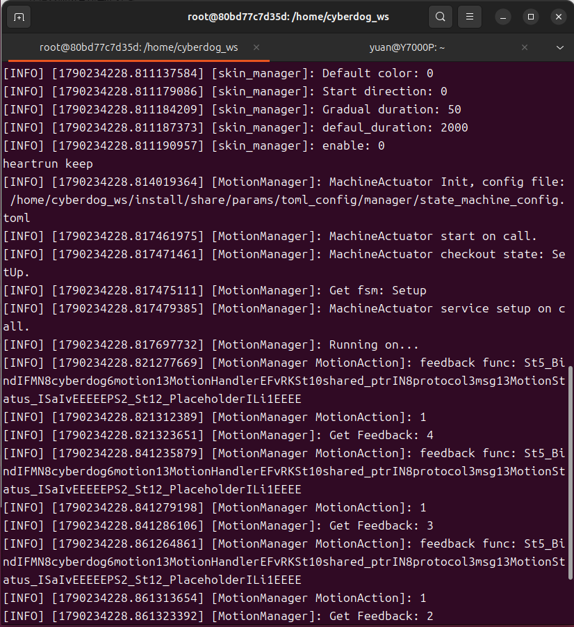

这里需要注意的是，`motion_manager` 必须保持运行。如果终端关闭，节点也会停止，后面的运动指令就无法正常执行。

## 7. Level 6：Motion 测试

### 7.1 激活状态机

先让状态机进入 `Active`：

```bash
ros2 service call /motion_managermachine_service \
  protocol/srv/FsMachine "{target_state: 'Active'}"
```

返回结果中的 `code=0` 表示请求成功。

### 7.2 站立和前进

执行站立动作：

```bash
ros2 service call /motion_result_cmd \
  protocol/srv/MotionResultCmd "{motion_id: 111}"
```

实际返回：

```text
protocol.srv.MotionResultCmd_Response(motion_id=111, result=True, code=0)
```

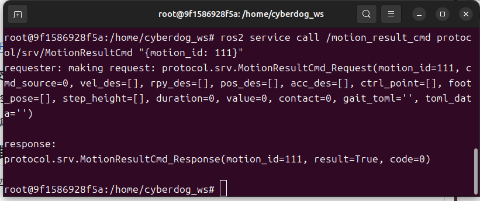

随后持续发布前进指令：

```bash
ros2 topic pub -r 20 /motion_servo_cmd \
  protocol/msg/MotionServoCmd \
  "{motion_id: 303, vel_des: [0.2, 0.0, 0.0]}"
```

发送约 8 秒后按 `Ctrl+C` 停止。

然后切换到快速前进指令：

```bash
ros2 topic pub -r 10 /motion_servo_cmd \
  protocol/msg/MotionServoCmd \
  "{motion_id: 305, vel_des: [0.6, 0.0, 0.0]}"
```

发送约 4 秒后按 `Ctrl+C` 停止。视频中依次展示了 `111` 站立、`303` 慢速前进和 `305` 快速前进三个动作。

### 7.3 结果验证

运动前模型位置：

```text
0.165084 -0.034835 0.23845 0.021009 0.014806 -0.121194
```

运动后模型位置：

```text
1.14459 -0.19503 0.255777 0.023058 -0.009514 -0.177972
```

x 轴位移约为：

```text
1.14459 - 0.165084 = 0.979506 m
```

机器狗向前移动约 0.98 米，说明控制指令确实传递到了 Gazebo，并产生了实际运动。

[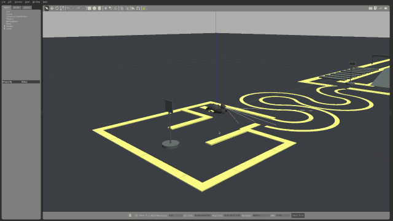](../media/09_level6_motion_demo.webm)

点击动图可打开完整 WebM 视频。

### 7.4 项目结果小结

Level 1 到 Level 6 最终全部完成。Ubuntu、Docker、CyberDog 容器、Gazebo、RViz2、相机、激光雷达和运动控制都完成了实际验证。Level 6 的模型位置变化说明机器狗不是只在界面中显示，而是真正接受了控制指令并在仿真环境中发生了运动。

## 8. 问题记录与注意事项

### 8.1 Level 4 配置与启动问题

Level 4 的操作说明不够细，很多地方需要自己理解后再判断配置应该放在哪里。相机配置不能只复制到文件中，还必须放在最外层 `<robot>` 根节点内部。我一开始把配置粘贴到了文件最顶部，结果它出现在了 `<?xml version="1.0"?>` 前面，执行 Xacro 时出现：

```text
XML parsing error: junk after document element
```

发现问题后，我恢复了原始备份，通过 `grep` 确认 `<!-- Foot contacts. -->` 所在行，再把相机配置插入到该注释之前，重新执行 Xacro 后校验通过。

编辑过程中，容器没有安装 `nano`，执行时会提示：

```text
bash: nano: command not found
```

后来改用 `vim`。第一次使用时还遇到了交换文件提示：

```text
E325: ATTENTION
Found a swap file by the name ".gazebo.xacro.swap"
```

结束旧的编辑进程并删除交换文件后，重新打开文件才正常。

启动仿真时，分步启动命令默认使用了 `paused=true`，Gazebo 虽然打开，但机器人没有完成初始化。控制程序因此找不到共享内存并退出：

```text
SharedMemoryObject::Attach shm_open(development-simulator) failed
```

最终使用以下参数重新启动：

```bash
ros2 launch cyberdog_gazebo race_gazebo.launch.py paused:=false use_lidar:=true
```

这样机器人模型、相机和激光雷达才能正常加载。一键启动脚本还出现了 GNOME Terminal 连接错误，因此改用三个终端分别启动 Gazebo、控制程序和 RViz2。

### 8.2 终端输入与命令执行问题

在终端输入命令时，输入法必须切换为英文。中文输入法下，引号、反斜杠和空格可能被输入成全角字符，命令无法执行。为避免这个问题，我在输入命令前都会检查当前输入法。

从聊天或 Markdown 中复制命令时，有时会把行首的反斜杠一起复制进去。例如：

```text
\ ros2 service call /motion_result_cmd ...
```

终端会把 `\ ros2` 当成命令名，并提示：

```text
bash: \ ros2: command not found
```

解决方法是删除行首多余的反斜杠，再把整条命令重新执行。遇到服务调用没有返回预期结果时，我会检查命令拼写、当前所在的终端和 ROS2 环境是否已经加载。

此外，编辑大型 XML 配置时，如果只根据文字说明寻找位置，很容易放错。后来我改用行号和关键字定位，例如先执行 `grep -n "Foot contacts" gazebo.xacro`，再进入编辑器准确插入。

### 8.3 问题汇总

| 问题 | 原因 | 解决方式 |
| --- | --- | --- |
| Ubuntu 安装步骤容易出错 | 第一次安装 Linux，对启动盘、BIOS 和分区不熟 | 对照教程逐步检查，不理解的地方先查清楚再操作 |
| NVIDIA 显卡导致黑屏 | 显卡驱动、Ubuntu 和内核版本不匹配 | 核对电脑型号和系统环境，参考资料和 AI 的解释处理驱动问题 |
| 教程版本和电脑环境不一致 | 教程时间较早，给出的系统或软件版本与当前电脑不同 | 先确认系统版本和报错，不直接照搬命令 |
| 对 Linux 命令不熟悉 | 以前主要使用 Windows | 对不认识的命令先查用途，并确认命令会修改什么 |
| 教程没有说明代码具体应放在哪里 | 只给出命令或配置，没有解释文件位置和 XML 层级 | 询问 AI、对照原始文件，并检查代码是否放在正确位置 |
| 输入命令时得不到预期结果 | 命令、路径、引号或换行输入错误 | 查看终端报错，重新输入正确命令 |
| 中文输入法导致命令无法正常输入 | 中文输入状态影响终端中的符号和命令 | 输入命令前切换到英文输入法 |
| 相机配置放入错误位置 | 配置被放到了 XML 声明之前 | 恢复原始文件，将配置插入 `Foot contacts` 之前 |
| 控制程序找不到共享内存 | Gazebo 以 `paused:=true` 启动，机器人模型没有初始化完成 | 使用 `paused:=false use_lidar:=true` 启动仿真 |
| 一键启动脚本无法创建终端 | 容器无法连接宿主机的 GNOME Terminal 服务 | 改用 Gazebo、控制程序和 RViz2 分步启动 |
| 找不到 Docker 20.10.21 | Ubuntu 24.04 官方仓库不提供该旧版本 | 使用当前官方版本 29.8.1，并确认项目所需命令兼容 |
| Docker 提示没有权限 | 当前用户不在 `docker` 组 | 使用 `sudo docker`，或按安全要求配置用户组 |
| `docker load` 长时间没有输出 | 镜像约 11.8 GB，导入需要时间 | 不要重复执行，完成后用 `docker images` 检查 |
| 找不到 `cyberdog_sim:v2026` | 原始镜像标签可能是 `v2` | 使用 `docker tag` 补充标签 |
| Gazebo 和 RViz2 无法显示 | 没有传入 `DISPLAY` 或没有挂载 X11 Socket | 设置 `DISPLAY`，挂载 `/tmp/.X11-unix` 并配置 X11 权限 |
| 没有相机蓝色视锥和图像话题 | 只有 `RGB_camera_link`，没有配置相机 Sensor 和 ROS2 插件 | 在 `gazebo.xacro` 中加入相机配置后重启仿真 |
| 相机话题收不到图像 | 传感器话题的 QoS 与普通订阅方式不一致 | 使用 `--qos-profile sensor_data` |
| 机器狗不执行运动 | 状态机没有进入 `Active` | 先调用 `/motion_managermachine_service` |
| 发布一次前进 Topic 后没有持续运动 | 前进使用连续发布的速度指令 | 保持 `ros2 topic pub` 运行几秒后再按 `Ctrl+C` |
| 相机配置放到了 XML 声明之前 | 不清楚 `<robot>` 根节点的位置，粘贴位置错误 | 恢复原始文件，通过 `Foot contacts` 关键字定位后重新插入 |
| `nano: command not found` | 容器没有安装 `nano` | 改用容器自带的 `vim` |
| Vim 提示 `.gazebo.xacro.swap` | 前一次 Vim 没有正常退出 | 结束旧进程、删除交换文件后重新编辑 |
| 控制程序提示共享内存不存在 | Gazebo 默认以 `paused=true` 启动，机器人没有完成初始化 | 使用 `paused:=false use_lidar:=true` 重新启动 |
| `launchsim.py` 无法打开 GNOME Terminal | 容器不能连接宿主机桌面 DBus | 使用分步启动，在三个终端分别启动 Gazebo、控制和 RViz2 |
| 命令出现 `bash: \ ros2: command not found` | 复制命令时带入了多余反斜杠 | 删除行首反斜杠后重新执行 |
| 中文输入法导致命令无法执行 | 标点或字符被输入成全角 | 输入命令前切换成英文输入法 |

## 9. 我的学习与改变

### 9.1 学习能力

通过这次项目，我认识到网上的教程不一定适合每一个人的电脑。遇到版本不同、界面不同或命令报错时，我逐渐学会先确认自己的系统版本、硬件型号和软件来源，再决定是否使用教程中的命令。

### 9.2 动手能力

从安装 Ubuntu 到运行 Gazebo，中间涉及系统、驱动、Docker、ROS2 和 Gazebo 多个层次。我按照步骤完成了配置、命令执行和结果检查，也加深了对这套仿真环境的理解。

### 9.3 排查能力

NVIDIA 黑屏问题让我印象最深。最开始我不知道问题出在哪里，只能不断尝试。后来我学会先收集报错和版本信息，再根据现象缩小范围，最终恢复了正常桌面环境。

进入 Docker 和 ROS2 阶段后，我又遇到了代码位置错误、终端命令输入错误、中文输入法影响命令、一键启动终端连接失败以及共享内存没有创建等问题。这些错误让我认识到，终端返回的信息不能忽略，很多时候需要根据报错去检查文件路径、XML 层级、启动参数和环境状态。

### 9.4 对 AI 辅助的理解

过程中有些命令和配置我以前没有接触过。遇到不懂的地方，我会把命令、配置或报错发给 AI，请它解释含义和提供排查方向。实际执行、结果判断和文件修改仍由我完成，AI 只起辅助作用。我还需要继续理解 Docker、ROS2 和 Gazebo 的基本原理，不能只停留在照步骤运行。

## 10. 后续改进计划

1. 重新整理 Ubuntu 和 NVIDIA 驱动安装过程，补齐实际使用的版本与报错。
2. 重新整理 Level 4 的命令，多问几次“这一步为什么需要”，避免只会照着输入。
3. 学习 ROS2 Topic、Service 和 QoS 的基础知识。
4. 学习 Xacro 的展开过程，理解相机配置为什么要放在当前 XML 层级。
5. 保存并分析机器狗运动视频，继续练习通过日志和位置变化判断运动结果。

## 附录：复现文件和验证材料

项目脚本、相机配置及完整使用步骤见：

```text
../README.md
```

验证材料位于 `../media/`：

- Level 1：`01_level1_ubuntu_docker.png`
- Level 2：`02_level2_docker_images.png`、`03_level2_container_terminal.png`
- Level 3：`04_level3_gazebo_rviz.png`、`04b_level3_gazebo_rviz_later.png`
- Level 4：`05_level4_gazebo_blue_cone.png`、`05b_level4_camera_frequency.png`、`06_level4_camera_topics.png`、`06b_level4_camera_messages.png`、`06c_level4_lidar_scan.png`
- Level 5：`07_level5_motion_manager_info.png`
- Level 6：`08_level6_motion_result_cmd.png`、`09_level6_motion_demo.gif`、`09_level6_motion_demo.webm`
