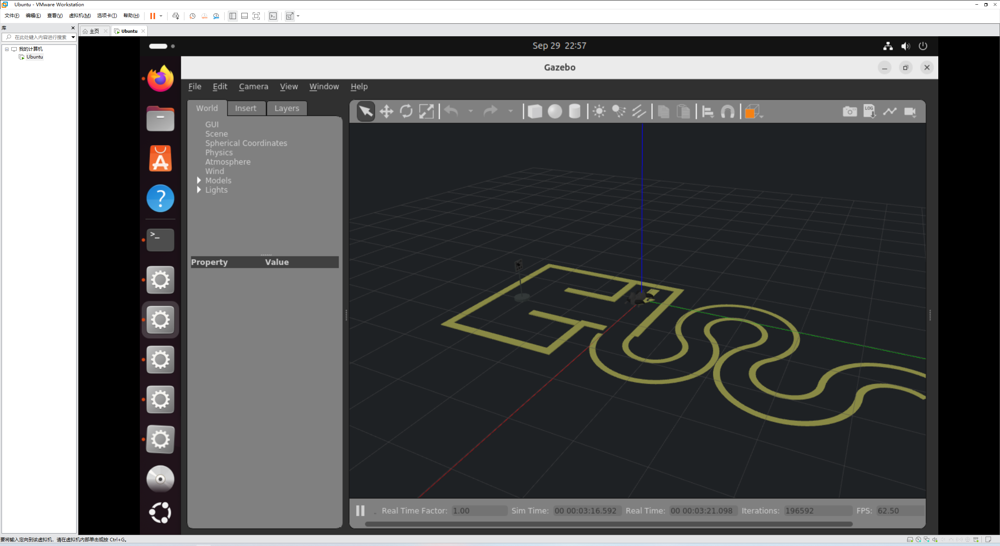
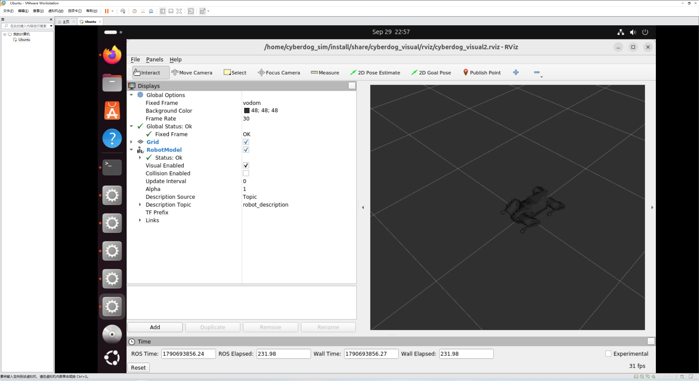

# Level 1：准备 Ubuntu 环境与 Docker 基础 实施报告

### 验证标准与提交截图：

提交 `lsb_release -a` 与 `docker --version` 的终端运行截图。


## 💻 部署选择：为什么最后用了虚拟机？
任务书给出了双系统、虚拟机和 WSL2 三个选项，也特别提醒了“虚拟机在开发上有局限性”。

结合我自己的实际需求，我的核心诉求就是：**不折腾主机，不求极致性能，只要环境能跑起来就行。**

- 一开始我其实是首选 WSL2 的，因为听说它性能好。但在配置过程中，遇到了各种玄学报错和网络问题，一度让我非常头疼。
- 双系统要分区、做启动盘，风险太大，果断放弃。
- 思来想去，还是**虚拟机（VMware Workstation）**最省心。一键安装，完全与主机隔离，出问题了直接删掉重来，绝不影响我日常使用电脑。

---

## 🛠️ 动手操作过程!

### 1. 安装 VMware Workstation!     
准备安装时发现，VMware 官网现在虽然对个人免费，但注册账号和登录的过程一直连不上服务器，非常耽误时间。
所以我直接采用了备选方案，通过国内网盘下载了 **VMware Workstation Pro v17.6.4 官方版**。下载后直接双击，一路“下一步”默认安装到 D 盘，很顺利。

### 2. 创建虚拟机与安装 Ubuntu 24.04
1. 打开 VMware，选择“创建新的虚拟机”。配置类型选择**“自定义（高级）”**。
2. 下载好 **Ubuntu 24.04 LTS (Desktop AMD64)** 的 ISO 镜像文件。
3. **分配资源**：为了保证虚拟机运行流畅，在自定义硬件里分配了充足的内存和处理器核心，并且勾选了“加速 3D 图形”。
4. 开启虚拟机，一路按屏幕提示完成 Ubuntu 的安装设置（语言选中文，设置好用户名和密码）。

### 3. 更换系统软件源（清华源）
刚装好的 Ubuntu 默认源下载速度太慢，所以顺手把 Ubuntu 系统软件源换成了**清华源**。
在设置 -> 关于 -> 软件和更新里，下载自选择“其他站点 -> 清华 (TUNA)”。换完之后在终端执行：
```bash
sudo apt update && sudo apt upgrade -y
```
# Level 2：导入 CyberDog 镜像与容器配置 实施报告

## 🛠️ 动手操作过程

### 1. 下载 Docker 镜像
任务书要求下载 `cyberdog_raceV2.tar`（大小约 11.0GB）。
任务书提供了百度网盘和 123 网盘两个线路，我实际使用的是**百度网盘**。虽然百度网盘非会员下载 11GB 文件速度非常慢，但考虑到网络稳定性，还是硬等了下来。下载完成后，把文件存放在 Windows 本地。

### 2. 导入 Docker 镜像
**文件传输踩坑（重要）**：为了让 Ubuntu 能读取文件，我首先尝试了 VMware 的“共享文件夹”功能。但在终端里执行 `cd /mnt/hgfs/...` 时，系统一直报错 `No such file or directory`。尝试安装 `open-vm-tools` 时又因为打字错漏（`insatll`）和历史遗留的源报错，浪费了不少时间。
为了不继续折腾环境配置，我直接改用**物理硬盘（U盘/移动硬盘）**，将 11GB 的文件从 Windows 拷贝到了 Ubuntu 系统的 `~/Downloads` 目录下。物理传输虽然原始，但对于大文件来说绝对稳妥。

文件拷进去后，打开终端，进入所在目录执行导入：
```bash
cd ~/Downloads
sudo docker load -i cyberdog_raceV2.tar
```
(⚠️ 重点经验：敲下这行命令并输入密码后，终端会没有任何输出，就像死机了一样。这是 11GB 文件解压写入的正常过程，千万不要按 Ctrl+C。耐心等待十几分钟后，终端才会显示 Loaded image: cyberdog_sim:v2。)

导入完成后，检查镜像是否成功存在：
```bash
sudo docker image
```
3. 授权 X Server
为了让容器内的 Gazebo 图形界面能直接显示在 Ubuntu 桌面上，需要在宿主机终端先授权 X Server：
```bash
xhost +
```

4. 运行 Docker 容器
授权完成后，运行容器。常规的 sudo docker run -it cyberdog_sim:v2 因为没有配置图形映射，大概率会黑屏报错。
因此，我使用了包含权限和显示映射的命令：
```bash
sudo docker run -it --shm-size="1g" --privileged=true -e DISPLAY=$DISPLAY -v /tmp/.X11-unix:/tmp/.X11-unix cyberdog_sim:v2
```
看到 access control disabled, clients can connect from any host 的提示，代表授权成功。

### 验证标准与提交截图：

1. 执行 `sudo docker images` 成功显示 `cyberdog_sim:v2026` 镜像的截图；

2. 成功运行 `docker run` 进入容器内部终端的截图。

# Level 3：运行 Gazebo + RViz2 仿真程序 实施报告

## 🛠️ 动手操作过程

### 1. 一键启动仿真环境
在上一步 Level 2 中，我尝试直接运行 `ros2 launch` 命令时报错找不到 `cyberdog_gazebo` 包。查阅任务书后发现，提供了一个**一键启动脚本**，完美绕过了手动配置繁琐环境变量的坑。

进入 Docker 容器内部，执行任务书给出的命令：
```bash
cd /home/cyberdog_sim
python3 src/cyberdog_simulator/cyberdog_gazebo/script/launchsim.py
```

### 验证标准与提交内容：

提交 Gazebo 和 RViz2 窗口成功弹出的全屏截图。

# Level 4：添加传感器配置 实施报告

## 🛠️ 动手操作过程

### 1. 定位并提取配置文件
根据任务书提示，需要给机器狗模型挂载相机传感器，这需要修改仿真环境中的机器人描述文件 `gazebo.xacro`。
首先在 Docker 容器内使用 `find` 命令搜索目标文件所在位置：
```bash
find / -name "gazebo.xacro" 2>/dev/null
```
由于虚拟机同时运行 3D 仿真，容器内直接编辑文件非常卡顿。为了操作流畅，我决定将文件“提取”到 Ubuntu 桌面，用系统自带的文本编辑器进行修改：
```bash
sudo docker cp b4912dcb7f9a:/home/cyberdog_sim/src/cyberdog_simulator/cyberdog_robot/cyberdog_description/xacro/gazebo.xacro ~/Desktop/
```
2. 添加相机配置
在 Ubuntu 桌面双击打开 gazebo.xacro 文件，搜索找到 RGB_camera_link 挂载点，将任务书提供的相机传感器 XML 配置粘贴进去：
<gazebo reference="RGB_camera_link">
  <sensor name="race_rgb_camera" type="camera">
    <!-- 相机一直工作 -->
    <always_on>true</always_on>
    
    <!-- 30 FPS -->
    <update_rate>30</update_rate>
    
    <!-- 在 Gazebo 中显示相机视锥 -->
    <visualize>true</visualize>
    
    <!-- 相对于 RGB_camera_link 的位姿 -->
    <pose>0 0 0 0 0 0</pose>
    
    <!-- 相机本身参数 -->
    <camera>
      <!-- 水平视场角， 1.047rad ≈ 60° -->
      <horizontal_fov>1.047</horizontal_fov>
      
      <image>
        <width>640</width>
        <height>480</height>
        <format>R8G8B8</format>
      </image>
      
      <clip>
        <near>0.05</near>
        <far>10.0</far>
      </clip>
    </camera>
  </sensor>
</gazebo>

(⚠️ 排坑记录：修改完毕后必须按 Ctrl+S 保存，关掉编辑器。)

3. 覆盖回容器并重启仿真
保存修改后，将文件塞回容器内的 src 和 install 两个路径：
```bash
sudo docker cp ~/Desktop/gazebo.xacro b4912dcb7f9a:/home/cyberdog_sim/src/cyberdog_simulator/cyberdog_robot/cyberdog_description/xacro/gazebo.xacro
sudo docker cp ~/Desktop/gazebo.xacro b4912dcb7f9a:/home/cyberdog_sim/install/share/cyberdog_description/xacro/gazebo.xacro
```
(⚠️ 排坑记录：由于之前终止过仿真，容器可能处于停止状态。需要先执行 sudo docker start b4912dcb7f9a，然后再带图形映射参数进入容器：sudo docker exec -it -e DISPLAY=$DISPLAY -e QT_X11_NO_MITSHM=1 b4912dcb7f9a /bin/bash)
进入容器后，重新运行启动脚本：
```bash
cd /home/cyberdog_sim
python3 src/cyberdog_simulator/cyberdog_gazebo/script/launchsim.py
```
重启后，Gazebo 界面中可以看到机器狗模型上多出了相机视锥。
4. 终端话题验证
新开一个 Ubuntu 终端，再次进入容器，执行 ros2 topic list | grep -E "camera|rgb|image" 时，报错 bash: ros2: command not found。
(⚠️ 排坑记录：这是因为新进入的终端没有自动加载 ROS 2 环境变量。解决办法是先执行 source /opt/ros/galactic/setup.bash，然后再查询话题，成功找到了相机相关的话题输出。)

### 验证标准与提交内容：

运行仿真后，在 Gazebo 中成功显示相机蓝色视锥，且能够查看到相机话题输出的终端截图。

# Level 5：启动运动控制管理服务 实施报告

## 🛠️ 我做了什么
按照任务书，我新开了一个终端进 Docker，加载了 `cyberdog_ws` 的环境，敲下了：
```bash
`ros2 run motion_manager motion_manager`
```
节点是成功起来了，终端里能看到一大片 `[INFO]` 日志，有 `Running on...` 和 `Get Feedback`，说明核心程序至少跑起来了。

## ❌ 没跑通的原因（全是踩过的坑）
1. **文件传得想吐**：最开始下那11G的镜像包（百度网盘慢得像蜗牛），然后怎么把文件从Windows弄进Ubuntu虚拟机，又折腾了半天。共享文件夹怎么都挂不上，一直报错，最后是老老实实拿物理硬盘拷进去的。
2. **键盘卡成PPT**：跑3D仿真的时候，虚拟机被彻底榨干了，键盘输入延迟极高，连密码都打不进去。最后全靠“在Windows记事本里打字 -> 去虚拟机里点鼠标右键粘贴”这种歪招才把命令敲完。
3. **底层硬件报错**：服务虽然起来了，但底层一直报 `[CAN_TX] Failed to set CAN socket name via ioctl()`。虚拟机里根本没有真实的 `can0` 总线，程序找不到硬件接口。我试着建了个虚拟的 `vcan0` 改名成 `can0`，但折腾到最后也没彻底解决。

## 🚀 后面怎么改
1. **换环境**：虚拟机底层对硬件接口的限制太多，准备彻底换到 WSL2 或者物理机，直接调硬件，不再受虚拟网卡的气。
2. **调性能**：跑服务前，先加上 `export LIBGL_ALWAYS_SOFTWARE=1` 用软件渲染，把算力让给通信。

### 验证标准与提交内容：

提交 `motion_manager` 节点成功启动并持续打印 `[INFO]` 日志的终端截图。![motion_manager` 节点成功启动并持续打印 `[INFO]` 日志的终端截图.png](results/Level5/motion_manager%60%20%E8%8A%82%E7%82%B9%E6%88%90%E5%8A%9F%E5%90%AF%E5%8A%A8%E5%B9%B6%E6%8C%81%E7%BB%AD%E6%89%93%E5%8D%B0%20%60%5BINFO%5D%60%20%E6%97%A5%E5%BF%97%E7%9A%84%E7%BB%88%E7%AB%AF%E6%88%AA%E5%9B%BE.png)

# Level 6：Motion 测试流程 实施报告

## 🛠️ 我做了什么
又开了个终端进容器，加载环境后，准备发激活状态机的指令：
```bash
`ros2 service call /motion_manager/machine_service protocol/srv/FsMachine "target_state: 'Active'"`
```

## ❌ 没跑通的原因（全是踩过的坑）
1. **卡在 waiting 让人崩溃**：指令一敲回车，直接卡死在 `waiting for service to become available...`，一点反应都没有。
2. **节点“失联”**：我用 `ros2 node list` 查了，节点明明还在（能看到 `/motion_manager`），但服务请求就是发不过去。查了半天，大概是因为虚拟机同时跑 Gazebo 和 RViz2，资源被榨干了，导致 ROS 2 底层通信的心跳包超时，双方听不到对方，直接死锁了。
3. **强制回环也失败**：试了 `export ROS_LOCALHOST_ONLY=1` 想强制走本地回环，结果报 `lo is not multicast-capable: disabling multicast`（环回接口不支持多播），直接又卡死了。
4. **重启也没用**：连 `ros2 daemon stop && ros2 daemon start` 都试了，但系统资源已经枯竭，网卡排队堵死，重启也救不回来。

## 🚀 后面怎么改
1. **彻底换环境**：这次最大的教训就是虚拟机算力不够，网络太脆弱。准备直接上 WSL2（不用走虚拟网卡）或者物理机，跑 ROS 2 通信绝对不会再卡 waiting。
2. **按顺序补录**：环境弄好后，就按文档里写的顺序——先发激活 `Active`，等回应后再发站起 `111`，最后发慢走 `303`，顺畅跑一遍，直接录个视频交差。
3. **精简运行**：跑控制逻辑的时候，先关掉 RViz2 省点资源，优先保证通信顺畅。
