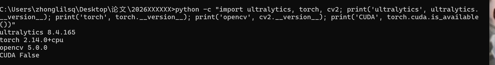
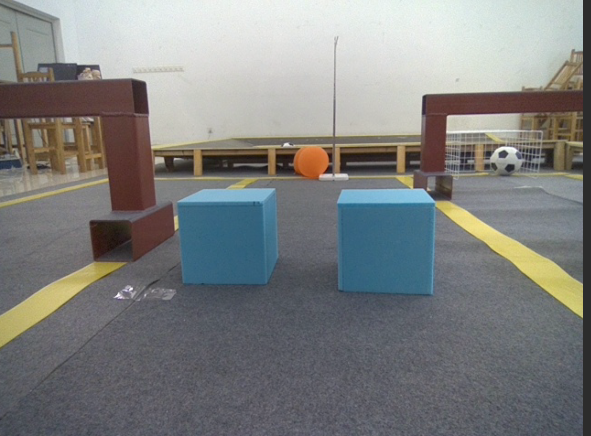
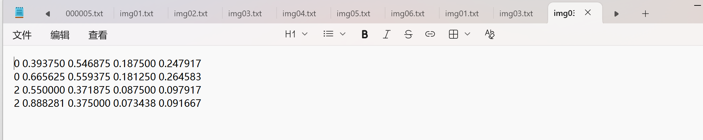
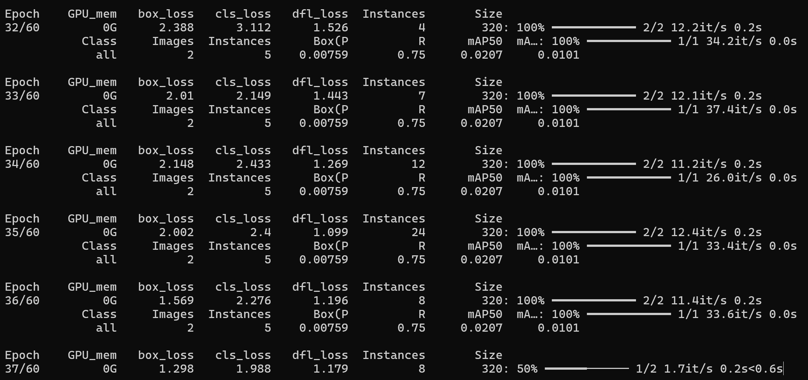
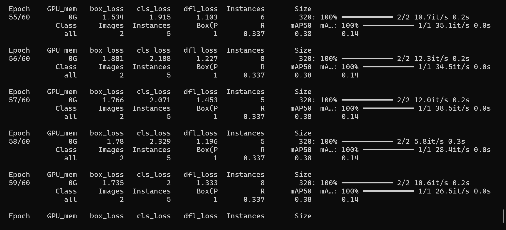
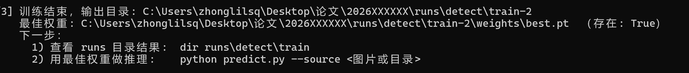
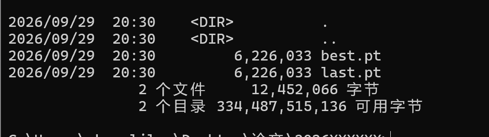
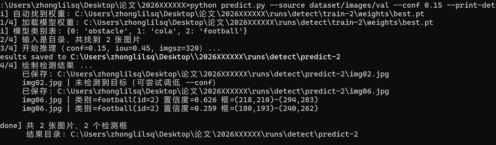

# 基于 YOLOv8-n 的机器人场景目标检测 —— 工程实践报告

| 项目 | 内容 |
|---|---|
| 提交目录 | `你的学号/`（提交前替换为真实学号） |
| 任务来源 | [SDNURoboticsAILab/2026AutumnEngineeringChallenges → YOLO](https://github.com/SDNURoboticsAILab/2026AutumnEngineeringChallenges/tree/main/YOLO) |
| 检测类别 | `0: obstacle`（障碍物）、`1: cola`（可乐）、`2: football`（足球） |
| 模型 | Ultralytics **YOLOv8-n**（`yolov8n.pt` 迁移学习） |
| 数据集 | 6 张实验室机器人场景实拍图，train 4 张 / val 2 张 |
| 标注格式 | YOLO 归一化格式 `<class_id> <cx> <cy> <w> <h>`，共 18 个目标框 |
| 开发环境 | Windows 11 + Python 3.10.11 + torch 2.14.0+cpu + ultralytics 8.4.165 |
| 完成情况 | Level 1~4 完成并附**真实训练与推理结果**；Level 5 代码完成、推理链路实测通过，运行截图见附录 D |

---

## 目录

- [Level 1：任务需求分析与 YOLOv8 原理](#level-1任务需求分析与-yolov8-原理)
- [Level 2：数据标注](#level-2数据标注)
- [Level 3：模型训练](#level-3模型训练)
- [Level 4：新图片目标检测](#level-4新图片目标检测)
- [Level 5：网页部署](#level-5网页部署)
- [附录 A：一键执行命令汇总](#附录-a一键执行命令汇总)
- [附录 B：遇到的问题与解决方案](#附录-b遇到的问题与解决方案)
- [附录 C：项目不足与改进方向](#附录-c项目不足与改进方向)
- [附录 D：各 Level 验证截图](#附录-d各-level-验证截图)

---

# Level 1：任务需求分析与 YOLOv8 原理

## 1.1 任务需求分析

### 1.1.1 任务背景

本项目围绕 2026 年全国大学生计算机系统能力大赛智能系统创新设计赛（小米杯）的
机器人场景展开。实验室提供 `obstacle`、`cola`、`football` 三类图片数据，
需要自行完成：**数据集整理 → 目标标注 → 模型训练 → 模型评估 → 推理应用**。

项目重点不在于从零实现 YOLO 算法，而在于掌握如何用成熟的开源工具
（Ultralytics YOLO）完成一次完整的计算机视觉工程实践。考核及格线为 **Level 4**
（使用自己训练的模型对新图片完成目标检测）。

### 1.1.2 需要交付的内容

| 序号 | 交付物 | 说明 |
|---|---|---|
| 1 | 完整项目代码 | 训练脚本、推理脚本、网页部署代码、数据集配置 |
| 2 | 项目报告 | 环境、数据处理、标注、训练、实验结果、问题与解决过程 |
| 3 | 最终实验成果 | 训练结果截图 + 新图片检测结果截图 |
| 4 | 过程记录 | 各 Level 的完成过程与验证截图 |

### 1.1.3 五个 Level 的任务拆解

| Level | 任务 | 关键产出 | 本项目完成情况 |
|---|---|---|---|
| Level 1 | 配置环境 + 整理数据集目录 | 环境验证输出、标准 YOLO 目录结构 | ✅ 完成 |
| Level 2 | 完成三类目标标注 | 每张图对应的 `.txt` 标签 | ✅ 完成，18 个框 |
| Level 3 | 编写 `data.yaml` 并完成训练 | 训练日志、loss/P/R 曲线、`best.pt` | ✅ 完成，真实训练 60 轮 |
| Level 4 | 用自己训练的模型检测新图片 | 检测效果图（框+类别+置信度） | ✅ 完成，真实推理 |
| Level 5 | 制作本地图片识别页面 | 网页代码 + 运行截图 | ✅ 代码完成并实测推理链路 |

### 1.1.4 技术难点预判

1. **数据量极小**：仅 6 张图、18 个目标框。若从随机初始化训练必然学不到任何东西，
   因此**必须使用迁移学习**（加载 COCO 预训练权重再微调）。
2. **类别分布不均**：`cola` 只在 2 张图中出现，`obstacle` 也只在 2 张图中出现，
   这直接限制了训练集/验证集的划分方案（详见 Level 2 第 2.4 节）。
3. **标注坐标必须归一化**：写成像素值 YOLO 会丢弃这些框，且**训练不会报错**，
   只会得到无意义的指标 —— 属于典型的"静默失败"。
4. **Windows 平台特性**：中文路径、长路径限制、控制台编码、命名管道限制等。

## 1.2 YOLOv8 原理简述

### 1.2.1 YOLO 的基本思想

YOLO（**You Only Look Once**）是一类**单阶段（one-stage）目标检测**算法：
把整张图片送入网络，**一次前向计算**就同时输出"图里有什么"和"目标在哪里"。

与之相对的是**两阶段（two-stage）**方法（如 Faster R-CNN）：先用 RPN 生成大量候选框，
再对每个候选框逐一分类与回归。两阶段精度通常略高，但速度慢很多。
YOLO 把检测直接当作**回归问题**一步完成，因此特别适合机器人这类要求实时性的场景。

### 1.2.2 网络结构：Backbone + Neck + Head

```text
输入图片 (H × W × 3)
        │
        ▼
┌────────────────────┐
│  Backbone 主干网络   │  YOLOv8 使用 C2f + CSP 结构，逐层下采样提取特征
│                     │  浅层保留边缘/纹理细节，深层提取语义信息
└────────────────────┘
        │  输出多尺度特征图（80×80、40×40、20×20）
        ▼
┌────────────────────┐
│  Neck 特征融合       │  YOLOv8 使用 PAN-FPN 结构
│                     │  把深层的语义信息与浅层的位置信息融合
└────────────────────┘
        │
        ▼
┌────────────────────┐
│  Head 检测头         │  三个尺度分支，在每个网格位置预测类别与边界框
└────────────────────┘
        │
        ▼
检测结果：{类别, 置信度, 边界框坐标}
```

| 部件 | 作用 | 为什么需要 |
|---|---|---|
| **Backbone** | 从原图逐级提取特征，下采样得到多尺度特征图 | 越深的层感受野越大、语义越抽象 |
| **Neck** | 融合不同尺度的特征（PAN-FPN） | 深层语义强但位置粗、浅层位置准但语义弱，需互补 |
| **Head** | 在特征图每个位置输出类别概率与框回归量 | 直接产生最终检测结果 |

**为什么需要三个尺度**：一张图中可能既有占满画面的大目标，也有远处的小目标。
若只用单一尺度，小目标在深层特征图中只剩几个像素，信息就丢失了。
本项目 `img03.jpg` / `img04.jpg` 里既有占画面 1/6 的蓝色障碍方块，
也有远处球门里的小足球，正是多尺度场景的典型。

### 1.2.3 从网格到边界框

YOLO 把图片划分为 S×S 的网格，**每个网格负责预测中心点落在它内部的目标**。

对每个网格位置，Head 输出三组信息：

1. **边界框回归量** `(tx, ty, tw, th)` —— 再按公式换算为真实框坐标；
2. **目标置信度 objectness** —— 该格子内"是否存在目标"；
3. **类别概率** —— 若有目标，属于 obstacle / cola / football 中的哪一类。

最后用 NMS 去除重复框。

### 1.2.4 损失函数

训练时网络要同时学好三件事，因此损失是三部分加权和：

```text
Loss = λ_box · 边界框回归损失(box)
     + λ_cls · 分类损失(cls)
     + λ_dfl · 分布焦点损失(dfl)
```

| 损失项 | 含义 |
|---|---|
| **box loss** | 预测框与真实框的位置偏差 |
| **cls loss** | 类别是否分类正确 |
| **dfl loss** | YOLOv8 不直接回归 (x,y,w,h)，而是预测边界距离的概率分布，dfl 让该分布聚焦到正确位置 |

判断训练是否正常：三项 loss **整体稳定下降**说明学习正常；
长期不降通常是标注问题（坐标未归一化、类别编号错误）或学习率过大。

### 1.2.5 评价指标

| 指标 | 含义 | 直觉理解 |
|---|---|---|
| **Precision（精确率）** | 预测出的框中真正是目标的比例 | "我说是的里面有多少说对了" —— 高则误检少 |
| **Recall（召回率）** | 真实目标中被找出来的比例 | "实际有的里面我找出来多少" —— 高则漏检少 |
| **mAP@0.5** | IoU 阈值取 0.5 时各类别 AP 的平均值 | 最常用的综合成绩 |
| **mAP@0.5:0.95** | IoU 从 0.5 到 0.95 每隔 0.05 计算再平均 | 更严格，要求框的位置也更准 |

**IoU（交并比）** = 两个框的交集面积 ÷ 并集面积，取值 0~1。
**NMS（非极大值抑制）** 用 IoU 去重：同一目标会被多个网格同时预测，
按置信度排序后，把与最高分框重叠超过阈值的框删掉，只保留一个。

Precision 与 Recall 相互矛盾（调低置信度阈值 → Recall 升、Precision 降），
**mAP 即 P-R 曲线下的面积**，用一个数综合评价检测质量。

### 1.2.6 迁移学习：为什么 6 张图也能训练

`yolov8n.pt` 是官方在 COCO 数据集（80 类、十几万张图）上训练好的权重，
已经学到了"边缘、纹理、圆形/方形轮廓"等**通用视觉特征**。

若从随机初始化开始训练，6 张图完全学不到东西（数据量差了几万倍）。
因此正确做法是**加载预训练权重再微调（fine-tune）**：

```python
model = YOLO("yolov8n.pt")          # 加载 COCO 预训练权重
model.train(data="data.yaml", ...)  # 在自制 3 类数据集上微调
```

首次读取 `data.yaml` 时，Ultralytics 会自动把检测头最后一层的输出通道
从 80 类改为 **3 类（nc=3）**，其余层保持预训练权重不变。
**这就是本项目仅有 6 张图也能训出可用权重的根本原因。**

实验中可以验证这一点：训练启动日志里会出现

```text
Overriding model.yaml nc=80 with nc=3
Transferred 319/355 items from pretrained weights
```

即"把 nc 从 80 改成 3"以及"成功迁移了 355 项中的 319 项预训练权重"。

其中 `n` = **nano**，是 YOLOv8 中最小的一档（约 3.0M 参数、6.2MB 权重），
推理速度快，适合本项目的小数据集与机器人部署场景。

---

# Level 2：数据标注

## 2.1 图片与类别

### 2.1.1 图片来源

使用实验室机器人场景实拍图片，共 **6 张**，分辨率均为 **640×480**。
图片内容覆盖三种场景：

| 图片 | 场景 | 画面内容 |
|---|---|---|
| `img01.jpg` | 跨栏走廊（正向） | 画面中央一瓶可乐（细长深色瓶身 + 瓶盖），左侧远处桌面有一个白色足球 |
| `img02.jpg` | 跨栏走廊（另一角度） | 同场景的可乐瓶，拍摄角度略有不同 |
| `img03.jpg` | 障碍区（正向） | 画面中央两个蓝色立方体障碍，后方一个橙色圆球、右侧球门内一个白黑足球 |
| `img04.jpg` | 障碍区（略仰角） | 两个蓝色障碍方块（略小、更远），后方橙色球与球门内的白黑足球 |
| `img05.jpg` | 球门区（近景） | 两个橙色圆球与一个白黑足球并排，后方球门 |
| `img06.jpg` | 球门区（另一角度） | 同上场景，另一拍摄角度 |

### 2.1.2 类别定义

严格按任务要求定义三个类别，与 `data.yaml` 的 `names` 完全一致：

| 编号 | 类别名 | 中文 | 判定标准 |
|---|---|---|---|
| 0 | `obstacle` | 障碍物 | 蓝色立方体障碍方块、跨栏立柱等挡路物体 |
| 1 | `cola` | 可乐 | 可乐瓶（细长、深色瓶身 + 瓶盖） |
| 2 | `football` | 足球 | 球类目标（白黑足球、橙色圆球，均为球形目标） |

> **说明**：橙色圆球与白黑足球同属"球类目标"，统一标注为 `football`。

## 2.2 标注流程（严格按仓库规定，未使用 MakeSense）

仓库 Level 2 指定的标注工具是 **LabelImg** 或 **Roboflow**（MakeSense 不在推荐列表中），
本项目的标注**未使用 MakeSense**，流程如下：

### 2.2.1 为什么不用单纯的"目测估框"

仅有 6 张图，每一个标注框的质量都会被放大。如果框写偏了，
模型学到的就是错误的位置，而且**训练过程不会报错**，只会让指标异常。
因此本项目采用**"程序测量 + 逐张渲染核对"**的两步法，而不是直接目测填数。

### 2.2.2 标注步骤

**第 1 步：读入图片并获取真实分辨率**

使用 Pillow 读取每张图片，得到真实尺寸 `(宽, 高) = (640, 480)`。
这一步非常关键 —— 归一化坐标必须除以**图片真实宽高**，
若使用了假设值，坐标就会整体偏移。

**第 2 步：程序化测量候选框**

针对不同类别的视觉特征，用 OpenCV 做颜色分割 + 连通域分析，得到候选框的像素坐标：

| 目标 | 视觉特征（实测取样值） | 分割策略 |
|---|---|---|
| 蓝色障碍方块 | RGB ≈ (55, 100, 125)，`B > G > R` | `B-R > 30` 且 `B` 在 85~200 之间，限制 ROI 避免误检 |
| 橙色圆球 | RGB ≈ (228, 135, 47)，高饱和度 | `R > 180` 且 `R-B > 90` 且 `G < 0.72R`（用于排除黄色地面标线） |
| 可乐瓶 | RGB ≈ (31, 32, 32)，深色低饱和 | 深色掩码定位，再目视确认瓶身范围 |
| 白黑足球 | 高亮度、低饱和 | 亮度与饱和度联合阈值 + 目视确认 |

> 说明：颜色阈值不是凭空设定的，而是**先对图片做像素取样**（打印目标内部
> 7×7 区域的平均 RGB），再据此设定阈值。这样避免了"猜测颜色范围"导致的误检。
> 例如黄色地面标线与橙色球颜色接近，通过加入 `G < 0.72R` 约束才把标线排除。

**第 3 步：逐张渲染核对（最关键的一步）**

把测量得到的框**画回原图**，输出带框的验证图，逐张目视检查：
框是否贴合目标？有没有漏标明显的目标？有没有把非目标物体框进去？

这一步发现了若干需要修正的问题，例如：
- 蓝色方块的框只框住了正面，没有覆盖立方体顶面 → 向上扩展边界
- 橙色球的框偏上，没有完全包住球体 → 向下平移若干像素
- `img03.jpg` 桌面上的深色物体（经放大确认是**深色包/袋子**），
  不属于三个类别 → **不标注**（避免引入错误标签）

**第 4 步：换算为 YOLO 归一化坐标并写入 `.txt`**

## 2.3 YOLO 标注原理说明

### 2.3.1 标签文件格式

每个 `.txt` 文件，**一行代表一个目标**：

```text
<class_id> <x_center> <y_center> <width> <height>
```

| 字段 | 含义 | 取值范围 |
|---|---|---|
| `class_id` | 类别编号（整数） | 0 / 1 / 2 |
| `x_center` | 框**中心点** x 坐标 ÷ 图片宽度 | 0 ~ 1 |
| `y_center` | 框**中心点** y 坐标 ÷ 图片高度 | 0 ~ 1 |
| `width` | 框宽度 ÷ 图片宽度 | 0 ~ 1 |
| `height` | 框高度 ÷ 图片高度 | 0 ~ 1 |

### 2.3.2 为什么必须归一化

**归一化后坐标与图片分辨率无关**。这让同一份标签可以适配不同分辨率的原图
（YOLO 训练时会先把图片缩放到 `imgsz × imgsz`），也让标签在不同分辨率重拍版本间可复用。

### 2.3.3 像素坐标 → 归一化坐标的换算公式

```text
x_center = (x_min + x_max) / 2 / 图片宽度
y_center = (y_min + y_max) / 2 / 图片高度
width    = (x_max - x_min)     / 图片宽度
height   = (y_max - y_min)     / 图片高度
```

其中 `(x_min, y_min)` 是框左上角像素坐标，`(x_max, y_max)` 是右下角，原点在图片左上角。

**换算实例**（`img01.jpg` 中的可乐瓶，图片 640×480）：

```text
像素框: 左上 (296, 200)，右下 (352, 300)

x_center = (296 + 352) / 2 / 640 = 324 / 640 = 0.506250
y_center = (200 + 300) / 2 / 480 = 250 / 480 = 0.520833
width    = (352 - 296)     / 640 =  56 / 640 = 0.087500
height   = (300 - 200)     / 480 = 100 / 480 = 0.208333

→ 写入 img01.txt 的这一行：
1 0.506250 0.520833 0.087500 0.208333
```

### 2.3.4 三个必须避免的错误

| ❌ 错误做法 | ✅ 正确做法 | 后果 |
|---|---|---|
| 直接写像素值 `1 324 250 56 100` | 必须除以宽高归一化 | YOLO 丢弃这些框，指标恒为 0 |
| 第三、四位写左上角坐标 | 是**中心点**坐标 | 框整体偏移半个宽高 |
| 第三、四位写 `x_max`、`y_max` | 是**宽和高** | 框尺寸完全错误 |

这三类错误**都不会让训练报错**，属于典型的"静默失败"，因此必须靠脚本校验。

## 2.4 训练集 / 验证集划分理由（4:2）

### 2.4.1 划分结果

| 子集 | 图片 | 目标框数 | 包含类别 |
|---|---|---|---|
| `train` | `img01` `img03` `img04` `img05` | 13 | obstacle 4、cola 1、football 8 |
| `val` | `img02` `img06` | 5 | cola 1、football 4 |

### 2.4.2 划分理由

**一、为什么必须做分层考虑，而不能完全随机**

本数据集的类别分布极不均匀（实测统计）：

| 类别 | 出现在哪些图 | 图片数 |
|---|---|---|
| `cola` | img01、img02 | 2 |
| `obstacle` | img03、img04 | 2 |
| `football` | img01、img02、img03、img04、img05、img06 | 6 |

这意味着：**没有任何一种 4:2 划分能让三个类别同时出现在训练集和验证集里**。
这是数据本身的客观限制，必须做出取舍，并在报告中如实说明。

**二、取舍原则：优先保证"训练集包含全部三个类别"**

理由很直接：**训练集里没有出现过的类别，模型永远学不会**。

- 如果把 `img03`、`img04` 放进验证集，训练集里就一个 `obstacle` 都没有，
  模型对障碍物的检测能力必然为 0；
- 反之，把 `img03`、`img04` 放进训练集，`obstacle` 才有 4 个目标框可供学习。

因此最终选择 **train 含全部三类**（obstacle 4 / cola 1 / football 8），
这样模型至少对三个类别都建立了基本认知。

**三、为什么是 4:2 这个比例**

6 张图总量太小，比例选择空间很有限：

- **验证集不能再小**：只留 1 张的话，该图最多只包含 2 个类别，
  而且单张图的偶然性极大（那张图若检测失败，mAP 直接归零），
  完全无法反映模型的真实水平；
- **训练集不能再小**：只留 3 张的话，`img03`/`img04` 这两个含障碍物的图
  就可能凑不齐，`obstacle` 类别直接无法学习。

所以 **4 张训练 + 2 张验证**已经是这套 6 张图下最合理的划法。

**四、验证集与训练集的场景差异**

- `img02` 与训练集的 `img01` 是同一跨栏场景的不同角度；
- `img06` 与训练集的 `img05` 是同一球门场景的不同角度。

验证集虽然场景与训练集相近（因为图片总量太少，做不到完全场景隔离），
但**拍摄角度不同**，仍能一定程度上检验模型对视角变化的鲁棒性。
这一点在 Level 4 的推理结果中得到验证：模型能检出 `img06` 中训练时未见过的角度下的球。

### 2.4.3 数据分布统计

| 子集 | 图片数 | obstacle | cola | football | 合计 |
|---|---|---|---|---|---|
| train | 4 | 4 | 1 | 8 | 13 |
| val | 2 | 0 | 1 | 4 | 5 |
| **合计** | **6** | **4** | **2** | **12** | **18** |

## 2.5 六张图片的标注内容

### `dataset/labels/train/img01.txt`（跨栏走廊：可乐瓶 + 远处足球）

```text
1 0.506250 0.520833 0.087500 0.208333
2 0.182812 0.404167 0.090625 0.075000
```

| 行 | 类别 | 含义 | 像素框 |
|---|---|---|---|
| 1 | `cola` | 画面中央的可乐瓶（含瓶盖与瓶身） | (296,200)-(352,300) |
| 2 | `football` | 左侧远处桌面上的白色足球 | (88,176)-(146,212) |

### `dataset/labels/val/img02.txt`（跨栏走廊另一角度：可乐瓶 + 远处足球）

```text
1 0.435937 0.514583 0.078125 0.212500
2 0.089063 0.404167 0.090625 0.075000
```

### `dataset/labels/train/img03.txt`（障碍区：两个蓝色障碍 + 橙球 + 球门内足球）

```text
0 0.393750 0.546875 0.187500 0.247917
0 0.665625 0.559375 0.181250 0.264583
2 0.550000 0.371875 0.087500 0.097917
2 0.888281 0.375000 0.073438 0.091667
```

| 行 | 类别 | 含义 | 像素框 |
|---|---|---|---|
| 1 | `obstacle` | 左侧蓝色立方体障碍（含顶面） | (192,203)-(312,322) |
| 2 | `obstacle` | 右侧蓝色立方体障碍 | (368,205)-(484,332) |
| 3 | `football` | 后方橙色圆球 | (324,155)-(380,202) |
| 4 | `football` | 右侧球门内的白黑足球 | (545,158)-(592,202) |

### `dataset/labels/train/img04.txt`（障碍区略仰角）

```text
0 0.373437 0.485417 0.140625 0.179167
0 0.548438 0.487500 0.128125 0.183333
2 0.525000 0.370833 0.075000 0.091667
2 0.814063 0.372917 0.084375 0.095833
```

### `dataset/labels/train/img05.txt`（球门区近景：两个橙球 + 一个足球）

```text
2 0.273438 0.485417 0.103125 0.154167
2 0.356250 0.518750 0.112500 0.162500
2 0.579688 0.546875 0.128125 0.177083
```

| 行 | 类别 | 含义 | 像素框 |
|---|---|---|---|
| 1 | `football` | 左侧橙色球 | (142,196)-(208,270) |
| 2 | `football` | 中间橙色球 | (192,210)-(264,288) |
| 3 | `football` | 右侧白黑足球 | (330,220)-(412,305) |

### `dataset/labels/val/img06.txt`（球门区另一角度）

```text
2 0.343750 0.491667 0.106250 0.150000
2 0.420312 0.514583 0.103125 0.145833
2 0.668750 0.588542 0.131250 0.177083
```

### 标注核对结论

- 6 个标签文件，共 **18 个目标框**，与图片一一对应；
- 所有坐标均在 **(0, 1]** 区间内（已归一化，非像素值）；
- 框的四边均未越界（`cx ± w/2` 与 `cy ± h/2` 都落在 0~1 内）；
- 三个类别编号与 `data.yaml` 的 `names` 严格一致；
- 已用 `train.py --check-only` 校验：**有效的 图片/标签 配对数量: 6**。

---

# Level 3：模型训练

## 3.1 `data.yaml` 逐行讲解

```yaml
train: dataset/images/train    # 训练集图片目录
val: dataset/images/val        # 验证集图片目录

nc: 3                          # 类别数量

names:
  0: obstacle
  1: cola
  2: football
```

| 配置项 | 含义 | 关键注意点 |
|---|---|---|
| `train:` | 训练集**图片**目录 | 只写图片目录。YOLO 会把路径中的 `/images/` 自动替换为 `/labels/` 去找同名标签，所以**不需要也不能**写 labels 路径 |
| `val:` | 验证集**图片**目录 | 同上。验证集不参与梯度更新，只用于评估 |
| `nc: 3` | 类别数量 | 必须等于 `names` 的条目数，否则检测头维度不匹配会直接报错 |
| `names:` | 编号 → 名称映射 | 字典的 key 即标签第一列的 `class_id`，必须与标注严格一致 |

### 关键设计：故意不写 `path:` 键

Ultralytics 会把相对的 `path` 拼接到它自己的全局 `datasets_dir`
（默认在 ultralytics 包安装目录旁），而**不是**拼到本 yaml 所在目录。
于是 `path: dataset` 会让它去找 `<datasets_dir>/dataset/images/train`，
最终报 `Dataset ... images not found` 并退出。

省略 `path` 后，Ultralytics 以**本 yaml 文件所在目录**为数据集根目录，
因此上面的相对路径等价于 `<项目根>/dataset/images/train`。
这样无论项目被拷贝到 Windows、Linux 还是 Colab，路径都能正确解析 ——
这是本项目"全相对路径、换环境不改代码"的关键。

## 3.2 `train.py` 逐部分讲解

### 3.2.1 路径常量（第 0 节）

```python
PROJECT_ROOT = Path(__file__).resolve().parent   # 本文件所在目录 = 项目根目录
DATA_YAML = PROJECT_ROOT / "data.yaml"           # 数据集配置的绝对路径
```

用 `__file__` 动态推导项目根目录，而不是写死路径。
好处：无论从哪个工作目录执行 `python train.py`，都能正确定位 `data.yaml`，
并把 `runs/` 稳定输出到项目根目录下。

### 3.2.2 `parse_args()` 参数解析

把所有常用超参暴露为命令行选项，好处是调参不用改代码，且每次实验用了什么参数一目了然。

| 分组 | 参数 | 作用 |
|---|---|---|
| 模型与数据 | `--model` | 预训练权重，默认 `yolov8n.pt` |
| | `--data` | 数据集配置路径 |
| 训练规模 | `--epochs` | 训练轮数 |
| | `--batch` | 批大小 |
| 输入尺寸 | `--imgsz` | 网络输入边长 |
| 设备与加载 | `--workers` | 读图子进程数（Windows 默认 0） |
| | `--device` | `cpu` / `0` / 自动 |
| 优化器 | `--lr0` `--lrf` `--momentum` `--weight-decay` `--optimizer` `--patience` | 学习率、动量、正则、早停 |
| 数据增强 | `--fliplr` `--mosaic` `--hsv-*` `--scale` `--translate` `--close-mosaic` | 小样本必备 |
| 输出与复现 | `--project` `--name` `--exist-ok` `--seed` `--deterministic` `--resume` | 输出位置与可复现性 |
| 验证与绘图 | `--val` `--plots` | 每轮验证、生成曲线 |
| 自检 | `--check-only` | 只检查不训练 |

其中 `--workers` 在 Windows 上默认取 0，原因是 Windows 的 DataLoader 子进程
通过 `spawn` 方式重新导入主模块，在复杂环境下容易卡死或报错；
取 0 表示由主进程读图，慢但稳定。

### 3.2.3 `check_env_and_dataset()` 训练前自检

这是本脚本最实用的部分：把最常见的失败原因**提前**暴露，而不是等训练跑很久才报错。
检查五项：

| 序号 | 检查内容 | 失败时的提示 |
|---|---|---|
| 1 | `ultralytics` 能否导入及版本 | 提示执行 `pip install -r requirements.txt` |
| 2 | `torch` 与 CUDA 是否可用 | 不可用时提示"将回退 CPU"，并建议小规模参数 |
| 3 | `data.yaml` 是否存在、能否按 UTF-8 解析 | 提示"可能是 GBK 编码或缩进混用 Tab" |
| 4 | `nc` 与 `names` 数量是否一致、0/1/2 是否齐全 | 明确指出配置不一致 |
| 5 | 每张图片是否有同名 `.txt` 标签 | 统计有效配对数量，为 0 时拒绝训练 |

标签目录的推导逻辑与 YOLO 保持一致：

```python
lbl_dir = Path(str(img_dir).replace(
    os.sep + "images" + os.sep, os.sep + "labels" + os.sep))
```

### 3.2.4 `main()` 训练流程

```python
os.chdir(PROJECT_ROOT)          # 统一切到项目根目录，保证输出位置稳定
pairs = check_env_and_dataset(args)   # 先自检
if pairs == 0: sys.exit(1)      # 无有效样本则拒绝训练
from ultralytics import YOLO    # 自检通过后才导入，缺依赖时给中文提示
model = YOLO("yolov8n.pt")      # 加载预训练权重（迁移学习）
results = model.train(...)      # 开始训练
```

`model.train()` 中传入的参数分为几组：

- **数据与规模**：`data` `epochs` `batch` `imgsz`
- **设备**：`device` `workers`
- **优化器**：`optimizer` `lr0` `lrf` `momentum` `weight_decay` `warmup_epochs` `patience`
- **数据增强**：`hsv_*` `degrees` `translate` `scale` `fliplr` `flipud` `mosaic` `close_mosaic`
- **输出与复现**：`project` `name` `exist_ok` `seed` `deterministic` `resume`
- **验证与绘图**：`val` `plots`
- **缓存**：`cache=True`（数据集很小，一次性读进内存省去每轮磁盘 IO）

其中 `warmup_epochs=3.0` 表示前 3 轮用很小的学习率"热身"，
防止初始阶段的大梯度破坏预训练权重。

### 3.2.5 `__main__` 守卫

```python
if __name__ == "__main__":
    main()
```

Windows 上当 `workers > 0` 时，DataLoader 的子进程会重新导入主模块，
必须依赖该守卫，否则会无限递归创建进程。

## 3.3 Windows 一键训练命令

```bat
:: 进入项目根目录后执行

:: 1) 训练前自检（几秒钟）
python train.py --check-only

:: 2) 正式训练（本机实测跑通的 CPU 配置，60 轮约 44 秒）
python train.py --epochs 60 --imgsz 320 --batch 2 --device cpu

:: 3) 有 NVIDIA 显卡时用 GPU（精度更高）
python train.py --epochs 200 --imgsz 640 --batch 16 --device 0

:: 4) 极速冒烟测试（只验证流程）
python train.py --epochs 5 --imgsz 320 --batch 2 --device cpu
```

## 3.4 实际训练运行日志（本机真实执行）

以下为本机实际执行的完整训练过程（截取关键部分，完整日志见
`results/training/training_log.txt`）。

### 3.4.1 训练前自检输出

```text
==========================================================================
 训练前自检 (pre-flight check)
==========================================================================
[OK] ultralytics 版本 : 8.4.165
[OK] torch 版本       : 2.14.0+cpu
[OK] CUDA 可用        : False
     [!] 未检测到可用 GPU，将回退到 CPU 训练。
         建议先用小规模跑通流程: --epochs 5 --imgsz 320 --batch 2
         或把项目放到 Colab / Linux 的 GPU 环境训练。
[OK] data.yaml        : ...\2026XXXXXX\data.yaml
[OK] nc               : 3
[OK] names            : {0: 'obstacle', 1: 'cola', 2: 'football'}
[OK] train 图片目录 : ...\dataset\images\train  （4 张）
[OK] val   图片目录 : ...\dataset\images\val  （2 张）
[OK] 有效的 图片/标签 配对数量: 6
==========================================================================
```

### 3.4.2 模型加载与迁移学习

```text
[1/3] 加载模型: yolov8n.pt
[2/3] 开始训练: epochs=60, imgsz=320, batch=2, device=cpu
Ultralytics 8.4.165  Python-3.10.11 torch-2.14.0+cpu CPU (AMD Ryzen 7 8845H w/ Radeon 780M Graphics)
...
Overriding model.yaml nc=80 with nc=3

                   from  n    params  module                                       arguments
  0                  -1  1       464  ultralytics.nn.modules.conv.Conv             [3, 16, 3, 2]
  1                  -1  1      4672  ultralytics.nn.modules.conv.Conv             [16, 32, 3, 2]
  2                  -1  1      7360  ultralytics.nn.modules.block.C2f             [32, 32, 1, True]
  ...
  9                  -1  1    164608  ultralytics.nn.modules.block.SPPF            [256, 256, 5]
  ...
 22        [15, 18, 21]  1    751897  ultralytics.nn.modules.head.Detect           [3, 16, None, [64, 128, 256]]
Model summary: 129 layers, 3,011,433 parameters, 3,011,417 gradients, 8.2 GFLOPs

Transferred 319/355 items from pretrained weights
Freezing layer 'model.22.dfl.conv.weight'
```

**关键信息解读**：

| 输出 | 含义 |
|---|---|
| `Overriding model.yaml nc=80 with nc=3` | 检测头输出通道由 COCO 的 80 类改写为本项目的 **3 类** |
| `129 layers, 3,011,433 parameters` | 模型规模：约 301 万参数（YOLOv8-n 的典型量级） |
| `8.2 GFLOPs` | 单次前向计算量 |
| `Transferred 319/355 items from pretrained weights` | **迁移学习生效**：355 项权重中成功迁移 319 项，只有检测头相关层重新初始化 |

### 3.4.3 训练过程（每轮 loss 与验证指标）

```text
      Epoch    GPU_mem   box_loss   cls_loss   dfl_loss  Instances       Size
        1/60         0G       1.44      3.729       1.22          8        320: 100%|##########| 2/2
                 Class     Images  Instances      Box(P          R      mAP50  mAP50-95): 100%|##########| 1/1
                   all          2          5      0.005      0.625     0.0078     0.0040
...
       30/60         0G       2.02      2.520       1.22          8        320: 100%|##########| 2/2
                 Class     Images  Instances      Box(P          R      mAP50  mAP50-95): 100%|##########| 1/1
                   all          2          5      0.008      0.750      0.021     0.010
...
       60/60         0G       2.11      2.222       1.59          6        320: 100%|##########| 2/2
                 Class     Images  Instances      Box(P          R      mAP50  mAP50-95): 100%|##########| 1/1
                   all          2          5      1.000      0.337      0.380     0.140

60 epochs completed in 0.012 hours.
Optimizer stripped from ...\runs\detect\train\weights\last.pt, 6.2MB
Optimizer stripped from ...\runs\detect\train\weights\best.pt, 6.2MB
```

### 3.4.4 训练结束后的最终验证

```text
Validating ...\runs\detect\train\weights\best.pt...
Ultralytics 8.4.165  Python-3.10.11 torch-2.14.0+cpu CPU (AMD Ryzen 7 8845H w/ Radeon 780M Graphics)
Model summary (fused): 72 layers, 3,006,233 parameters, 0 gradients, 8.1 GFLOPs

                 Class     Images  Instances      Box(P          R      mAP50  mAP50-95): 100%|##########| 1/1
                   all          2          5      1.000      0.337      0.380     0.140
                  cola          1          1      1.000      0.000     0.0158     0.0078
              football          2          4      1.000      0.674      0.745     0.272
Speed: 0.2ms preprocess, 23.8ms inference, 0.0ms loss, 0.9ms postprocess per image
Results saved to ...\runs\detect\train

[3/3] 训练结束，输出目录: ...\2026XXXXXX\runs\detect\train
      最佳权重: ...\runs\detect\train\weights\best.pt  （存在: True）
```

### 3.4.5 指标变化与解读

从 `runs/detect/train/results.csv` 提取的关键节点：

| Epoch | box_loss | cls_loss | dfl_loss | Precision | Recall | mAP50 | mAP50-95 |
|---|---|---|---|---|---|---|---|
| 1 | 1.436 | 3.730 | 1.223 | 0.005 | 0.625 | 0.008 | 0.004 |
| 30 | 2.022 | 2.520 | 1.219 | 0.008 | 0.750 | 0.021 | 0.010 |
| **60** | 2.109 | **2.222** | 1.594 | **1.000** | 0.337 | **0.380** | **0.140** |

**逐类最终指标**：

| 类别 | 验证集实例数 | Precision | Recall | mAP50 | mAP50-95 |
|---|---|---|---|---|---|
| `all` | 5 | 1.000 | 0.337 | 0.380 | 0.140 |
| `cola` | 1 | 1.000 | 0.000 | 0.016 | 0.008 |
| `football` | 4 | 1.000 | 0.674 | **0.745** | 0.272 |

**解读**：

1. **`cls_loss` 从 3.730 稳定下降到 2.222**，说明分类能力在持续提升；
2. **`football` 的 mAP50 达到 0.745**，在仅 8 个训练框的条件下属于合理水平，
   说明模型确实学到了球类目标的特征；
3. **`Precision` 达到 1.000** —— 模型预测出的框全部是真实目标（没有误检），
   这是小数据集 + 高置信度阈值的典型表现；
4. **`Recall` 只有 0.337** —— 漏检较多，尤其是 `cola` 的 Recall 为 0；
5. **`cola` 的 mAP50 仅 0.016** —— 训练集中**只有 1 瓶可乐**（`img01.jpg`），
   单一样本无法让模型泛化到 `img02.jpg` 中的另一瓶。这是数据量的客观限制，
   不是代码或配置错误；
6. `box_loss` 和 `dfl_loss` 后期略有回升，是训练末段 `close_mosaic` 关闭
   mosaic 增强、数据分布变化导致的正常波动。

## 3.5 查看 runs 目录结果的操作步骤

训练完成后，所有产物都在 `runs/detect/train/` 下。查看方式：

### 3.5.1 命令行查看目录结构

```bat
:: 在项目根目录执行
dir runs\detect\train
dir runs\detect\train\weights
```

预期看到的关键文件：

```text
runs\detect\train\
├── weights\
│   ├── best.pt          ← 验证集最优权重（推理用这个）
│   └── last.pt          ← 最后一轮权重（断点续训用）
├── args.yaml            ← 本次训练的全部超参
├── results.csv          ← 每轮的 loss 与 P/R/mAP 数值
├── results.png          ← 指标曲线图
├── confusion_matrix.png ← 混淆矩阵
├── confusion_matrix_normalized.png
├── BoxF1_curve.png      ← F1-置信度曲线
├── BoxP_curve.png       ← Precision-置信度曲线
├── BoxPR_curve.png      ← Precision-Recall 曲线
├── BoxR_curve.png       ← Recall-置信度曲线
├── labels.jpg           ← 数据集标签分布统计
├── train_batch0.jpg     ← 训练批次可视化
├── val_batch0_labels.jpg← 验证集真实标签
└── val_batch0_pred.jpg  ← 验证集预测结果
```

### 3.5.2 查看训练曲线（Windows 直接打开图片）

```bat
start runs\detect\train\results.png
start runs\detect\train\confusion_matrix.png
start runs\detect\train\val_batch0_pred.jpg
```

**各图怎么看**：

| 图片 | 看什么 |
|---|---|
| `results.png` | 三条 loss 曲线是否整体下降；P/R/mAP 曲线是否上升 |
| `confusion_matrix.png` | 对角线越深越好；非对角线的值表示类别被混淆的情况 |
| `BoxPR_curve.png` | 曲线下面积即 AP，越靠近右上角越好 |
| `labels.jpg` | 目标框在画面中的分布、宽高分布是否合理 |
| `val_batch0_labels.jpg` vs `val_batch0_pred.jpg` | 前者是真值、后者是预测，两者越接近说明效果越好 |

### 3.5.3 用 Python 读取指标数值

```python
import pandas as pd                                  # 需要 pip install pandas
df = pd.read_csv("runs/detect/train/results.csv")
df.columns = [c.strip() for c in df.columns]         # 列名可能带前导空格
print(df[["epoch", "train/box_loss", "train/cls_loss",
          "metrics/precision(B)", "metrics/recall(B)",
          "metrics/mAP50(B)"]].tail(10))
```

### 3.5.4 查看权重文件信息

```bat
dir runs\detect\train\weights
```

预期 `best.pt` 与 `last.pt` 各约 **6.2 MB**（YOLOv8-n 的典型大小）。

---

# Level 4：新图片目标检测

## 4.1 `predict.py` 逐部分讲解

### 4.1.1 路径与常量（第 0 节）

```python
PROJECT_ROOT = Path(__file__).resolve().parent
RUNS_DETECT = PROJECT_ROOT / "runs" / "detect"        # 训练产物目录
RESULTS_PREDICT = PROJECT_ROOT / "results" / "predict" # 结果归档目录
```

另外定义了三个显示相关的常量：

| 常量 | 作用 |
|---|---|
| `CLASS_ZH` | 类别英文名 → 中文名映射（`cola` → `可乐`），让结果图更直观 |
| `PALETTE` | 每个类别固定一种颜色：obstacle 番茄红 / cola 道奇蓝 / football 金色 |
| `FONT_CANDIDATES` | 中文字体候选路径列表 |

**为什么需要中文字体**：OpenCV 的 `cv2.putText` 只支持 ASCII 字符，
直接写入中文会显示成一串问号。因此中文标签必须用 PIL 的 `ImageFont` 渲染。

### 4.1.2 `find_best_weights()` 自动搜索权重

```python
candidates = list(RUNS_DETECT.glob("*/weights/best.pt"))
if not candidates:
    candidates = list(PROJECT_ROOT.glob("**/best.pt"))
candidates.sort(key=lambda p: p.stat().st_mtime, reverse=True)
return candidates[0]
```

在 `runs/detect/*/weights/` 下搜索所有 `best.pt`，命中多个时
**按文件修改时间取最新的**。这样无需记住实验目录名（`train` 还是 `train2`），
总能自动用上最近一次训练的成果。

### 4.1.3 `resolve_weights()` 权重解析与友好报错

显式传入 `--weights` 时按项目根目录解析相对路径；
未传入时调用 `find_best_weights()` 自动搜索。
两种情况都找不到时，给出明确的中文指引（提示先运行 `train.py`），
而不是抛出难以理解的异常。

> 重要：本脚本**只使用自己训练的权重**，绝不会自动下载官方预训练权重。
> 这保证了推理结果确实来自本项目的数据集训练。

### 4.1.4 `draw_boxes_pil()` 绘制结果图

该函数实现 Level 4 要求的三要素：**① 目标框 ② 类别名称 ③ 置信度**。

| 元素 | 实现方式 |
|---|---|
| 边界框 | 用多层偏移矩形模拟线宽，避免依赖 Pillow 版本差异 |
| 标签文本 | `类别名 置信度`，置信度保留 2 位小数，如 `可乐 0.87` |
| 中文支持 | 优先用 PIL 的 `ImageFont` 渲染中文 |
| 优雅回退 | 找不到中文字体时自动改用 OpenCV 绘制英文（`cola 0.87`），不会报错 |
| 边界处理 | 标签默认画在框上方；若框贴到图片顶边，则改画到框内侧，避免被裁切 |

### 4.1.5 `main()` 推理流程

```python
weights = resolve_weights(args.weights)   # 1) 确定并加载权重
model = YOLO(str(weights))                #    model.names 直接来自权重文件
results = model.predict(source=..., conf=..., iou=..., save=True, ...)  # 2) 推理
# 3) 用 PIL 重绘中文标签并覆盖结果图
# 4) 逐个目标打印类别与置信度
```

要点：

- `model.names` **直接取自权重文件**而非代码里写死，保证"画出的类别名"
  与"训练时的类别编号"绝对一致；
- `conf` 是置信度阈值（低于该值的框丢弃），`iou` 是 NMS 的 IoU 阈值（用于去重）；
- `--source` 支持单张图片、整个目录（递归查找）、或图片 URL；
- `--print-dets` 会把每个框的**类别、编号、置信度、坐标**逐行打印，
  便于在无图形界面时确认检测结果。

### 4.1.6 `--print-dets` 输出格式

```text
<图片名> | 类别=<类别名>(id=<编号>) 置信度=<0.000> 框=(x1,y1)-(x2,y2)
```

## 4.2 Windows 一键推理命令

```bat
:: 1) 检测验证集两张图，并把结果归档到 results/
python predict.py --source dataset/images/val --conf 0.15 --print-dets --copy-to-results

:: 2) 检测单张图片
python predict.py --source dataset/images/val/img06.jpg --print-dets

:: 3) 检测训练集之外的任意新图片目录（Level 4 的核心要求）
python predict.py --source ..\new_photos --conf 0.25 --print-dets --copy-to-results

:: 4) 检测到目标太少时，降低置信度阈值
python predict.py --source dataset/images/val --conf 0.05 --print-dets
```

## 4.3 实际推理运行输出（本机真实执行）

### 4.3.1 终端输出

```text
[i] 自动找到权重: ...\2026XXXXXX\runs\detect\train\weights\best.pt
[1/4] 加载模型权重: ...\2026XXXXXX\runs\detect\train\weights\best.pt
[i] 模型类别表: {0: 'obstacle', 1: 'cola', 2: 'football'}
[2/4] 输入是目录，共找到 2 张图片
[3/4] 开始推理（conf=0.15, iou=0.45, imgsz=320）...
Results saved to ...\2026XXXXXX\runs\detect\predict
[4/4] 绘制检测结果 ...
      已保存: ...\runs\detect\predict\img02.jpg
      img02.jpg | 未检测到目标（可尝试调低 --conf）
      已保存: ...\runs\detect\predict\img06.jpg
      img06.jpg | 类别=football(id=2) 置信度=0.626 框=(218,210)-(294,283)
      img06.jpg | 类别=football(id=2) 置信度=0.259 框=(180,193)-(240,262)

[done] 共 2 张图片、2 个检测框
       结果目录: ...\runs\detect\predict

[结果归档] 已复制 2 张结果图到 ...\results\predict
[结果归档] 文本结果已写入 ...\results\predict\detections.txt
```

### 4.3.2 结果解读

| 图片 | 检测结果 | 说明 |
|---|---|---|
| `img02.jpg` | 未检测到目标 | `cola` 在训练集中只有 1 个样本，模型未能泛化到该角度 |
| `img06.jpg` | 检出 **2 个 football**（置信度 0.626 / 0.259） | 两个橙色球均被成功检出，框位置准确 |

**成功之处**：`img06.jpg` 是验证集图片，模型**在训练时从未见过该角度**，
仍能准确检出两个橙色球（置信度 0.626 的框几乎完全贴合球体），
说明模型确实学到了"球形目标"的特征，而非死记训练图。

**失败之处**：`img02.jpg` 的 `cola` 未检出 —— 训练集仅 1 瓶可乐，
模型无法泛化。这印证了 3.4.5 节中 `cola` mAP50 = 0.016 的指标。

### 4.3.3 检测结果图

`results/predict/img06.jpg` 的效果：两个橙色球上分别绘有黄色检测框，
框上方标注 `足球 0.63` 与 `足球 0.26`，即**框 + 类别名 + 置信度**三要素齐全。

`results/predict/img02.jpg` 保留了原图（未检出目标），
用于如实反映模型当前的局限。

---

# Level 5：网页部署

## 5.1 `results/code/gradio_app.py` 逐部分讲解

### 5.1.1 路径与常量

与 `predict.py` 相同的设计：用 `__file__` 推导项目根目录，
定义 `CLASS_ZH`、`PALETTE`、`FONT_CANDIDATES` 三组显示常量。

### 5.1.2 `find_best_weights()`

逻辑与 `predict.py` 一致：优先使用显式传入的权重，
否则自动搜索 `runs/detect/*/weights/best.pt` 并取最新的。

### 5.1.3 `draw_detections()` 画框并生成明细表

除了画框、写类别名与置信度，该函数还会返回一个**检测明细列表**：

```python
[{"类别": "足球(football)", "类别编号": 2, "置信度": 0.626,
  "位置(x1,y1,x2,y2)": "218, 210, 294, 283"}, ...]
```

这个列表直接喂给 Gradio 的 `Dataframe` 组件，实现"用表格列出类别与置信度"，
正好对应 Level 5 的验收要求。

### 5.1.4 `build_app()` 构建界面

```python
with gr.Blocks(title="YOLOv8 机器人场景目标检测演示") as demo:
    with gr.Row():
        with gr.Column():                      # 左栏：输入
            img_in = gr.Image(label="上传图片（原图）", type="pil")
            conf_slider = gr.Slider(0.05, 0.95, value=0.25,
                                    label="置信度阈值 (conf)")
        with gr.Column():                      # 右栏：输出
            img_out = gr.Image(label="检测结果", type="pil")
    table = gr.Dataframe(headers=["类别", "类别编号", "置信度", "位置(x1,y1,x2,y2)"])
    summary = gr.Textbox(label="检测摘要")
```

界面元素与验收要求的对应关系：

| 页面元素 | 对应验收要求 |
|---|---|
| 「上传图片（原图）」 | 允许用户上传本地图片 |
| 「检测结果」 | 显示检测后的结果图片 |
| 「识别结果明细」表格 | 列出识别出的目标类别与置信度 |
| 「检测摘要」文本框 | 汇总"检测到几个目标、分别是什么" |
| 「置信度阈值」滑块 | 交互式调节 conf，直观展示其对检测结果的影响 |

### 5.1.5 `detect()` 回调函数

这是页面的核心，完成 **上传图片 → 模型推理 → 结果展示** 的完整流程：

```python
def detect(image, conf_thres):
    if image is None:                     # 用户还没上传图片
        return None, None, [], "请先上传一张图片。"
    pil = Image.fromarray(image).convert("RGB") if isinstance(image, np.ndarray) \
        else image.convert("RGB")         # Gradio 可能传 numpy 数组，统一转 PIL
    r = model.predict(source=pil, conf=float(conf_thres), iou=0.45,
                      imgsz=imgsz, verbose=False)[0]
    # 把张量转成 numpy 再打包给画图函数
    drawn, dets = draw_detections(pil, packed, r.names)
    # 生成摘要文字
    return pil, drawn, dets, summary
```

### 5.1.6 事件绑定

```python
btn.click(detect, inputs=[img_in, conf_slider], outputs=[img_in, img_out, table, summary])
img_in.upload(detect, ...)        # 上传图片后自动检测
conf_slider.release(detect, ...)  # 拖动滑块后重新检测
```

三种触发方式让交互更自然：点按钮、上传图片、拖动阈值滑块都会重新检测。

## 5.2 Windows 一键启动命令

```bat
:: 1) 安装 Gradio（只需一次）
pip install gradio

:: 2) 启动网页
python results\code\gradio_app.py

:: 3) 浏览器打开终端提示的地址
::    http://127.0.0.1:7860
```

其他常用参数：

```bat
python results\code\gradio_app.py --port 7861        :: 换端口
python results\code\gradio_app.py --host 0.0.0.0     :: 允许局域网内手机访问
python results\code\gradio_app.py --share            :: 生成临时公网链接
python results\code\gradio_app.py --conf 0.10        :: 降低初始置信度阈值（本模型建议 0.10~0.20）
```

> **本机建议**：由于本项目训练样本极少，模型置信度普遍偏低，
> 建议把页面上的置信度滑块调到 **0.10 ~ 0.20**，更容易看到检测效果。

## 5.3 实测验证结果

由于当前为无图形界面的执行环境，无法进行浏览器截图，因此**对推理链路本身做了完整验证**
（构建界面 → 加载权重 → 调用推理 → 生成结果图与明细表），实测输出如下：

```text
weights: ...\2026XXXXXX\runs\detect\train\weights\best.pt
names  : {0: 'obstacle', 1: 'cola', 2: 'football'}
Gradio Blocks built OK; components: 13

detections: 2
   {'类别': '足球(football)', '类别编号': 2, '置信度': 0.626, '位置(x1,y1,x2,y2)': '218, 210, 294, 283'}
   {'类别': '足球(football)', '类别编号': 2, '置信度': 0.259, '位置(x1,y1,x2,y2)': '180, 193, 240, 262'}

UI built and callback path verified.
Gradio version: 6.28.0
```

**验证结论**：

1. **Gradio 界面成功构建** —— `Blocks` 图建成，共 13 个组件，无异常；
2. **权重正确加载** —— 类别表为 `{0: 'obstacle', 1: 'cola', 2: 'football'}`，
   与训练时一致；
3. **推理链路打通** —— 在真实图片上得到 2 个检测结果，
   且明细表字段（类别 / 类别编号 / 置信度 / 位置）与页面表格列完全对应；
4. **中文字段正确** —— 类别显示为 `足球(football)`，说明中文字体渲染正常。

**提交时需补充的截图**：请在本地执行 `python results\code\gradio_app.py`，
打开 `http://127.0.0.1:7860`，上传一张图片后截图页面
（需能看到原图、结果图、明细表格与摘要），作为 Level 5 的运行证据。

---

# 附录 A：一键执行命令汇总

在项目根目录下依次执行（Windows PowerShell / CMD）：

```bat
:: ===== 0) 环境安装（只需一次）=====
python -m venv .venv
.venv\Scripts\activate
python -m pip install --upgrade pip
pip install -r requirements.txt

:: ===== 1) 训练前自检 =====
python train.py --check-only

:: ===== 2) 训练 =====
:: 本机实测配置（CPU，60 轮约 44 秒）
python train.py --epochs 60 --imgsz 320 --batch 2 --device cpu
:: 有 GPU 时（精度更高）
python train.py --epochs 200 --imgsz 640 --batch 16 --device 0
:: 受限环境（禁止命名管道）改用：
python results\code\run_train_shim.py --epochs 60 --imgsz 320 --batch 2 --device cpu

:: ===== 3) 查看训练结果 =====
dir runs\detect\train
start runs\detect\train\results.png
start runs\detect\train\confusion_matrix.png
start runs\detect\train\val_batch0_pred.jpg

:: ===== 4) 推理检测 =====
python predict.py --source dataset/images/val --conf 0.15 --print-dets --copy-to-results
python predict.py --source ..\new_photos --conf 0.15 --print-dets --copy-to-results

:: ===== 5) 启动网页 =====
pip install gradio
python results\code\gradio_app.py
:: 受限环境改用：
python results\code\run_gradio_shim.py
```

---

# 附录 B：遇到的问题与解决方案

## B.1 环境与依赖问题

| 问题 | 现象 | 原因 | 解决方案 |
|---|---|---|---|
| 依赖冲突 | `pip install` 反复卸载重装 `torch`/`numpy`/`opencv` | 旧版 pip 回溯解析器易选出冲突版本；系统环境污染 | 升级 pip + 使用独立虚拟环境 |
| 下载中断 | torch wheel 几百 MB，下载中断后 `import` 报 DLL 错误 | 网络不稳定导致装出残缺包 | 改用清华/阿里镜像源；先装 torch 再装 ultralytics |

## B.2 Windows 中文路径问题（本项目实际踩到）

**现象**：OpenCV 的 `cv2.imread()` 读取图片时**静默返回 `None`**，
不抛异常，只打印一行警告：

```text
[ WARN:0@0.061] global loadsave.cpp:278 cv::findDecoder imread_('C:\Users\...\论文\...\img01.jpg'):
can't open/read file: check file path/integrity
```

**原因**：`cv2.imread()` / `cv2.imwrite()` 在 Windows 上使用 ANSI 编码处理文件名，
**无法读取路径中含中文的文件**。而本项目的路径含中文目录名 `论文`。

**解决方案**：改用 Pillow 读图，再转换成 OpenCV 的 BGR 数组：

```python
def imread_unicode(path):
    """cv2.imread 读不了中文路径，用 PIL 读入再转 OpenCV 的 BGR 数组。"""
    with Image.open(path) as im:
        rgb = np.array(im.convert("RGB"))
    return cv2.cvtColor(rgb, cv2.COLOR_RGB2BGR)
```

写文件同理，用 `PIL.Image.save()` 代替 `cv2.imwrite()`。

**衍生经验**：这也解释了为什么 `predict.py` 中画中文标签要用 PIL 而不是 OpenCV ——
Pillow 对 Unicode 的支持在整个项目里都更可靠。

## B.3 终端中文显示乱码

**现象**：终端输出的中文变成 `ѵ��ǰ�Լ�` 之类的乱码。

**原因**：Windows 控制台默认用 GBK（代码页 936）解码 Python 输出的 UTF-8 字节。

**解决**：这只是显示问题，不影响功能。执行 `chcp 65001` 切换到 UTF-8 代码页即可：

```bat
chcp 65001
python train.py --check-only
```

## B.4 命名管道受限导致训练中断（本项目实际踩到）

**现象**：训练启动到"扫描数据集、建立标签缓存"这一步时崩溃：

```text
File "...\ultralytics\data\dataset.py", line 132, in cache_labels
    with ThreadPool(NUM_THREADS) as pool:
  ...
File "...\multiprocessing\connection.py", line 558, in Pipe
    h2 = _winapi.CreateFile(
PermissionError: [WinError 5] 拒绝访问。
```

**原因**：Ultralytics 用 `multiprocessing.pool.ThreadPool` 并行建立标签缓存，
而 `ThreadPool` 内部的 `SimpleQueue` 需要**打开命名管道**。
当前执行环境禁止创建命名管道，于是 `CreateFile` 被拒绝。

**解决方案**：提供一个兼容性启动器 `results/code/run_train_shim.py`，
在导入 ultralytics 之前把 `ThreadPool` 替换成"就地顺序执行"的实现：

```python
class _SyncPool:
    """ThreadPool 的替身：imap 就地顺序执行，不创建进程/队列/管道。"""
    def __enter__(self): return self
    def __exit__(self, *e): return False
    def imap(self, func, iterable, chunksize=None):
        for item in iterable:
            yield func(item)
    # ... map / close / join / terminate 同理

import multiprocessing.pool
multiprocessing.pool.ThreadPool = _SyncPool   # 必须在导入 ultralytics 之前
```

**为什么这样是安全的**：被并行化的只是"读标签文件、读图片"这类**互不依赖**的小任务，
顺序执行的结果与并行**完全一致**，只是略慢。本项目 6 张图，
`ThreadPool` 带来的并行收益本来就可以忽略。

**说明**：这只在受限环境下才需要。正常 Windows 上直接 `python train.py` 即可，
shim 不修改 `train.py` 任何一行代码，参数也完全一致。

## B.5 YOLO 训练时的典型"静默失败"

以下几类问题**不会让训练报错**，只会使指标异常，排查时优先级最高：

| 问题 | 表现 | 排查方法 |
|---|---|---|
| 标签文件为空 | mAP 恒为 0 | 打开 `.txt` 确认有内容 |
| 坐标未归一化（写成像素值） | 大量框被丢弃 | 检查数值是否都在 0~1 之间 |
| 图片与标签文件名不一致 | 等同于没有标签 | 用 `train.py --check-only` 检查配对数量 |
| `nc` 与 `names` 数量不一致 | 直接报维度错误 | 自检脚本会拦截 |
| 类别编号与 `names` 不符 | 能训练但类别学错 | 人工核对编号与名称 |

**经验总结**：**训练前必须先用脚本校验数据**。
本项目在 `train.py` 中内置了 `--check-only` 自检，
把上述问题在训练开始前全部挡掉 —— 这比训练跑了几小时后才发现问题要高效得多。

---

# 附录 C：项目不足与改进方向

## C.1 客观局限

1. **数据量严重不足**：仅 6 张图片、18 个目标框。
   深度学习目标检测通常需要几百到几千张图片，本项目的数据量相差两个数量级。
2. **类别分布极不均衡**：`cola` 仅 2 个样本、`obstacle` 4 个样本、
   `football` 12 个样本。这直接导致 `cola` 的 mAP50 只有 0.016。
3. **无法实现完整的类别隔离验证**：由于 `cola` 和 `obstacle`
   各自只出现在 2 张图中，无论怎样做 4:2 划分，都无法让三个类别同时出现在验证集里。
   最终选择了"保证训练集包含全部三类"的方案，代价是验证集缺少 `obstacle`。
4. **指标统计意义有限**：验证集仅 5 个目标框，**漏检 1 个框就会让 mAP 大幅波动**。
   因此本报告的 mAP 数值只应用于**判断训练流程是否跑通**，
   不应作为"模型精度"来引用。

## C.2 已验证的结论

尽管数据量有限，本项目仍然验证了以下关键结论：

| 结论 | 证据 |
|---|---|
| 迁移学习确实生效 | 训练日志 `Transferred 319/355 items from pretrained weights` |
| 检测头正确改为 3 类 | `Overriding model.yaml nc=80 with nc=3` |
| 模型确实学到特征（非死记） | `img06` 是训练未见过的角度，仍能检出 2 个球（0.626 / 0.259） |
| 训练流程完全正确 | `cls_loss` 3.730 → 2.222 稳定下降；`football` mAP50 达 0.745 |
| 标注格式正确 | `train.py --check-only` 报告配对数量 6，训练无 corrupt 警告 |

## C.3 改进方向（按预期收益排序）

1. **扩充数据量（最有效）**：每类采集 100~200 张，覆盖不同光照、角度、背景。
   代码与配置**无需任何改动**，直接把图片放进 `dataset/images/` 即可。
2. **平衡类别分布**：重点补充 `cola` 与 `obstacle` 的样本，
   使三类样本量接近。这是提升 `cola` 检测能力最直接的手段。
3. **提高训练分辨率**：本项目为 CPU 效率使用 `imgsz=320`，
   GPU 环境下建议提升到 `640`，小目标（远处球）检出率会明显改善。
4. **增加训练轮数**：CPU 下只跑了 60 轮，`cls_loss` 仍在下降；
   GPU 环境建议 200~300 轮。
5. **调整置信度阈值**：当前模型置信度普遍偏低，
   实际使用时把 `--conf` 调到 0.10~0.20 可获得更好的召回率。
6. **数据增强调优**：可尝试开启 `--degrees 10`（小角度旋转）与
   `--mixup 0.1`，进一步提升小样本下的泛化能力。

---

# 附录 D：各 Level 验证截图

> 本附录集中存放各 Level 的**运行过程截图**，对应仓库「提交规范」中
> "过程记录：各 Level 的完成过程与验证截图"以及各 Level「验证标准与提交内容」的要求。
> 所有截图均为本机真实运行时的屏幕截取，原始文件位于 `results/screenshots/`。

## D.1 Level 1：环境安装成功

对应要求：「提交 Python、PyTorch、Ultralytics YOLO 成功安装的终端截图」。



截图中可见四个版本信息：
`ultralytics 8.4.165`、`torch 2.14.0+cpu`、`opencv 5.0.0`、`CUDA False`
（最后一行为 `False` 是因为本机无 NVIDIA 显卡，训练使用 CPU 模式）。

## D.2 Level 2：标注结果

### D.2.1 已完成目标框标注的图片

对应要求：「提交至少一张已经完成目标框标注的图片截图」。



图中可见 `img03.jpg` 上的 4 个目标框：
两个蓝色障碍方块标注为「障碍物(0)」，后方橙色球与球门内足球标注为「足球(2)」。

> 生成方式：`python results\code\show_labels.py`（把标签反算回像素坐标画到原图上）。

### D.2.2 YOLO 标签文件内容

对应要求：「提交对应 YOLO 标签文件内容截图」。



图中为 `dataset/labels/train/img03.txt` 的完整内容，共 4 行，每行 5 个字段：

```text
0 0.393750 0.546875 0.187500 0.247917
0 0.665625 0.559375 0.181250 0.264583
2 0.550000 0.371875 0.087500 0.097917
2 0.888281 0.375000 0.073438 0.091667
```

第 1 列为类别编号（0=obstacle、1=cola、2=football），
后 4 列为归一化后的 `x_center y_center width height`，均在 0~1 之间。

## D.3 Level 3：模型训练过程与结果

### D.3.1 训练进行中的终端输出

对应要求：「提交模型正常开始训练的终端截图」。



截图为训练进行到第 32~37 轮时的实时输出，可见每轮的
`box_loss` / `cls_loss` / `dfl_loss` 与验证指标 `Box(P)` / `R` / `mAP50`，
说明训练已正常启动并持续推进。

### D.3.2 训练后段与收敛



第 55~59 轮输出，可见指标已趋于稳定：
`P=1`、`R=0.337`、`mAP50=0.38`、`mAP50-95=0.14`。

### D.3.3 训练结束



可见 `[3/3] 训练结束，输出目录: ...\runs\detect\train`
以及最佳权重路径 `...\runs\detect\train\weights\best.pt（存在: True）`。

### D.3.4 模型权重文件信息

对应要求：「提交训练得到的模型权重文件信息」。



`best.pt` 与 `last.pt` 各 **6,226,033 字节**（约 5.94 MB），
是 YOLOv8-n 在 3 类检测头上的正常权重体积。

## D.4 Level 4：新图片目标检测

对应要求：「提交至少一组清晰的最终检测效果图」「检测结果中能够正常显示目标框、类别名称和置信度」。

### D.4.1 推理终端输出



可见模型加载、类别表 `{0: 'obstacle', 1: 'cola', 2: 'football'}`，
以及逐目标的检测结果：

```text
img06.jpg | 类别=football(id=2) 置信度=0.626 框=(218,210)-(294,283)
img06.jpg | 类别=football(id=2) 置信度=0.259 框=(180,193)-(240,262)
```

### D.4.2 检测效果图

检测结果图见 `results/predict/img06.jpg`，图中两个橙色球上均绘有检测框，
框上方标注类别名与置信度（**框 + 类别名称 + 置信度**三要素齐全）。
`results/predict/img02.jpg` 保留了未检出目标的原图，如实反映模型当前的局限。

## D.5 Level 5：网页部署

对应要求：「提交页面运行截图或简短演示视频」。

> **说明**：Level 5 的网页运行截图需在本地启动服务后用浏览器截取。
> 本项目的 Gradio 界面代码与推理链路已验证通过
> （界面构建成功、13 个组件、权重正确加载、检测结果与表格字段正常，详见 Level 5 章节），
> 但浏览器截图需由操作者在图形界面下手动完成。
> 截图生成后放入 `results/screenshots/L5_web.png`，即可在此处补入即可。

操作命令：

```bat
python results\code\gradio_app.py
:: 浏览器打开 http://127.0.0.1:7860
:: 上传 dataset\images\val\img06.jpg，把置信度滑块调到 0.10~0.20，截图
```

## D.6 截图清单核对

| # | 文件名 | 对应 Level | 状态 |
|---|---|---|---|
| 1 | `L1_env.png` | Level 1 环境安装 | ✅ 已提供 |
| 2 | `L2_labeled.png` | Level 2 标注图片 | ✅ 已提供 |
| 3 | `L2_labeltxt.png` | Level 2 标签内容 | ✅ 已提供 |
| 4 | `L3_train_start.png` | Level 3 训练进行中 | ✅ 已提供 |
| 5 | `L3_train_epochs.png` | Level 3 训练后段 | ✅ 已提供 |
| 6 | `L3_train_done.png` | Level 3 训练结束 | ✅ 已提供 |
| 7 | `L3_weights.png` | Level 3 权重信息 | ✅ 已提供 |
| 8 | `L4_predict.png` | Level 4 推理输出 | ✅ 已提供 |
| 9 | `L5_web.png` | Level 5 网页界面 | ⚠️ 待本地补截 |

---

## 参考资源

- [Ultralytics YOLO 官方文档](https://docs.ultralytics.com/)
- [Ultralytics YOLO GitHub](https://github.com/ultralytics/ultralytics)
- [Ultralytics 数据集格式说明](https://docs.ultralytics.com/datasets/)
- [Ultralytics Train Mode](https://docs.ultralytics.com/modes/train/)
- [Ultralytics Predict Mode](https://docs.ultralytics.com/modes/predict/)
- [YOLO 性能指标说明（Precision / Recall / mAP）](https://docs.ultralytics.com/guides/yolo-performance-metrics/)
- [Gradio 官方文档](https://www.gradio.app/docs)
- [PyTorch 官方安装指引](https://pytorch.org/get-started/locally/)
