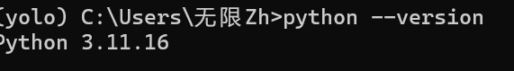
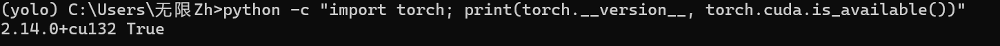
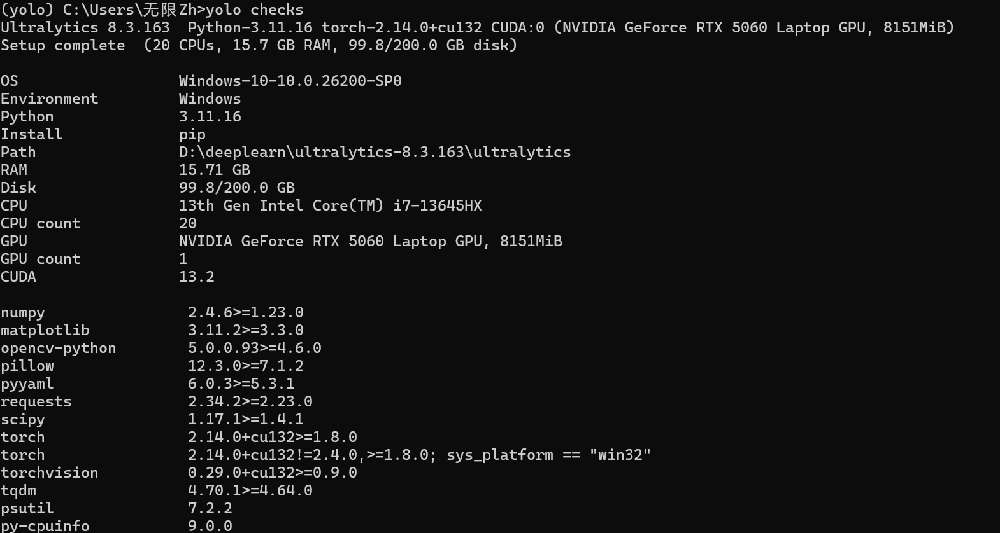
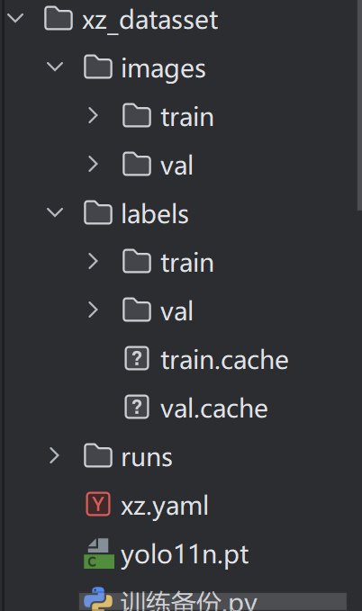
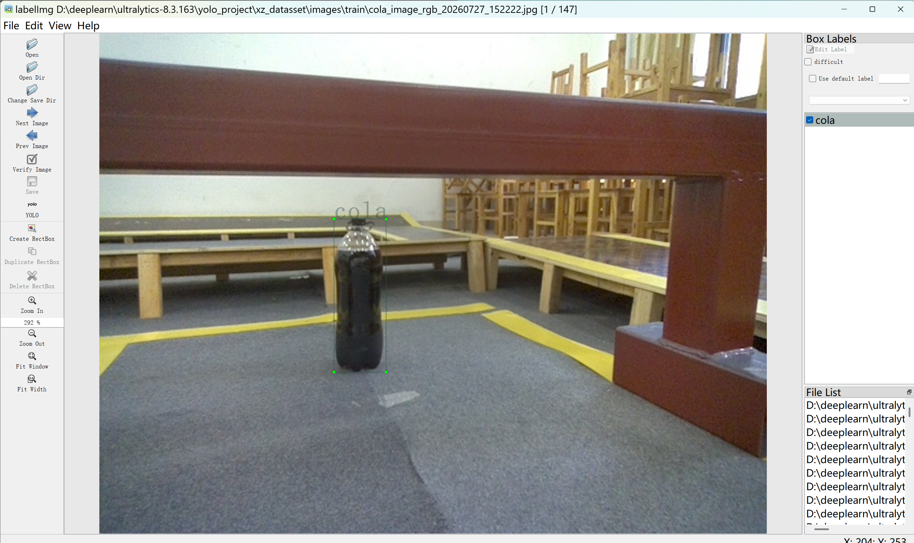
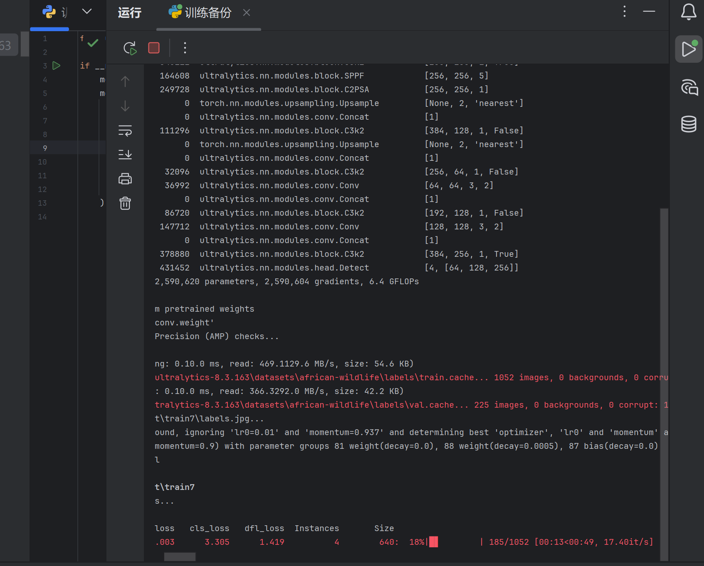
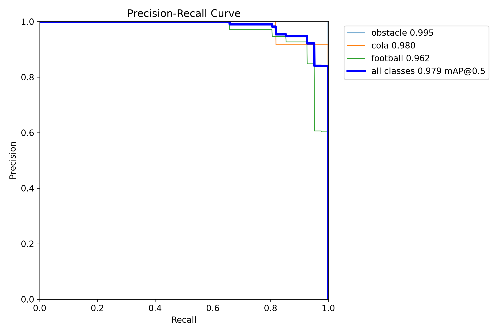
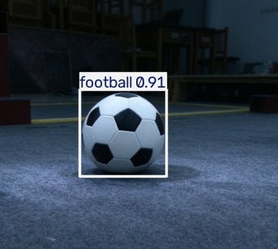
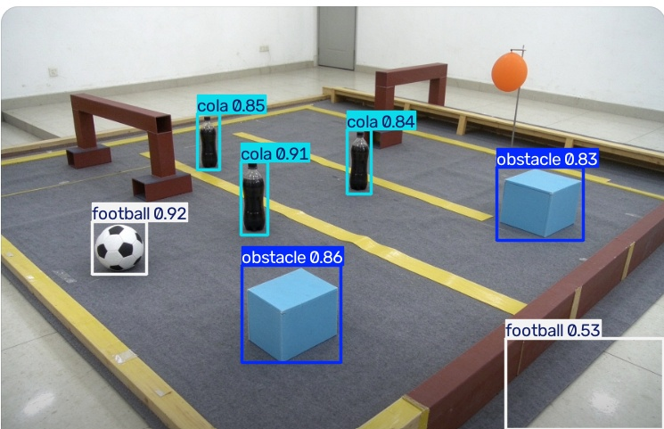
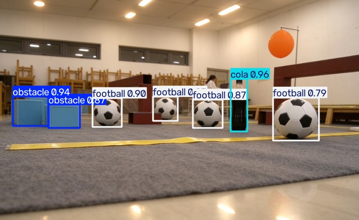

# YOLO 目标检测项目报告

## 一、环境配置（Level 1）

- Python 3.11
- PyTorch 2.14.0+cu132
- Ultralytics 8.3.163
- GPU：NVIDIA GeForce RTX 5060 Laptop（8GB 显存）
- 开发环境：Windows 11 + PyCharm

**环境验证截图：**





---

## 二、数据集整理（Level 1）

- 原始数据：obstacle、cola、football 三个文件夹
- 图片格式：jpg
- 划分比例：80% 训练集 / 20% 验证集
- 随机种子：42（保证可复现）

**数据划分脚本：** `spilt.py`

**目录结构：**



---

## 三、数据标注（Level 2）

- 工具：LabelImg
- 类别编号：
  - 0：obstacle（障碍物）
  - 1：cola（可乐）
  - 2：football（足球）

**标注界面截图：**



**YOLO 标签文件示例：**
````
2 0.571875 0.547917 0.131250 0.179167
2 0.188281 0.376042 0.051562 0.035417
````

含义：类别编号 + 目标中心点坐标（归一化）+ 宽度 + 高度

[查看标签文件](txt/00001%20(1).txt)

---

## 四、模型训练（Level 3）

- 模型：yolo11n.pt（预训练权重）
- epochs：100
- imgsz：640
- batch：-1（自动）
- 优化器：AdamW（自动选择）

**训练启动截图：**



**训练结果：**

| 类别 | mAP@0.5 |
|------|---------|
| obstacle | 0.995 |
| cola | 0.980 |
| football | 0.962 |
| **all** | **0.979** |

**PR曲线：**



**训练结果文件：**

- 最佳权重：`runs\detect\train6\weights\best.pt`
- 结果指标：`runs\detect\train6\results.csv`

---

## 五、新图片推理（Level 4）

- 加载自己训练得到的 `best.pt`
- 对 15 张训练集之外的新图片进行推理
- 检测结果包含：目标框、类别名称、置信度

**单目标检测：**



**多目标检测：**



**不同场景检测：**



---

## 六、问题与解决

| 问题             | 原因                          | 解决方案                                                                                    |
|----------------|-----------------------------|-----------------------------------------------------------------------------------------|
| conda 清华源报 403 | 清华镜像站不再提供 Anaconda 仓库       | 删除失效源，改用 conda-forge                                                                    |
| GitHub 下载超时    | 国内网络访问 GitHub 不稳定           | 手动下载 yolo11n.pt 放到本地                                                                    |
| 数据集路径不匹配       | data.yaml 里 train 写成 trains | 统一 key 名和目录名                                                                            |
| 一个个标签太耗时       | 照片有百来张                      |  先用小数据集训练出可用模型，再逐步完善 |

---

## 七、总结

通过本次项目，完整走通了目标检测的流程：

1. 配置 Python + PyTorch + Ultralytics 环境
2. 整理 obstacle / cola / football 三类数据
3. 使用 LabelImg 完成标注
4. 训练 YOLO11 模型，mAP@0.5 达到 0.979
5. 使用自己训练的模型对新图片完成推理
## 八、参考文献与工具

1. Ultralytics YOLO 官方文档：https://docs.ultralytics.com
2. Ultralytics GitHub：https://github.com/ultralytics/ultralytics
3. LabelImg GitHub：https://github.com/HumanSignal/labelImg
4. B站 YOLO 教程视频
5. DeepSeek、豆包 AI（辅助答疑）


最终模型能够准确识别三类目标，满足考核要求。