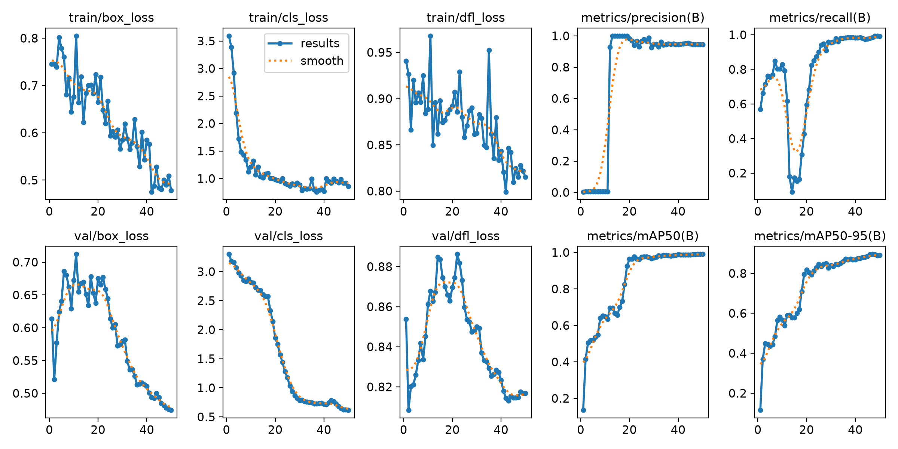
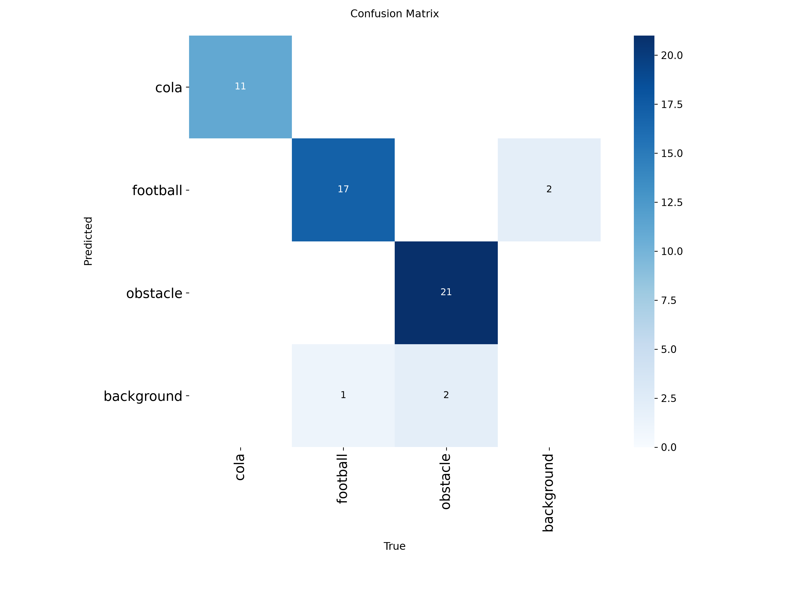

# YOLO11 目标检测项目报告

> 项目：基于 YOLO11n 的 cola / football / obstacle 三目标检测
> 作者：计工本 2026 刘锦泽
> 日期：2026-10

---

## 一、项目概述

本项目使用轻量级检测模型 **YOLO11n**，对三类目标——`cola`（可乐瓶）、`football`（足球）、`obstacle`（障碍物）——完成"数据标注 → 模型训练 → 自动标注扩充数据 → 推理检测 → 验证评估"的完整闭环。

核心工作流：

1. 用 LabelImg 人工标注 94 张图片，建立训练集；
2. 基于 yolo11n.pt 预训练权重训练 50 轮；
3. 用训练好的 best.pt 对 847 张未标注图片自动标注，扩充为标准 YOLO 数据集；
4. 在新图片上推理，输出带目标框、类别名、置信度的效果图；
5. 在验证集上评估 mAP / Precision / Recall。

---

## 二、环境

| 组件 | 版本 / 说明 |
|---|---|
| 操作系统 | Windows（桌面工作站） |
| Python | 3.11.16（Anaconda 环境 `E:\anaconda\envs\yolo`） |
| PyTorch | 2.11.0+**cu128**（CUDA 版，必须） |
| torchvision | 0.26.0+cu128 |
| ultralytics | 8.3.163 |
| GPU | NVIDIA RTX 5060 Laptop（8GB），CUDA 可用 |
| 标注工具 | LabelImg |

安装命令（见 `requirements.txt`）：

```bash
pip install torch==2.11.0+cu128 torchvision==0.26.0+cu128 --index-url https://download.pytorch.org/whl/cu128
pip install ultralytics==8.3.163
```

环境验证（GPU 可用、torch 加载成功）见 `results/过程记录/level1/`。

---

## 三、数据处理

### 3.1 数据集划分

| 数据集 | 来源 | 训练集 | 验证集 | 说明 |
|---|---|---|---|---|
| `dataset/`（xuezha） | LabelImg 人工标注 | 66 张 | 28 张 | 主训练集，YOLO 格式 |
| `dataset_auto/` | best.pt 自动标注 | 678 张 | 169 张 | 80/20 划分，seed=0 可复现 |

### 3.2 目录结构（YOLO 标准格式）

```
dataset/
├── images/train|val/      # 图片
├── labels/train|val/     # 同名 .txt 标签（class cx cy w h）+ classes.txt
└── data.yaml              # 数据集配置
```

### 3.3 自动标注统计

对 847 张图片自动检测：825 张检出目标，22 张无目标（生成空标签）；共生成 **1760 个框**：

| 类别 | 框数量 |
|---|---|
| cola | 333 |
| football | 685 |
| obstacle | 733 |

---

## 四、标注

人工标注使用 **LabelImg**，切换到 YOLO 模式，逐张框出三类目标并保存同名 `.txt` 文件，文件内容为归一化格式 `class_id center_x center_y width height`。

标注过程截图见 `results/过程记录/level2/`（图中可见对足球、可乐瓶等目标拉框并指定 `football`、`cola` 类别）。

---

## 五、训练

### 5.1 训练配置

| 参数 | 值 |
|---|---|
| 预训练权重 | yolo11n.pt |
| epochs | 50 |
| batch | 16 |
| imgsz | 640 |
| device | 0（GPU） |
| workers | 0（Windows 必须） |
| optimizer | auto（lr0=0.01） |
| seed | 0 |

训练命令：

```bash
python train.py                      # 默认参数
python train.py --epochs 50 --batch 16
```

训练约 3 分钟完成，最佳权重保存在 `runs/weights/best.pt`。

### 5.2 权重文件信息

| 文件 | 大小 | MD5 |
|---|---|---|
| best.pt | 5,458,906 字节（5.21 MB） | 51acd04d862d6ae8218e609d019d029c |
| last.pt | 5,458,906 字节 | 799a49ce5eba358b23371ee7cc8ed1c6 |

模型结构：检测模型，181 层，**2,590,425 个参数**，6.4 GFLOPs，3 类，推理尺寸 640。

---

## 六、实验结果

在 xuezha 验证集（28 张图 / 52 个实例）上：

### 6.1 整体指标

| 指标 | 值 |
|---|---|
| **mAP50** | **0.9886** |
| mAP50-95 | 0.8933 |
| Precision | 0.9439 |
| Recall | 0.9850 |

### 6.2 各类别指标

| 类别 | Precision | Recall | mAP50 | mAP50-95 |
|---|---|---|---|---|
| cola | 0.937 | 1.000 | 0.995 | 0.898 |
| football | 0.900 | 0.998 | 0.978 | 0.856 |
| obstacle | 0.995 | 0.957 | 0.993 | 0.926 |

### 6.3 结果图

训练过程 Loss / Precision / Recall / mAP 曲线：



混淆矩阵：



其他曲线（PR、P、R、F1）见 `runs/train/`。

---

## 七、最终成果展示

### 7.1 训练结果截图

- 训练开始终端：`results/训练结果截图/01_训练开始终端截图.png`
- 训练完成终端：`results/训练结果截图/02_训练完成终端截图.png`
- 训练结果目录：`results/训练结果截图/03_训练结果目录截图.png`
- 权重文件目录：`results/训练结果截图/04_权重文件目录截图.png`

### 7.2 新图片检测结果

使用 best.pt 对新图片文件夹推理，效果图均含 **目标框 + 类别名称 + 置信度**（框线宽 3），共 8 张，见 `results/检测结果截图/`：


推理命令：

```bash
python predict.py --source 待检测图片文件夹 --save-txt
```

---

## 八、过程记录（各 Level）

| Level | 阶段 | 截图目录 |
|---|---|---|
| Level 1 | 环境搭建：Anaconda 创建 yolo 环境，安装 CUDA 版 PyTorch 2.11.0+cu128、torchvision、ultralytics | `results/过程记录/level1/` |
| Level 2 | 数据标注：LabelImg 人工框选 cola / football / obstacle，导出 YOLO 格式标签 | `results/过程记录/level2/` |
| Level 3 | 模型训练与验证：训练开始/完成终端、结果目录、权重信息、results 曲线、混淆矩阵、val 验证指标 | `results/过程记录/level3/` |
| Level 4 | 新图片检测：best.pt 推理输出带框效果图（框+类别+置信度） | `results/过程记录/level4/` |

---

## 九、问题与解决过程

| # | 问题现象 | 原因 | 解决方法 |
|---|---|---|---|
| 1 | pip 安装 torch 后只能用 CPU，GPU 训练不生效 | 国内默认镜像装的是 CPU 版 torch | 指定 CUDA 源安装：`--index-url https://download.pytorch.org/whl/cu128`，装 `2.11.0+cu128` |
| 2 | 训练启动即报 `CUDA error: illegal memory access` | Windows 下 workers>0 + cache='ram' 与 CUDA 冲突 | 固定 `workers=0`、`cache=False`（脚本已内置） |
| 3 | 脚本运行时卡死 / 无输出 | Windows 多进程 dataloader 缺少入口保护 | 所有脚本加 `if __name__ == "__main__":` |
| 4 | 含 Windows 路径的 docstring 报 `SyntaxError: (unicode error) unicodeescape` | 字符串中 `\x` 等被当作转义符 | 路径统一用正斜杠 `/` 或原始字符串 |
| 5 | 启动时提示从 GitHub 下载 yolo26n.pt 失败（SSL） | ultralytics AMP 自检联网失败 | 仅警告不阻断训练，可忽略 |
| 6 | 无 GPU 环境 | 设备差异 | 脚本 `--device cpu` 即可切换 CPU 推理 |

---

## 十、目录结构

```
├── README.md            # 项目说明与使用方法
├── report.md             # 本报告
├── requirements.txt     # 依赖清单
├── train.py             # 模型训练脚本
├── predict.py            # 模型推理/检测脚本
├── auto_label.py         # 自动标注脚本
├── val.py                # 模型验证脚本
├── data.yaml             # 数据集配置
├── dataset/              # 人工标注数据集（train 66 / val 28）
├── dataset_auto/         # 自动标注数据集（train 678 / val 169）
├── runs/
│   ├── weights/         # yolo11n.pt / best.pt / last.pt / 权重信息.txt
│   ├── train/           # results.png、results.csv、混淆矩阵、各曲线
│   └── val/             # val_submit 验证输出
└── results/
    ├── 训练结果截图/      # 终端/目录/曲线截图
    ├── 检测结果截图/      # 新图片带框检测效果图
    └── 过程记录/          # level1~level4 完成过程与验证截图
```
