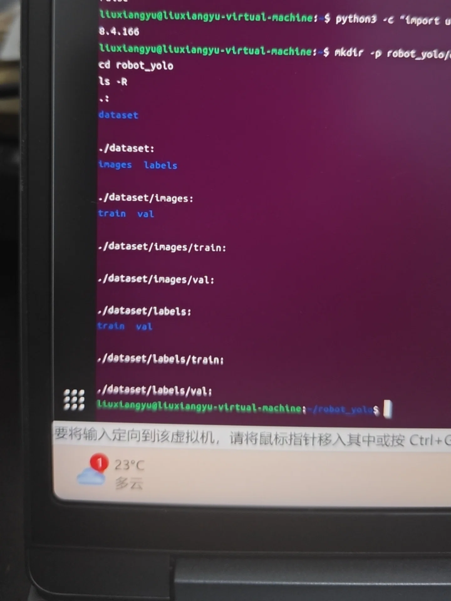
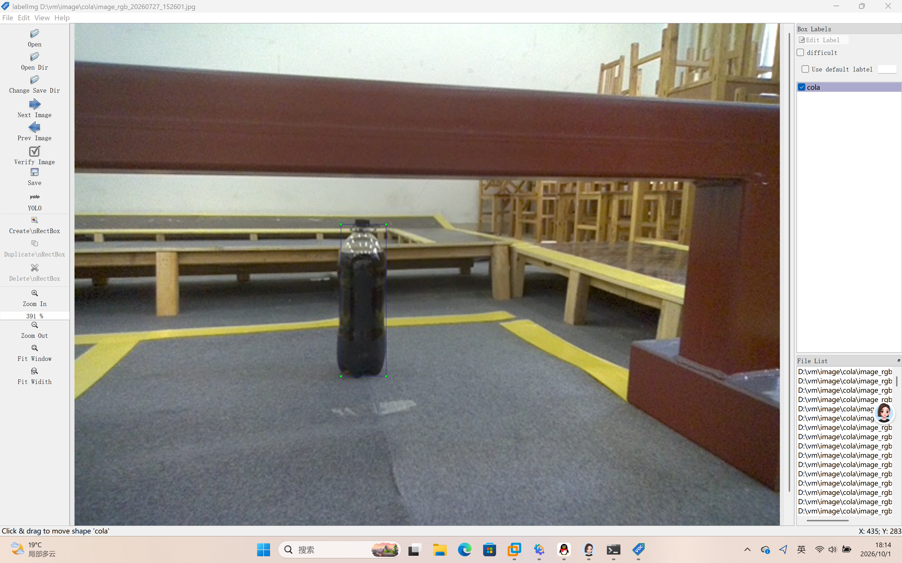
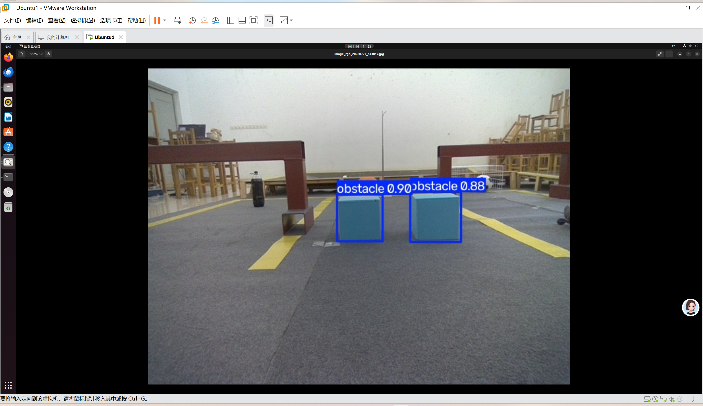
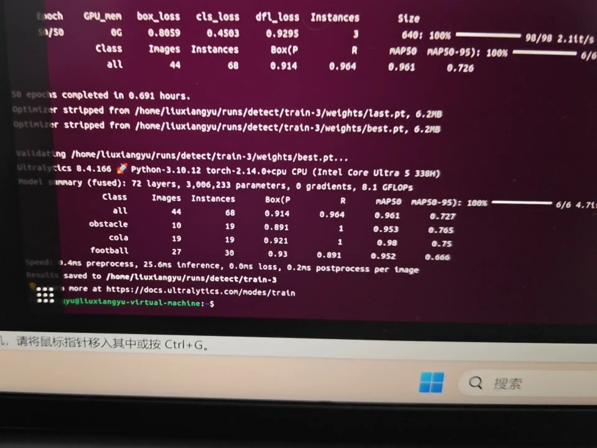

# YOLOv8目标检测项目实验报告
学号：202611160534
姓名：刘翔宇

## 一、实验概述
本项目基于YOLOv8深度学习目标检测框架，在Ubuntu虚拟机环境下完成多类别目标检测任务。整个实验分为5个Level循序渐进开展：虚拟机环境搭建、数据集采集与标注、模型训练、模型效果评估、可视化网页部署。项目完成从数据准备、模型训练推理到Web界面演示的完整工程流程。

## Level1 环境搭建
本阶段主要完成Ubuntu虚拟机深度学习环境部署。首先配置VMware虚拟机，安装Ubuntu操作系统，接着使用pip工具安装PyTorch、OpenCV、YOLOv8等依赖库。安装完成后，运行YOLOv8自带的推理示例，调用预训练权重做基础图片推理测试。验证图片可以正常读取、模型可以成功加载并输出检测框，确认CUDA、依赖包版本无冲突，环境可用，为后续数据集制作与模型训练打下基础。

## Level2 数据集制作
本阶段完成数据集采集、标注与数据集划分。总共采集435张目标场景图像，使用LabelImg标注工具对图片内目标进行框选标注，生成YOLO格式txt标签文件。标签文件内记录目标类别编号以及归一化后的坐标信息。
数据集按照9:1比例自动划分，训练集391张，验证集44张。训练集用于模型学习目标特征，验证集用于训练过程中评估模型泛化能力。
> 注：完整数据集文件体积较大，仓库内仅选取部分样本图片用于展示。

## Level3 模型训练
使用划分完成的自制数据集训练YOLOv8模型。编写训练脚本，配置data.yaml数据集描述文件，文件内填写类别名称、类别数量、训练集与验证集路径。设置训练轮数、batch大小、图像输入尺寸等超参数，启动模型训练。
训练过程中程序自动计算损失函数、Precision、Recall、mAP等评价指标，自动生成训练曲线、混淆矩阵、预测效果图。训练结束保存最佳权重文件best.pt，后续推理评估将加载该权重文件。

## Level4 模型评估
加载Level3训练得到的best.pt权重，选取**训练集、验证集以外**的全新图片做推理测试。模型读取图片，输出目标检测框、类别名称与置信度。对比检测结果和图片真实目标，评估模型在未见过样本上的检测效果。
观察模型是否存在漏检、误检问题，分析模型优缺点。如果检测效果较差，可返回数据集阶段，补充更多样本或者修正标注。

## Level5 可视化页面部署
使用Streamlit框架搭建本地网页推理应用。编写Python网页脚本，加载训练完成的YOLOv8权重。网页提供图片上传功能：用户上传图片后，后台自动调用YOLO模型完成目标检测，将绘制好检测框的图片回显在网页上，实现可视化交互推理。
启动streamlit服务，在浏览器访问本地地址，测试图片上传、推理、结果展示整套流程，完成模型工程化封装。

## 六、实验遇到的问题与解决方案
1. 虚拟机与Windows主机文件传输困难，无法直接拖拽复制文件夹
> 解决：尝试VMware共享文件夹挂载失败，改用打包压缩文件的方式，同时保存关键实验截图来留存实验结果。

2. GitHub存在文件大小限制，完整数据集无法上传仓库
> 解决：挑选部分具有代表性的样本图片上传到仓库，在报告中备注：完整数据集体积过大，仓库仅保留抽样样本，样本分为训练集、验证集。

3. Markdown报告内图片无法正常加载，预览出现404
> 解决：图片文件名不使用中文与空格，统一采用英文命名，使用仓库相对路径来引用图片，修正图片链接。

4. Git分支操作不熟悉，担心直接修改main分支，不符合作业提交规范
> 解决：新建独立分支完成全部代码、文档与图片修改，确认所有内容无误后，再提交Pull Request，满足约定式提交规范。

## 七、个人总结
本次项目基于YOLOv8完成目标检测全流程实验，按照Level1至Level5循序渐进完成任务。项目涵盖Ubuntu虚拟机环境搭建、LabelImg数据集标注、数据集划分、模型训练、图片推理测试，最后使用Streamlit搭建网页可视化推理界面，完整走完计算机视觉目标检测项目开发链路。

在实操过程中，我熟悉了Linux终端命令、Python脚本编写、YOLO模型的训练与调测，同时掌握GitHub仓库版本管理、分支操作以及Pull Request项目提交的完整流程。项目过程中遇到文件传输、路径报错、仓库提交规范等各类问题，锻炼了自己排查问题、调试解决问题的能力。

通过本次实验，我对深度学习目标检测原理、数据集制作、模型网页部署有了更加直观、深入的理解，收获很多工程实践经验。
