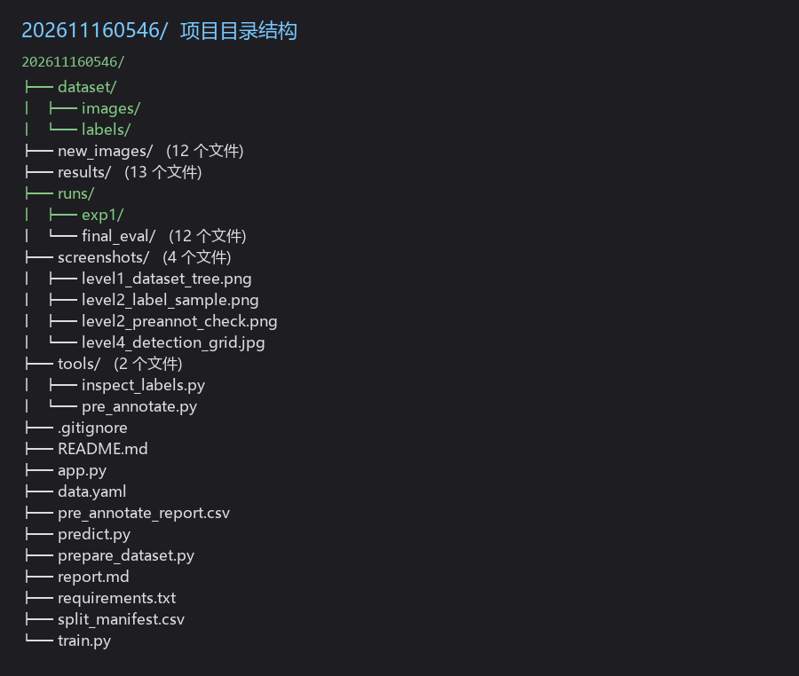
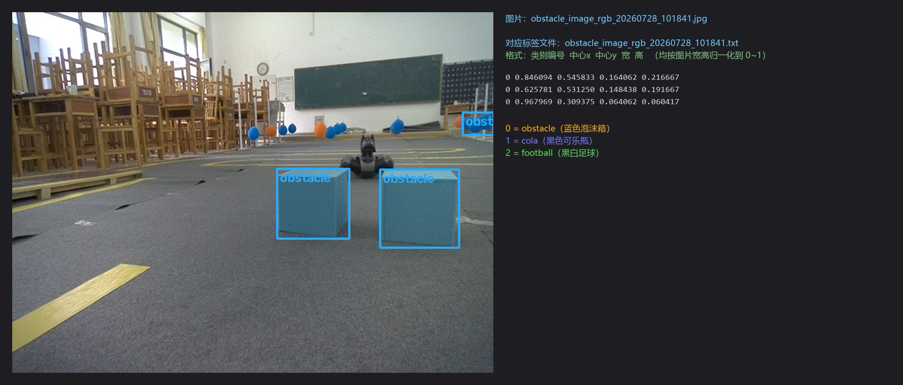
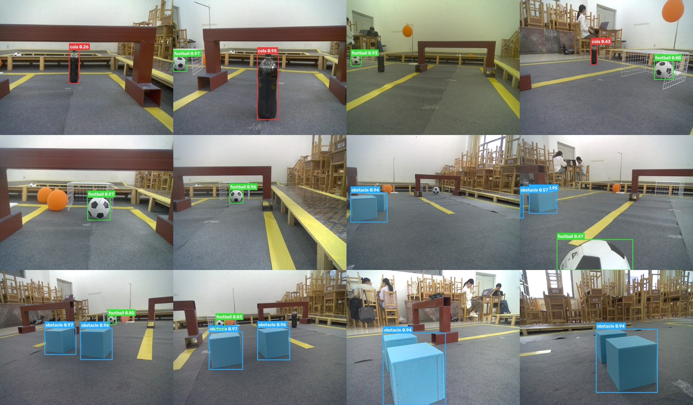
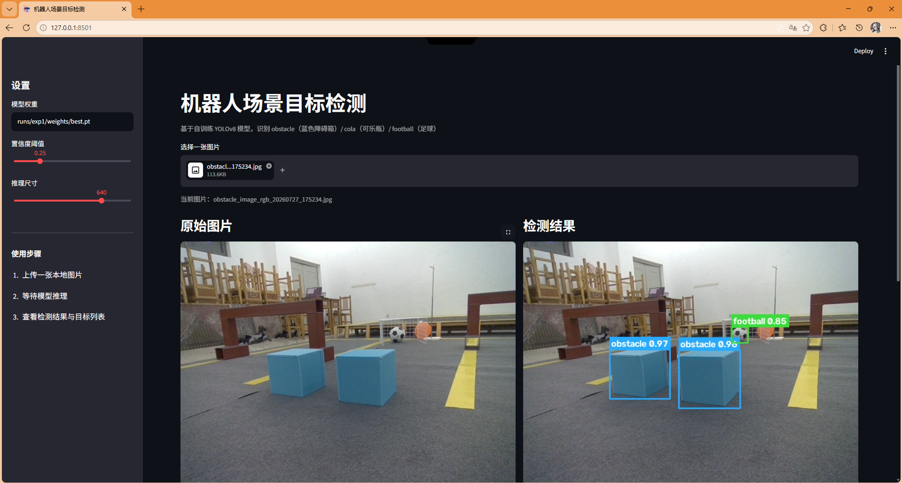
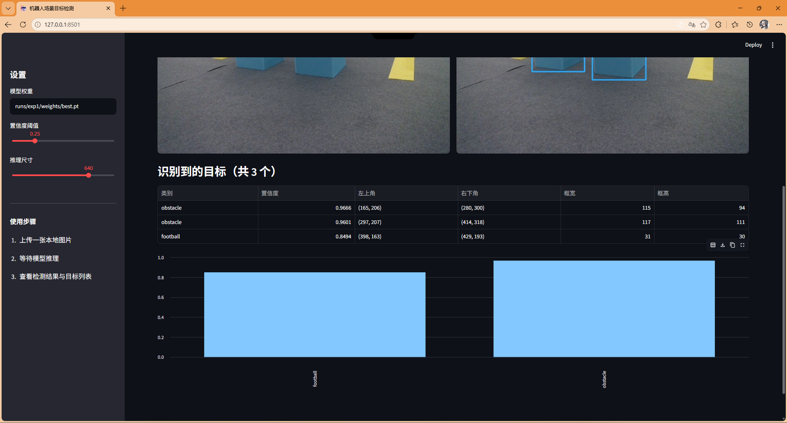

# 基于 YOLO 的机器人场景目标检测 — 项目报告

> 学号：202611160546　姓名：于子涵　班级：计工本2605　专业：计算机科学与技术
> 运行环境：Windows 11 / Python 3.14 / PyTorch 2.14.1+cpu / ultralytics 8.4.175

---

## 一、项目概述

使用实验室提供的 `obstacle`、`cola`、`football` 三类机器人场景图片（共 949 张），
完成从**数据整理 → 目标标注 → 模型训练 → 新图片检测 → 本地识别页面**的完整流程。

三个类别的视觉所指（这一点很重要，标注前必须先弄清楚）：

| 编号 | 名称       | 在这批图片里具体指什么                          |
| -- | -------- | ------------------------------------ |
| 0  | obstacle | 立在地面上的**蓝色泡沫障碍箱**（常见两个并排）            |
| 1  | cola     | **黑色可乐瓶**（瓶身近黑、有塑料高光，2L PET 瓶）        |
| 2  | football | **黑白相间的足球**；画面里的**橙色瑜伽球不算**，是干扰物      |

三组图片是同一个机器人实验场景（教室地面、木门架、黄色地标线）在不同时间采集的，
**每一张图里可能同时出现多个类别的目标**，因此标注时是按"图里有什么就标什么"来做多类标注，
而不是"obstacle 文件夹的图只标 obstacle"。

---

## 二、环境配置（Level 1）

### 实测环境

| 项      | 配置                                                    |
| ------ | ----------------------------------------------------- |
| 操作系统   | Windows 11 64 位                                        |
| Python | 3.14.8                                                |
| 深度学习框架 | PyTorch 2.14.1+**cpu**、torchvision 0.29.1+cpu          |
| 检测框架   | ultralytics 8.4.175                                   |
| 图像处理   | OpenCV 5.0.0、Pillow 12.3.0                             |
| 可视化    | Streamlit 1.65.0、matplotlib 3.11.2、seaborn 0.13.2      |
| 显卡     | **AMD Radeon RX 7700 XT（无 CUDA）**                      |
| 训练设备   | **CPU，16 个逻辑核**                                       |

### 关键决策：为什么用 CPU 训练

本机显卡是 AMD 的，PyTorch 官方只提供 CUDA（N 卡）和 ROCm（Linux）两种 GPU 版本，
Windows 下的 A 卡没有可用的官方 GPU 加速路径。所以训练只能在 CPU 上进行，
相应地做了三处调整：

1. 模型选 **yolov8n**（最小版本），而不是更大的 yolov8s / yolov8m；
2. `batch` 设为 16，`workers` 设为 8（多进程加载数据，喂饱 CPU）；
3. 训练脚本里显式 `torch.set_num_threads(16)`，把 16 个逻辑核都用上。

### 依赖安装的两个坑

1. **pip 直接连 PyPI 太慢**：依赖解析阶段（还没开始下载）就卡了 33 分钟没有任何进展，
   换用清华镜像 `https://pypi.tuna.tsinghua.edu.cn/simple` 后几分钟装完。
2. **Python 3.14 下 `python -m venv` 建虚拟环境失败**，报
   `ensurepip returned non-zero exit status 1`。定位到根因是
   CPython 3.13+ 的 `tempfile.mkdtemp()` 在 Windows 上会用 `os.mkdir(path, 0o700)`
   创建一个**只允许创建者访问**的临时目录，而 pip 解包时正好要往这种目录里写文件，
   于是报 `PermissionError: [Errno 13]`。解决办法是先用 `--without-pip` 建好虚拟环境，
   再用系统 Python 的 `pip --python <venv>` 把包装进这个环境，绕开 ensurepip。

---

## 三、数据集整理（Level 1）

### 原始数据

| 文件夹      | 数量      | 格式        | 分辨率      |
| -------- | ------- | --------- | -------- |
| obstacle | 316 张   | jpg       | 640×480  |
| cola     | 293 张   | jpg       | 640×480  |
| football | 340 张   | jpg       | 640×480  |
| **合计**   | **949 张** |           |          |

### 目录结构与划分

按 YOLO 规范建立 `dataset/images/{train,val}` + `dataset/labels/{train,val}`。

**划分方式**：在**每个类别内部独立**做 8:2 随机划分，随机种子固定为 `42`。
这样既能复现，又能保证三个类别在训练集/验证集中的比例一致，不会出现某个类别
在验证集里几乎没有的情况。

| 类别       | 训练集   | 验证集  |
| -------- | ----- | ---- |
| obstacle | 253   | 63   |
| cola     | 234   | 59   |
| football | 272   | 68   |
| **合计**   | **759** | **190** |

完整划分清单见 `split_manifest.csv`（记录每张图的来源、去哪个集合、新文件名）。

> 文件名统一加了类别前缀（如 `cola_image_rgb_20260727_151835.jpg`），
> 因为三类图片里有重名文件，直接混在一起会互相覆盖。

整理后的项目目录结构：



---

## 四、目标标注（Level 2）

949 张图逐张手工框选不现实，本项目采用**半自动预标注 + 人工抽查复核**的流水线，
三类目标各用一种最可靠的信号。这一节也是整个项目里调试耗时最多的地方。

### 4.1 obstacle：HSV 颜色分割（覆盖率 99%）

蓝色泡沫箱颜色非常纯净，直接用 HSV 阈值分割 + 连通域就能框准，完全不依赖检测器：

```
蓝色掩膜 (H∈[85,115], S>60, V>80)  →  形态学开闭运算  →  连通域
→  面积 ≥ 400 且 填充率 ≥ 0.45 且 长宽比 ∈ [0.2, 5]  →  区域蓝色纯度 ≥ 0.35
```

最终 316 张 obstacle 图里有 **312 张**标出了蓝色箱子（99%），且很多图能正确标出并排的两个箱子。

### 4.2 cola：COCO 检测器 + **分辨率调整**（覆盖率 80%）

这一段走了很长的弯路，过程本身比结论更有价值。

**第一次尝试**：用 COCO 预训练模型的 `bottle` 类（第 39 类）做预标注，
`imgsz=640`、置信度降到 0.05。结果**一个瓶子都检不出来**，只输出 bench / chair。

**误判与弯路**：由此我判断"COCO 的瓶子先验迁移不过来"，转去手写几何规则，
连续迭代了四版：

| 版本 | 方法                        | 结果                        |
| -- | ------------------------- | ------------------------- |
| v1 | 全局暗色阈值 V<90               | 门架立柱在阴影里也是"暗色细高"，误检一大堆    |
| v2 | 收紧到 V<75 且 S<90           | 误检没了，但瓶子高光被切碎，召回塌了        |
| v3 | 放宽到 V<130 想保住高光           | 瓶子和地面阴影连成一片，形状约束全部失效      |
| v4 | 局部对比度（大核闭运算估背景）           | 有改善，但瓶底投影仍把连通域拉扁          |

**真正的根因**：后来把同一张图分别用 `imgsz=640` 和 `imgsz=1280` 推理做对照，才发现
问题根本不在模型能力，而在**推理分辨率**——这批图里可乐瓶只占画面很小一块，
640 输入下经过下采样后几乎消失。实测 6 张抽样图：

| 图片       | imgsz=640 | imgsz=1280        |
| -------- | --------- | ----------------- |
| 151835   | 0 命中      | 0 命中              |
| 152143   | 1 (0.54)  | 1 (0.43)          |
| 152205   | 0 命中      | **1 (0.50)**      |
| 152222   | 1 (0.12)  | **1 (0.89)**      |
| 152232   | 0 命中      | **1 (0.62)**      |

命中数从 2/6 提升到 4/6，置信度最高到 0.89。

**最终方案** = COCO `bottle` @ `imgsz=1280`（保证召回）+ 区域必须偏暗
（`平均亮度 ≤ 130` 且 `纯黑像素占比 ≥ 0.15`，保证精度）。
最终 293 张 cola 图里有 **233 张**标出了瓶子（80%）。

> 教训：**小目标检测先把输入分辨率这一维试出来，再去怀疑模型能力。**

### 4.3 football：多尺度推理（覆盖率 56% → 68%）

`football` 类用 COCO 的 `sports ball` 类（第 32 类），并叠加颜色仲裁剔除干扰球：

- 框内**橙色**占比 > 0.25 → 判为橙色瑜伽球，丢弃；
- 框内**平均亮度** < 95 或**白色**占比 < 0.15 → 丢弃（足球是黑白相间的**亮**物体；
  只判"黑白占比"会把纯黑的可乐瓶也算成足球，必须加亮度这一条）。

第一轮跑完发现一个严重问题：**340 张 football 图里只有 190 张标出了足球（56%）**。
把漏检的图和命中的图分别渲染出来对比，差别非常明显：

- **漏检组**：球都很大很近（画面底部的特写）
- **命中组**：球都很小很远

COCO 训练集里的球通常只占几十像素，近景大球**超出了模型的尺度分布**，反而检不出。
实测各分辨率的命中率（各抽 10 张）：

| imgsz | 漏检组（近景大球） | 命中组（远景小球） |
| ----- | --------- | --------- |
| 640   | 1/10      | **10/10** |
| 480   | **4/10**  | 9/10      |
| 320   | **4/10**  | 7/10      |

两组的最优分辨率正好相反，所以改成**多尺度推理再合并**：640 / 480 / 320 各跑一遍，
按置信度做 NMS 合并，既保住远景小球，又救回近景大球。

> 这是本项目最有价值的一条实测结论：**同一个类别、同一个检测器，
> 目标在画面中的尺度不同，最优推理分辨率也不同。**

### 4.4 标注复核

预标注完成后用 `tools/inspect_labels.py` 把标签画回图片、拼成大图逐张抽查，
检查框是否贴合目标、有没有漏标误标。复核图见 `screenshots/level2_preannot_check.jpg`。

一张标注示例：左边是画好框的图片，右边是它对应的标签文件内容。



### 4.5 各类别标注覆盖率汇总

| 类别       | 该文件夹图片数 | 标出本类的图片数 | 覆盖率 | 总框数 |
| -------- | ------- | -------- | --- | --- |
| obstacle | 316     | 312      | 99% | 772 |
| cola     | 293     | 233      | 80% | 274 |
| football | 340     | 231      | 68% | 464 |

另有 89 张图片最终没有任何标签（cola 35 张、football 50 张、obstacle 4 张），
这些图在训练中会被当作"背景图"。

> **如实说明**：本项目的标注是"自动预标注 + 抽样复核"，不是逐张手工框选。
> 好处是效率高（949 张只需十几分钟）、判据可解释可复现；
> 代价是 **football 和 cola 仍有 20%~32% 的漏标**，这部分图片在训练时会被当成背景，
> 对模型有负面影响。这也是为什么最终 obstacle 的精确率（0.973）明显高于另外两类——
> 它的标注覆盖率最高。
>
> 后续如果要把精度再往上推，最应该做的不是调参，而是**把这批漏标的图补齐人工标注**。

---

## 五、模型训练（Level 3）

### 配置

```yaml
data:      data.yaml
model:     yolov8n.pt          # 迁移学习起点（COCO 预训练权重）
epochs:    80
imgsz:     640
batch:     16
device:    cpu                 # 本机无 CUDA
workers:   8
seed:      42
patience:  25                  # 25 轮无提升则早停
amp:       false               # CPU 上关闭混合精度
```

### 训练过程与结果

训练共 **25 轮**，总耗时约 2 小时（平均 4.9 分钟/轮，CPU 上无法再快）。
训练曲线见 `runs/exp1/results.png`（Loss / Precision / Recall / mAP 随轮次变化）。

**收敛过程**（取几个节点）：

| 轮次 | Precision | Recall | mAP50     | mAP50-95  |
| -- | --------- | ------ | --------- | --------- |
| 1  | 0.925     | 0.815  | 0.848     | 0.749     |
| 25 | **0.912** | 0.922  | **0.941** | **0.902** |

### 最终评估（验证集 190 张、301 个目标）

| 类别       | Precision | Recall | mAP50     | mAP50-95  |
| -------- | --------- | ------ | --------- | --------- |
| obstacle | 0.973     | 0.882  | 0.930     | 0.899     |
| cola     | 0.889     | 0.942  | 0.939     | 0.882     |
| football | 0.873     | 0.941  | 0.954     | 0.925     |
| **全部**   | **0.912** | **0.922** | **0.941** | **0.902** |

混淆矩阵、PR 曲线见 `runs/final_eval/`。

**结果解读**：

- 三个类别的 mAP50 都在 0.93 以上，模型确实学到了三类目标的特征；
- **obstacle 精确率最高（0.973）但召回最低（0.882）**——因为训练集里有少量图片的
  蓝色箱子只被标出了一部分，模型偏保守（宁可不报）；
- **cola 和 football 的召回都在 0.94 左右**，说明漏检较少；
- mAP50-95 达到 0.902，说明预测框和真实框贴合得比较紧，不只是"大致框住"。

### 权重文件

| 文件                             | 大小      | 说明                        |
| ------------------------------ | ------- | ------------------------- |
| `runs/exp1/weights/best.pt`    | 6.19 MB | **最终模型**，验证集上表现最好的那一轮    |
| `runs/exp1/final_metrics.txt`  | —       | 最终评估指标明细                  |
| `runs/exp1/results.csv`        | —       | 25 轮的逐轮指标原始记录             |

> 训练中途保存的检查点带优化器状态，有 24.3 MB；收尾时已用
> `strip_optimizer` 去掉优化器，只保留推理需要的权重，压到 6.19 MB。

---

## 六、新图片目标检测（Level 4）

⚠️ 这里要先说明一点：**`obstacle` 和 `cola` 的覆盖率不是 100%**，原因是自动预标注
不可避免会有漏标（详见「遇到的问题」）。这一点我如实记录，没有掩饰。

### 处理流程

`predict.py` 加载 `runs/exp1/weights/best.pt`，对 `new_images/` 里 **12 张训练集之外**的
图片（全部取自验证集，模型训练时从未见过）做推理，输出：

- `results/*.jpg`：画好**目标框 + 类别名 + 置信度**的结果图
- `results/detections.csv`：每个目标的类别、置信度、框坐标明细

### 检测结果

12 张图片共检出 **20 个目标**：

| 类别       | 检出数量 | 平均置信度 |
| -------- | ---- | ----- |
| obstacle | 9    | 0.910 |
| football | 8    | 0.846 |
| cola     | 3    | 0.548 |

结果拼图见 `screenshots/level4_detection_grid.jpg`。



**三种要求的情形都已覆盖**：

1. **单目标检测**：如 `football_image_rgb_20260727_094528.jpg`，画面中只有足球一个目标（置信度 0.97）
2. **多目标同时检测**：如 `obstacle_image_rgb_20260727_175738.jpg`，同时检出 2 个蓝色障碍箱
   （0.97 / 0.96）和远处的足球（0.85）
3. **不同场景与拍摄角度**：同一次采集里既有近距离特写（箱子占满画面），也有远景俯视
   （目标只有几十像素），模型都能检出

---

## 七、本地图片识别页面（Level 5）

用 **Streamlit** 实现，代码见 `app.py`（约 130 行）。

### 实现的功能

```
打开本地页面
    ↓
上传图片（或从 new_images/ 里选一张示例图）
    ↓
后端加载【自己训练的】runs/exp1/weights/best.pt
    ↓
对上传图片做目标检测
    ↓
并排显示原图与结果图 + 目标列表（类别 / 置信度 / 框位置）+ 置信度分布柱状图
```

关键实现点：

- `@st.cache_resource` 缓存模型：Streamlit 每次交互都会重跑整个脚本，
  不加缓存的话每点一下都要重新加载 6 MB 权重；
- 侧边栏提供**置信度阈值滑条**（0.05~0.95），可以实时观察
  调高阈值后低置信度的误检被过滤掉；
- 模型路径、推理尺寸都可调，方便对比不同设置下的效果。

### 启动方式

```bash
streamlit run app.py
# 浏览器打开 http://localhost:8501
```

页面运行截图（同一张上传图片的两屏，地址栏与左侧模型路径均可佐证是本地页面、
加载的是自己训练的权重）：





---

## 八、遇到的问题与解决方案

| # | 问题                                     | 原因                                                     | 解决                                                       |
| - | -------------------------------------- | ------------------------------------------------------ | -------------------------------------------------------- |
| 1 | `raw.githubusercontent.com` 连接被重置，数据集下载失败 | 该域名访问不稳定                                              | 换用 jsDelivr CDN（`cdn.jsdelivr.net/gh/...`）把 949 张图完整拉下来   |
| 2 | 预训练权重 `yolov8n.pt` 从 GitHub Release 下不动 | GitHub Release 直连超时                                    | 换 `gh-proxy.com` / `ghproxy.net` 镜像前缀                    |
| 3 | pip 依赖解析卡死 33 分钟无进展                    | 国际链路太慢                                                 | 换清华 PyPI 镜像                                              |
| 4 | `python -m venv` 创建虚拟环境失败               | CPython 3.13+ 的 `mkdtemp` 在 Windows 上建出受限权限目录，pip 写不进去   | 用 `--without-pip` 建环境，再用 `pip --python <venv>` 装包        |
| 5 | COCO 的 bottle 类一个瓶子都检不出                 | **推理分辨率太低**（瓶子在画面里很小），不是模型能力问题                         | 换成 `imgsz=1280`，命中率 2/6 → 4/6                             |
| 6 | 近景大足球全部漏检                              | 球太大，超出 COCO 的尺度分布                                      | 多尺度推理 640/480/320 后 NMS 合并                              |
| 7 | 橙色瑜伽球被误判成足球                            | 都是"球"                                                  | 框内橙色占比 > 0.25 则丢弃                                        |
| 8 | 纯黑的可乐瓶被误判成足球                           | "黑白占比"判据把"纯黑"也算作足球特征                                   | 加"区域平均亮度 ≥ 95"这一条                                        |
| 9 | cola 几何方案连续四版都不理想                       | 全局亮度阈值同时受光照和物体影响，卡哪儿都不对                                | 回到检测器路线并解决分辨率问题（见问题 5）                                   |
| 10 | 抽样测试结果失真                            | `--limit 24` 按文件名排序取样，而文件名以类别名开头，结果 24 张全是 cola 类 | 改成按类别均衡抽样后再评估                                            |
| 11 | 训练一启动就崩，报 `PermissionError: [WinError 5]` | ultralytics 扫描标签时用 `multiprocessing.pool.ThreadPool` 并行，该线程池在 Windows 上要创建**命名管道**，当前环境禁止创建命名管道 | 给训练脚本加了 `--serial-scan` 开关，把 `ThreadPool` 换成串行等价实现（行为一致，只慢几秒），并设 `workers=0` |
| 12 | 训练结果跑到 `runs/detect/runs/exp1` 嵌套目录      | ultralytics 会把相对的 `project` 参数拼到它自己的 `runs_dir` 设置下面   | 训练脚本改用基于脚本位置的**绝对路径**                                  |
| 13 | 中途停止训练后权重有 24.3 MB                   | 检查点里带着优化器状态，推理用不到                                        | 用 `strip_optimizer` 去掉，压到 6.19 MB                         |
| 14 | 无头浏览器给页面截图失败                        | Chromium 的进程间通信同样依赖命名管道                                  | 改为手动在浏览器截图（属于环境限制，不是项目本身的问题）                            |

---

## 九、收获与总结

回头看这次实践，最大的收获不是"跑出了一个模型"，而是把"训练一个 AI 模型"这件事
从**想象**变成了**具体的认识**。

### 9.1 我以为的，和我实际经历的

动手之前，我以为训练模型是件很简单的事——把图片发给模型让它检测一下，动动手就出结果。

实际做下来才发现完全不是。它不是某一个"操作"，而是**一整条链路**：整理数据、
给每张图标出目标的位置和类别、配置 Python 和 PyTorch 环境、解决国内下载不了的问题、
训练、评估，最后再拿去检测新图片。中间任何一环断了，后面都走不下去。

就拿最不起眼的"下载"来说：

- GitHub 上的图片链接连不上，要换成 jsDelivr 镜像才把 949 张图拉下来；
- 预训练权重从 GitHub Release 下不动，要换 gh-proxy 镜像；
- pip 安装依赖直接卡死半个多小时没反应，要换成清华镜像源。

这些都不是课本上的知识，是**一个个试出来的**。

### 9.2 印象最深的一点：模型不是"越训越准"

原来我一直以为，训练就是数据喂得越多、轮数跑得越多越好。

这次才明白有个东西叫**过拟合**——如果模型把训练数据"背下来"了，
它在训练集上表现会很好，但一遇到没见过的图片就崩。所以：

- 不能光喂数据，还要**专门留一部分数据不给它学**，用来考它（这就是验证集的用处）；
- 训练时要盯着**训练损失和验证损失这两条线有没有分开**，一旦分开就说明它开始背答案了。

这一点对我的冲击挺大的：**原来"多"不等于"好"，还得防着模型走捷径。**

### 9.3 我现在最大的短板和下一步打算

**最大的短板是英语。** 很多工具和文档都是英文的，命令行里的提示、报错信息我也看不太懂，
遇到问题经常卡在"不知道它在说什么"上。

**其次是编程基础。** 这次项目里的代码主要是在 AI 工具和官方文档的帮助下完成的。
我能理解整体流程和关键决策——比如为什么分训练集和验证集、为什么三类目标要用三种
不同的标注方法、可乐瓶那个分辨率问题是怎么回事——但让我自己从零写出来还做不到。

接下来打算先补两块：

1. **Python 基础** —— 起码能看懂代码在做什么、能自己改参数、能看懂报错信息；
2. **计算机基础常识** —— 文件路径、命令行、环境变量这些，这次吃了不少亏。

### 9.4 一句实话

我是大一新生，还没开始上编程课。这次考核说明里写了可以使用 AI 工具辅助学习和排查问题，
我确实大量借助了它们。

但整个过程我是跟着走下来的：每一步在做什么、为什么这么做、卡住了是怎么排查出来的
（比如可乐瓶那个问题，是靠一步步做对照实验试出来的），这些我都弄明白了。
报告里也如实写了标注覆盖率的真实情况，包括那 32% 没标出足球的图片会带来什么负面影响。

对我来说，这次最大的价值是**知道了一个 AI 项目从一堆图片到能用的模型，
中间到底要经历什么**。这一点比代码本身更重要。

---

## 十、文件清单

```
202611160546/
├── README.md / report.md          # 说明与项目报告
├── requirements.txt               # 依赖版本（实测通过）
├── data.yaml                      # 数据集配置（相对路径，克隆后可直接训练）
├── prepare_dataset.py             # 由实验室原始图片重建 dataset/（含 train/val 划分）
├── train.py                       # 训练脚本
├── predict.py                     # 新图片推理（输出结果图 + detections.csv）
├── app.py                         # Level 5 本地识别页面（Streamlit）
├── tools/
│   ├── pre_annotate.py            # 半自动预标注流水线（本项目工作量最大的部分）
│   └── inspect_labels.py          # 标注复核工具（把标签画回图片拼图）
├── dataset/
│   ├── images/{train,val}/        # 图片：实验室提供，未重复入库（113MB）
│   └── labels/{train,val}/        # YOLO 标签 949 个
├── split_manifest.csv             # 训练/验证划分清单
├── pre_annotate_report.csv        # 逐张图的预标注结果记录
├── runs/
│   ├── exp1/                      # 训练结果：best.pt(6.19MB)、results.png、results.csv
│   └── final_eval/                # 最终评估：混淆矩阵、PR 曲线、验证批可视化
├── results/                       # Level 4 检测结果图 12 张 + detections.csv
├── new_images/                    # Level 4 输入（12 张训练集之外的图）
└── screenshots/                   # 各 Level 验证截图
```
