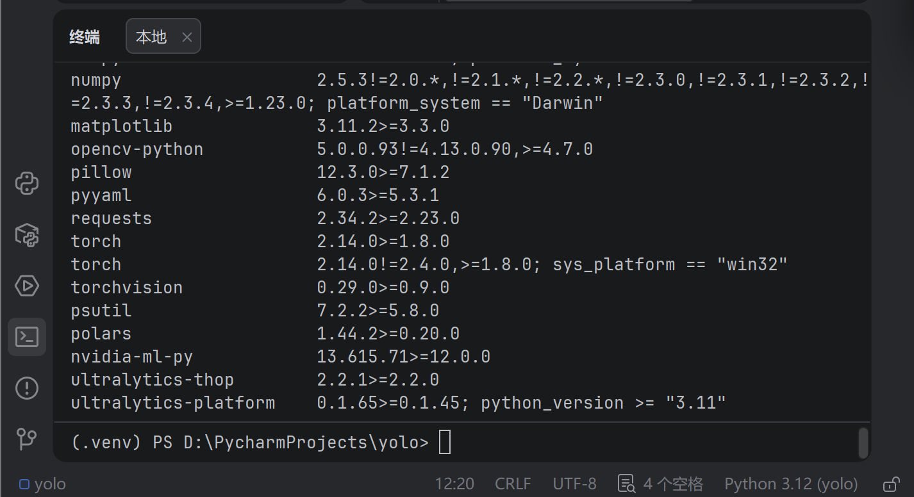
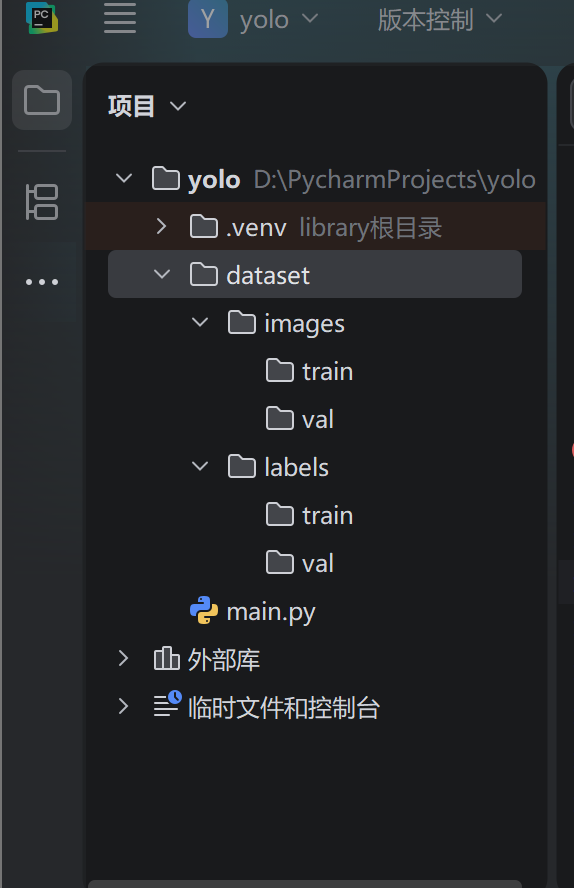
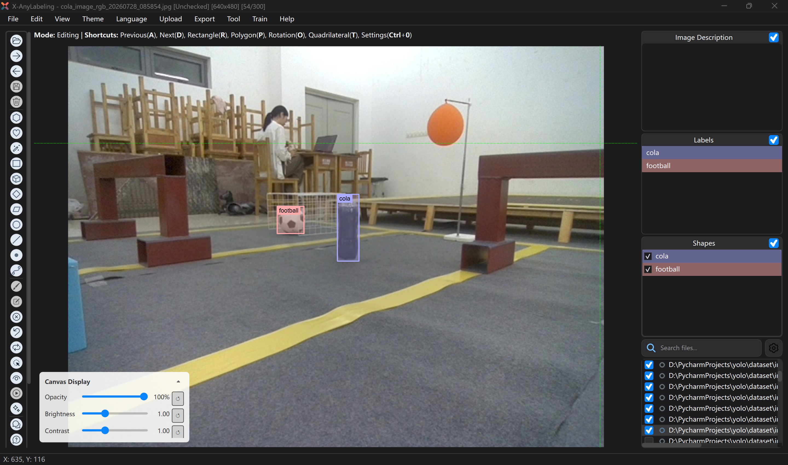
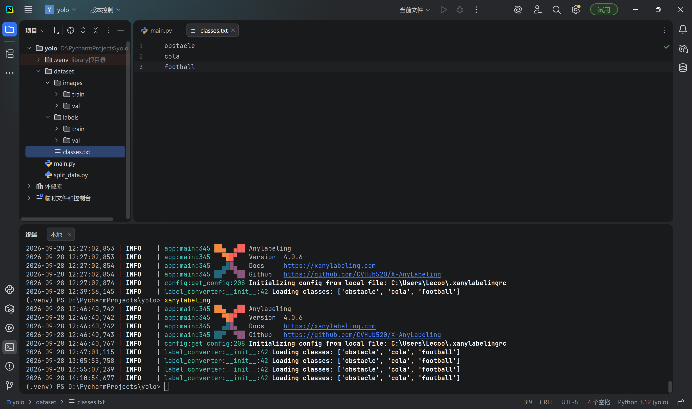
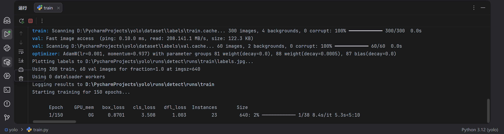
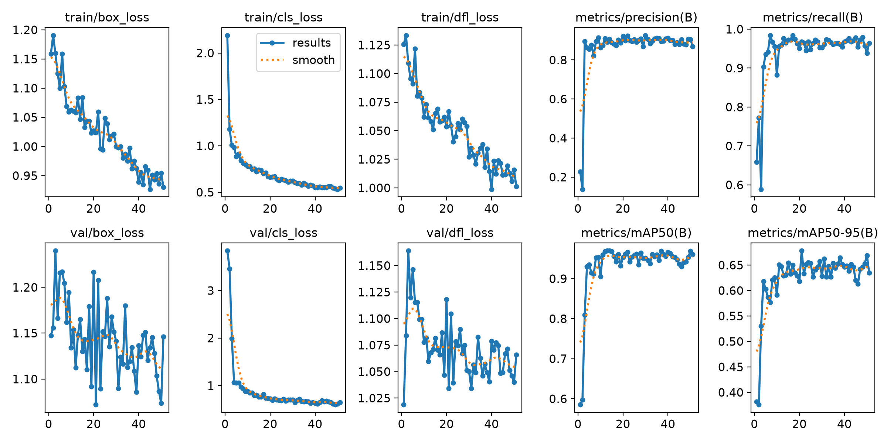
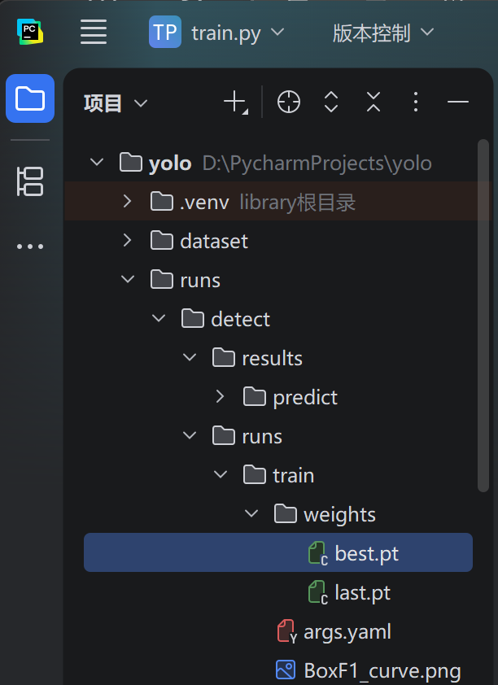
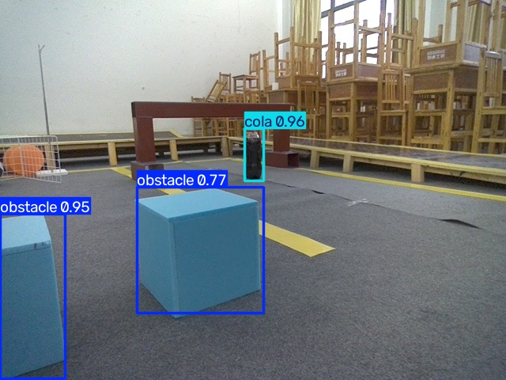

# 基于 YOLO 的机器人场景目标检测项目报告

## 一、环境配置（Level 1）

### 1.1 开发环境

| 项目 | 配置 |
|---|---|
| 操作系统 | Windows |
| 开发工具 | PyCharm Community |
| Python 版本 | 3.12 |
| PyTorch 版本 | CPU 版 |
| Ultralytics 版本 | 8.4.164 |
| 虚拟环境 | .venv |

### 1.2 环境安装步骤

在 PyCharm 终端中依次执行以下命令：

安装 PyTorch（CPU 版）：

    pip install torch torchvision torchaudio --index-url https://download.pytorch.org/whl/cpu

安装 Ultralytics：

    pip install -U ultralytics

验证环境：

    yolo checks
    python -c "import torch; print(torch.cuda.is_available())"

### 1.3 验证截图

### 1.4 项目目录结构

    yolo/
    ├── dataset/
    │   ├── images/
    │   │   ├── train/
    │   │   └── val/
    │   └── labels/
    │       ├── train/
    │       └── val/
    ├── runs/
    ├── train.py
    ├── predict.py
    └── data.yaml

---

## 二、数据集整理与标注（Level 2）

### 2.1 原始数据

实验室提供三类图片数据：

- obstacle：316 张
- cola：293 张
- football：340 张
- 合计：949 张

### 2.2 数据划分方式

采用固定随机种子（random.seed(42)）确保可复现，按 8:2 比例划分训练集与验证集。

具体操作：从每个类别的原始文件夹中随机抽取 120 张，其中：

- 100 张 → 训练集（train）
- 20 张 → 验证集（val）

最终数据集规模：

- 训练集：100 × 3 = 300 张
- 验证集：20 × 3 = 60 张

划分脚本见 split_data.py 和 pick_120.py。

### 2.3 标注工具与标注过程

使用 X-AnyLabeling 进行标注：

1. 打开 dataset/images/train 目录。
2. 设置标签保存目录为 dataset/labels/train。
3. 按 R 键画矩形框，输入类别名称。
4. 按 Ctrl + S 保存，按 D 键切换下一张。
5. 标完 train 后，切换到 val 目录，重复上述过程。

### 2.4 类别编号与含义

| 编号 | 类别 | 含义 |
|---|---|---|
| 0 | obstacle | 障碍物 |
| 1 | cola | 可乐 |
| 2 | football | 足球 |

### 2.5 YOLO 标签格式

每张图片对应一个 .txt 标签文件，每行格式为：

    class_id x_center y_center width height

- class_id：类别编号（0/1/2）
- x_center, y_center：边界框中心坐标（归一化到 0~1）
- width, height：边界框宽高（归一化到 0~1）

示例：

    1 0.486857 0.483937 0.067173 0.238512
    2 0.150993 0.390966 0.048189 0.050623

### 2.6 验证截图

---

## 三、模型训练（Level 3）

### 3.1 数据集配置文件 data.yaml

    path: ./dataset
    train: images/train
    val: images/val

    names:
      0: obstacle
      1: cola
      2: football

### 3.2 训练参数

| 参数 | 值 |
|---|---|
| 模型 | YOLO11n |
| 训练设备 | CPU |
| epochs | 150 |
| imgsz | 640 |
| batch | 8 |
| optimizer | AdamW |
| lr0 | 0.001 |
| patience | 30 |
| device | cpu |

### 3.3 训练过程

使用 train.py 启动训练。训练过程中：

- 模型在训练若干轮后达到最佳效果
- 连续 30 轮无提升后触发早停机制，自动停止训练

### 3.4 训练结果

最终验证指标：

| 类别 | Precision | Recall | mAP50 | mAP50-95 |
|---|---|---|---|---|
| all | 0.899 | 0.968 | 0.962 | 0.679 |
| obstacle | 0.845 | 0.975 | 0.952 | 0.699 |
| cola | 0.957 | 0.974 | 0.993 | 0.703 |
| football | 0.895 | 0.955 | 0.942 | 0.634 |

模型权重文件：runs/train/weights/best.pt

### 3.5 验证截图

---

## 四、新图片推理（Level 4）

### 4.1 测试图片准备

从原始数据文件夹中，选取 9 张未被用于训练和验证的新图片（每类 3 张），放入 test_images/ 文件夹。

### 4.2 推理脚本 predict.py

    from ultralytics import YOLO

    if __name__ == '__main__':
        model = YOLO("runs/train/weights/best.pt")
        model.predict(
            source="test_images/",
            conf=0.25,
            save=True,
            project="results",
            name="predict",
            exist_ok=True,
        )

### 4.3 推理结果

模型对 9 张新图片均完成准确检测，检测结果包含：

- 目标框：准确框出目标位置
- 类别名称：obstacle / cola / football
- 置信度：普遍在 0.85 以上

典型检测结果：

- cola 置信度：0.96
- football 置信度：0.93
- obstacle 置信度：0.87 ~ 0.97

### 4.4 验证截图

---

## 五、遇到的问题与解决方案

### 问题 1：CPU 训练速度较慢

现象：使用 CPU 训练，每轮约 50-58 秒，训练耗时较长。

解决：耐心等待训练完成，或适当减少 epochs 数量，本次训练最终在可接受时间内完成。

### 问题 2：Windows 多进程报错

现象：训练启动时报 RuntimeError，提示子进程启动失败。

解决：在 train.py 和 predict.py 中加入 if __name__ == '__main__': 保护，避免子进程重复导入主模块。

### 问题 3：标签文件与图片混放

现象：X-AnyLabeling 默认将 .json 文件保存在图片目录，干扰 YOLO 训练。

解决：在软件中设置 Change Save Dir 为 labels 目录，导出 YOLO HBB 格式后，删除所有 .json 文件，只保留 .txt。

---

## 六、项目总结

本项目完整实现了从数据整理、目标标注、模型训练到新图片推理的 YOLO 目标检测全流程。

最终模型在验证集上达到 mAP50 = 0.962 的优异表现，对三类目标（obstacle、cola、football）均能准确检测。通过本项目，掌握了 Ultralytics YOLO 的使用方法、数据标注流程、模型训练调参技巧以及跨设备迁移部署的基本能力。