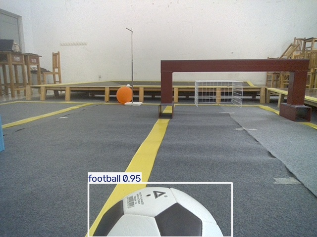
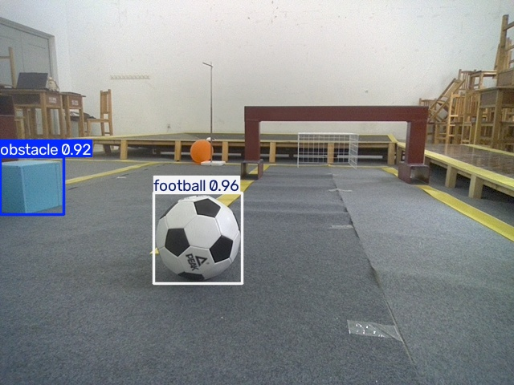
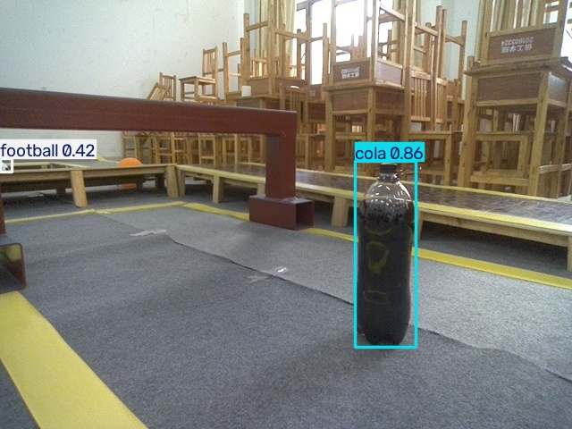
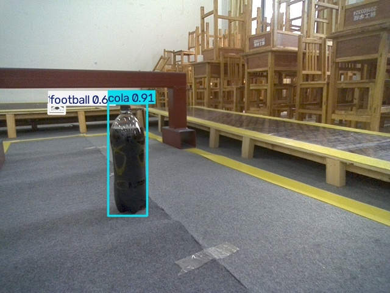

# 项目报告：基于 YOLO 的机器人场景目标检测

## 一、环境配置
配置了 Miniconda + Python 3.11 环境，安装了 PyTorch 2.14.1 和 Ultralytics 8.4.174。

/01_conda版本.png>)
/02_yolo环境存在.png>)
/03_进入yolo环境.png>)
/04_yolo版本.png>)
/05_ultralytics安装信息.png>)
/06_项目目录结构.png>)

## 二、数据集整理
原始数据共 949 张图片，按 80% / 20% 划分为训练集（759张）和验证集（190张）。

/07_数据划分完成.png>)
/08_train图片.png>)
/09_val图片.png>)

## 三、数据标注
使用 X-AnyLabeling 完成标注，类别编号 0=obstacle、1=cola、2=football。

/13c_xanylabeling安装成功.png>)
/14_xanylabeling启动.png>)
/16_标签文件内容.png>)
/17_标注示例.png>)
/18_标签内容.png>)

## 四、模型训练
使用 YOLO11n 训练，imgsz=640，batch=8，共训练 79 轮，mAP50 稳定在 0.97 后手动终止。

/20_data_yaml内容.png>)
/21_训练开始.png>)
/23_results曲线.png>)

模型权重文件：`runs/detect/runs/train/weights/best.pt`，文件大小约 6 MB。

## 五、新图片检测
使用自己训练的 `best.pt` 对训练集之外的新图片进行检测，结果如下。

### 1. 单个目标检测

### 2. 多个目标同时检测

### 3. 不同场景 / 不同角度下的检测

## 六、遇到的问题及解决方案
1. 下载预训练模型慢 → 用浏览器手动下载后放到项目目录。
2. data.yaml 报 YAML 语法错误 → 改用正斜杠并检查缩进。
3. 原电脑 CPU 训练速度慢 → 换到新电脑训练，再把结果拷回。
4. 手动终止后没有 results.png → 用 plot_results.py 从 results.csv 自己画图。
5. 缺失 pandas 包 → pip install pandas matplotlib。

## 七、总结
完整走通了目标检测项目的流程：环境配置 → 数据整理 → 标注 → 训练 → 推理。最终模型 mAP50 达到 0.97。
