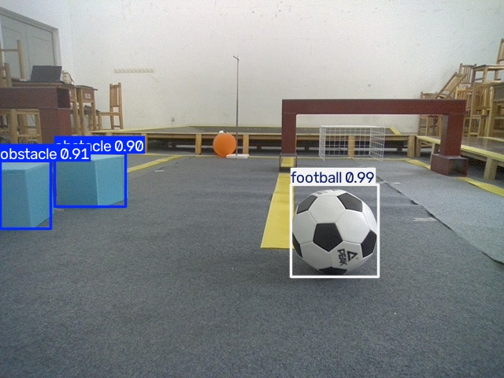

# 基于 YOLO 的机器人场景目标检测

本项目为 2026 年全国大学生计算机系统能力大赛智能系统创新设计赛（小米杯）相关机器人场景的工程实践项目。使用 YOLOv8n 对机器人场景中的三类目标进行检测。

## 检测类别

| 编号 | 类别 | 说明 |
|------|--------|--------|
| 0 | obstacle | 障碍物 |
| 1 | cola | 可乐 |
| 2 | football | 足球 |

## 项目成果

- 模型：YOLOv8n
- 训练轮数：30 epochs
- 图片尺寸：416
- 训练设备：CPU
- 验证集 mAP50：**0.977**
- Precision：0.91
- Recall：0.973

模型对足球、可乐、障碍物三类目标识别准确，最高置信度达 0.99，在 CPU 上单张推理约 8 毫秒。

## 环境依赖

主要依赖：

- Python 3.10
- PyTorch 2.14.1 (CPU)
- Ultralytics 8.4.174
- OpenCV、Pillow、PyYAML、Matplotlib、Pandas、Seaborn

安装方式：

```bash
pip install -r requirements.txt
```

## 项目结构

```text
202611800123/
├── train.py                 # 模型训练脚本
├── predict.py               # 新图片推理脚本
├── data.yaml                # 数据集配置文件
├── requirements.txt         # 依赖清单
├── README.md                # 项目说明（本文件）
├── report.md                # 项目详细报告
├── images/                  # 各阶段验证截图
├── results/
│   └── predict/             # 推理结果图
└── runs/
    └── detect/
        └── runs/
            └── train/
                └── exp/
                    ├── results.png        # 训练曲线图
                    └── weights/
                        └── best.pt        # 训练得到的最优模型
```

## 数据集

数据集包含三类目标：`obstacle`、`cola`、`football`。

数据按照 YOLO 格式组织：

```text
dataset/
├── images/
│   ├── train/
│   └── val/
└── labels/
    ├── train/
    └── val/
```

每张图片对应一个同名 `.txt` 标签文件，每行格式为：

```text
类别编号 中心点x 中心点y 宽度 高度
```

坐标均为 0~1 归一化值。

## 数据标注

标注工具：**X-AnyLabeling**

标注流程：

1. 打开图片目录 `dataset/images/train`
2. 设置导出目录 `dataset/labels/train`
3. 格式选择 `YOLO`
4. 按 `W` 画框，选择对应类别
5. 保存后自动生成 `.txt` 标签文件

## 模型训练

运行训练脚本：

```bash
python train.py
```

训练参数：

| 参数 | 值 |
|--------|------|
| model | yolov8n.pt |
| epochs | 30 |
| imgsz | 416 |
| batch | 4 |
| device | cpu |

训练结果保存在：

```text
runs/detect/runs/train/exp/
```

其中：

- `weights/best.pt`：验证集表现最好的模型权重
- `results.png`：训练过程 Loss、Precision、Recall 曲线图

## 新图片推理

使用训练得到的模型对新图片进行检测：

```bash
python predict.py
```

检测结果会保存在 `results/predict/` 目录下。每张结果图中会显示：

- 目标边界框
- 类别名称
- 置信度

## 检测效果

单目标检测：


多目标检测：


不同角度/场景检测：



## 遇到的问题与解决

1. **GPU 版本 PyTorch 下载太慢**  
   尝试清华、阿里云等镜像仍然很慢，最终改用 CPU 版 PyTorch，训练 30 轮仅需约 7 分钟，顺利完成项目。

2. **labelImg 安装报错**  
   在 `yolo` 环境下安装 labelImg 失败，改用 X-AnyLabeling 进行标注，界面友好且支持直接导出 YOLO 格式。

3. **训练时路径错误**  
   最初 `data.yaml` 中路径写成 `D:/`，实际项目在 `C:/Users/lenovo/Desktop/`，修改为绝对路径后训练正常。

4. **模型保存路径较深**  
   训练结果被自动保存到 `runs/detect/runs/train/exp` 下，推理时需注意使用正确路径加载 `best.pt`。
