# 机器人实验室目标检测系统项目报告

## 一、项目概述

本项目基于 YOLOv8 算法，针对机器人实验室场景下的三种目标（障碍物 obstacle、可乐 cola、足球 football）进行了目标检测的完整工程实践。项目内容涵盖了环境配置、数据集制作与标注、模型训练、本地推理以及基于 Streamlit 的 Web 页面部署。

## 二、数据集准备

1. **原始数据整理**：从官方仓库下载了包含三类目标（cola, football, obstacle）的原始图片（共约 900 余张）。

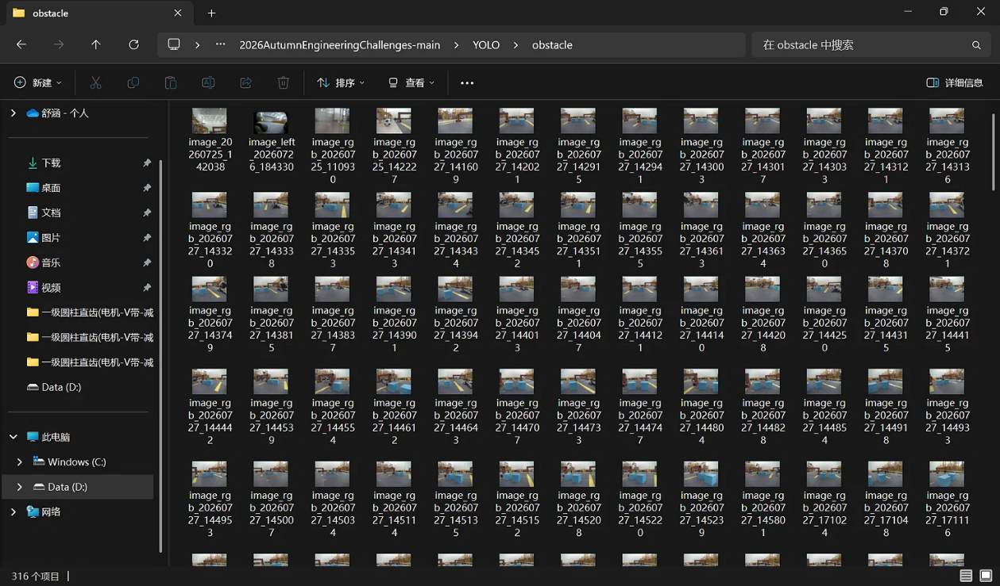

2. **数据集划分**：编写 Python 脚本（`split_dataset.py`），按照 8:2 的比例将图片随机划分为训练集和验证集，并建立了标准的 YOLO 数据集目录结构（`images/train`、`images/val`、`labels/train`、`labels/val`）。

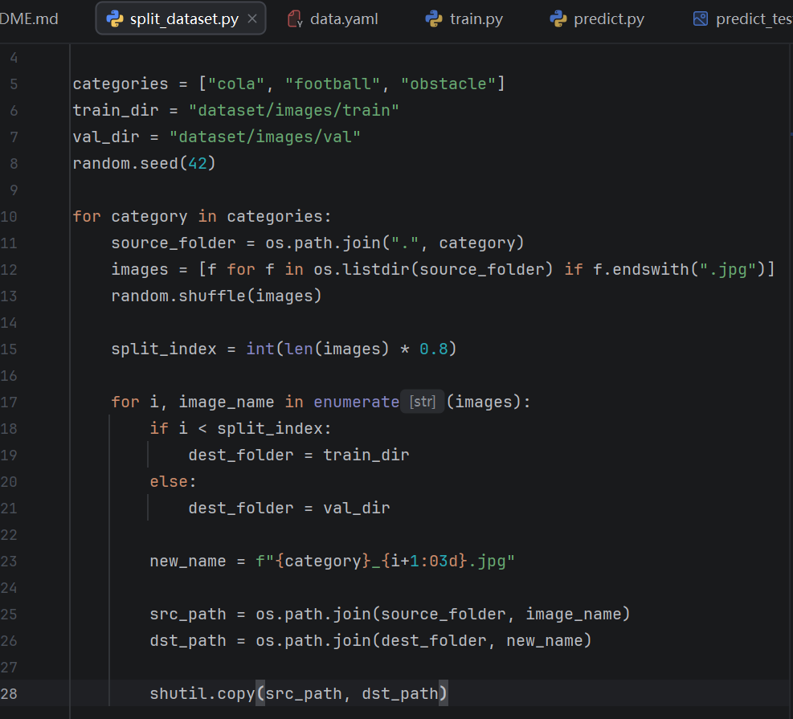

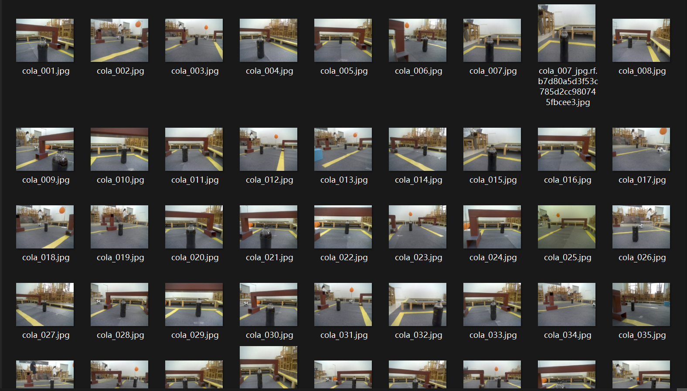

3. **数据标注**：使用 Roboflow 在线标注平台，对抽取的样本进行人工标注。

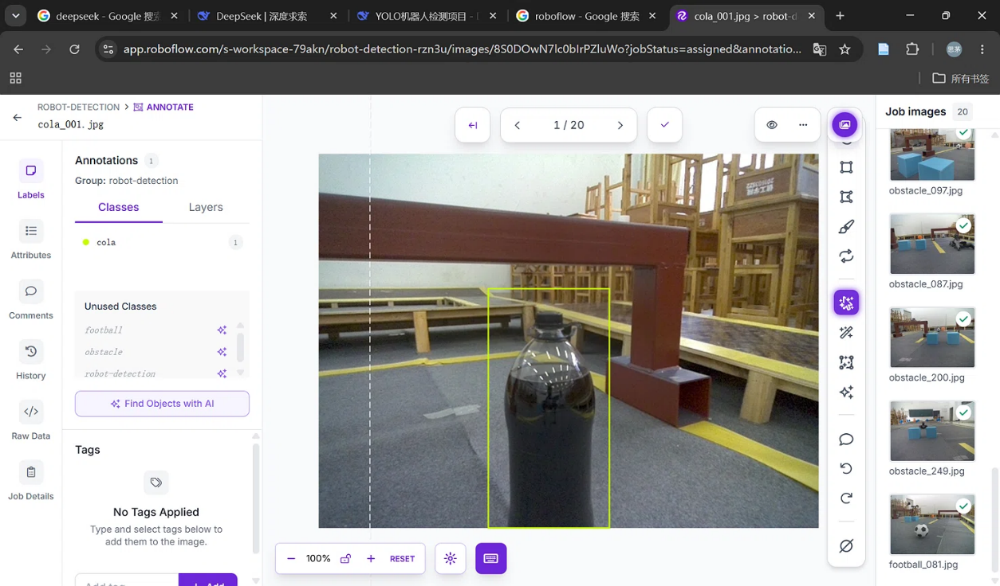

4. **标签格式**：导出为 YOLOv8 格式（`.txt`），确认标签数据为归一化后的中心点与宽高。

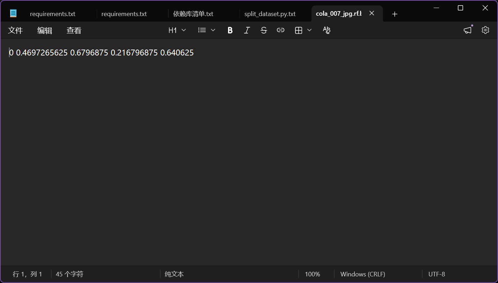

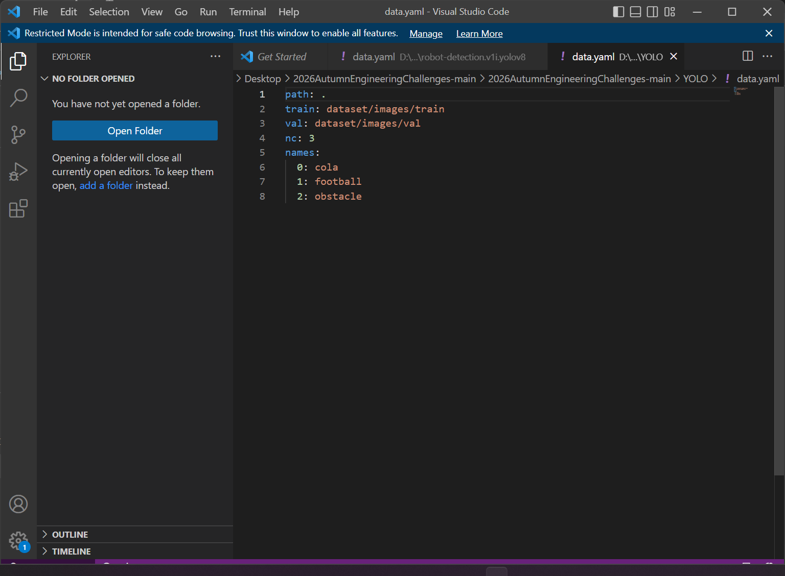

## 三、模型训练

1. **环境配置**：在 PyCharm 中创建虚拟环境，安装 PyTorch 和 Ultralytics 库。

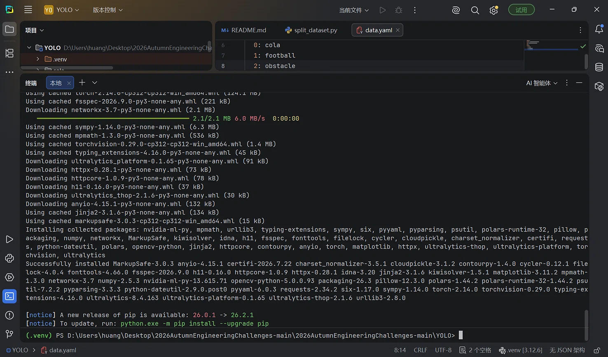

2. **训练过程**：使用 `yolov8n.pt` 预训练模型。由于本地电脑没有 NVIDIA 显卡（CUDA 不可用），初始配置 `device=0` 报错。

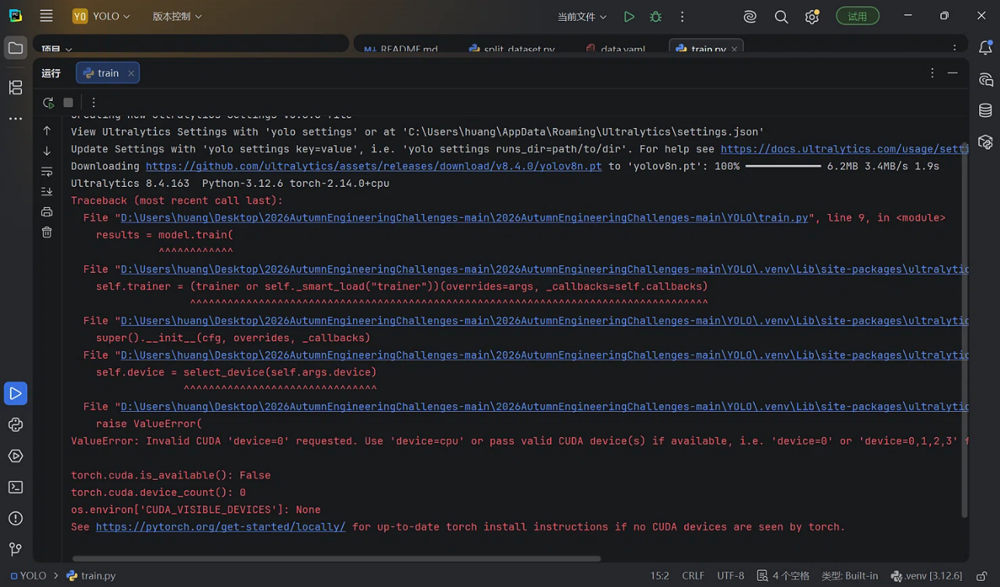

3. **训练参数调整**：将训练设备改为 CPU（`device="cpu"`），将训练轮数调整为 100 轮（`epochs=100`），并设置 `name="train_v2"` 防止覆盖。

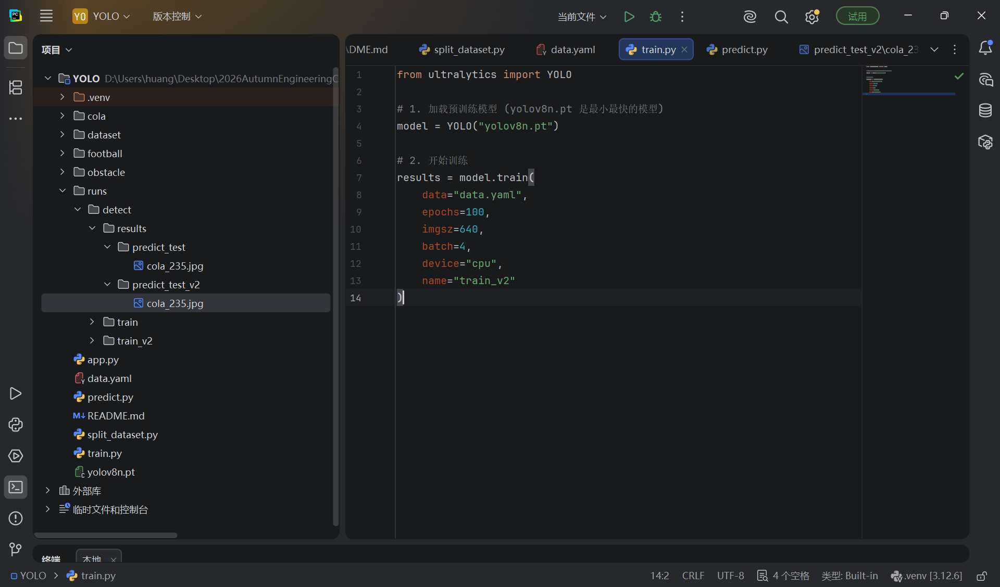

4. **训练结果**：经历了长达约 5 小时的 CPU 训练，完成了 100 轮迭代。但观察训练日志发现，由于样本量极度匮乏，mAP50 指标近乎为 0。

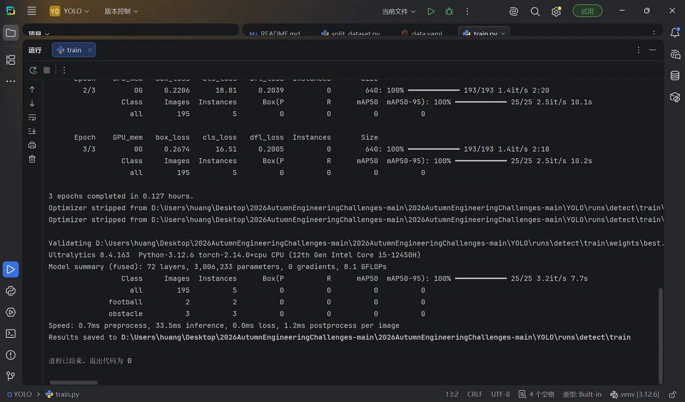

## 四、推理与 Web 部署

1. **本地推理**：编写 `predict.py`，加载训练好的 `best.pt` 权重文件对验证集图片进行推理。

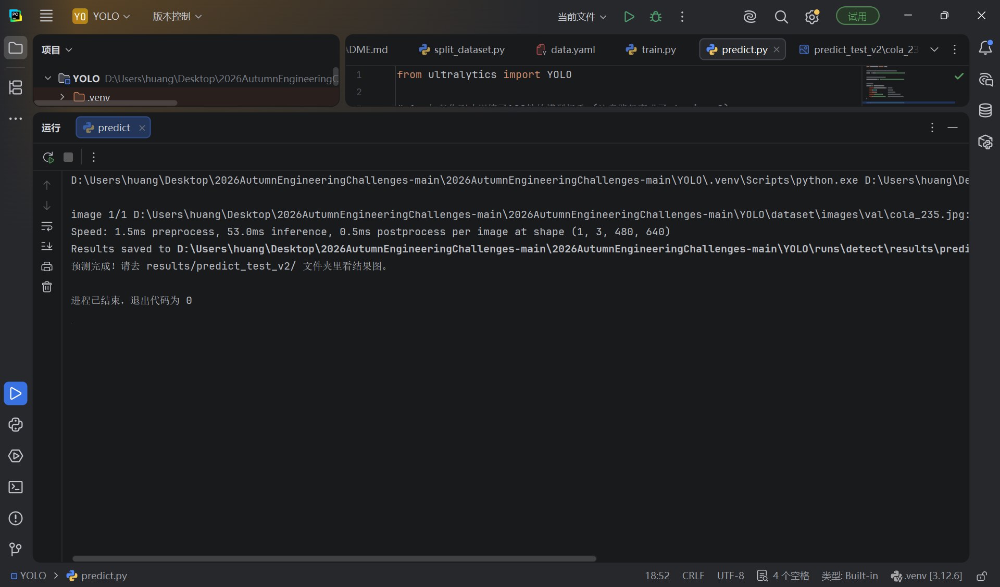

2. **Web 页面制作**：使用 Streamlit 框架编写 `app.py`，实现本地图片上传与检测结果显示。

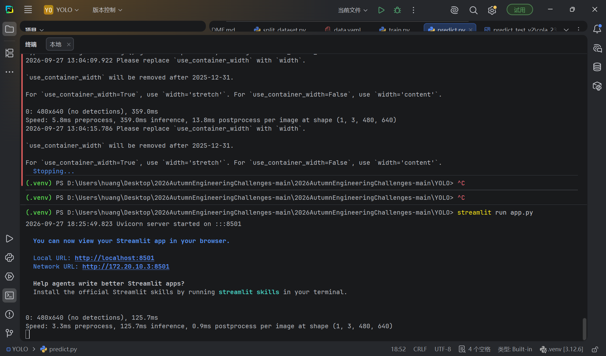

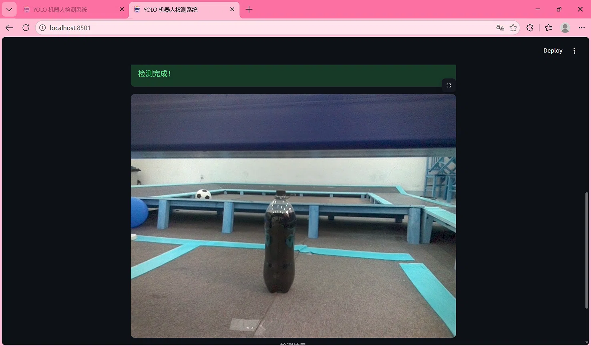

## 五、问题分析与反思

1. **模型精度极低（mAP 接近 0）的原因分析**：
   - **训练样本严重不足**：本次项目中，由于时间与人工精力限制，仅标注了 19 张图片（训练集与验证集各一部分），总实例数仅有个位数。深度学习模型极度依赖数据量，在如此小的样本集上训练，即使迭代 100 轮，也会发生严重的过拟合（Overfitting），导致模型泛化能力为零。
   - **计算资源受限**：本地电脑缺乏支持 CUDA 的独立显卡，使用 CPU 训练不仅耗时极长（100 轮耗时 5 小时），也限制了 Batch Size 和输入分辨率的选择。

2. **改进方向与未来计划**：
   - 下一步计划使用自动化脚本或外包标注，完成原始数据集中全部 900 余张图片的标注工作。
   - 引入数据增强技术（如随机旋转、马赛克增强等），扩充有效样本量。
   - 租用或申请配备 GPU 的服务器进行训练，将 `epochs` 提升至 300 轮以上，预计 mAP50 将会有质的飞跃。

## 六、总结

本次项目虽然受限于数据量导致最终精度不佳，但完整跑通了从环境搭建、数据清洗与划分、在线标注、模型训练、推理脚本编写到 Web 界面部署的全流程（Level 1 - Level 5）。让我深刻体会到了“数据和算力是深度学习两大基石”这一工程真理。
